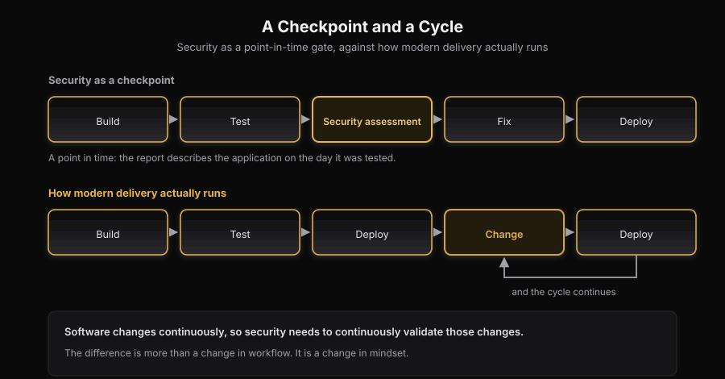
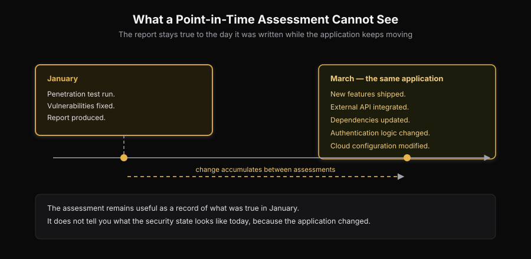
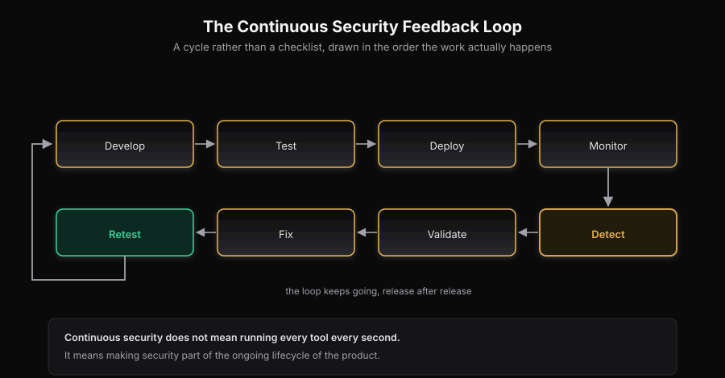
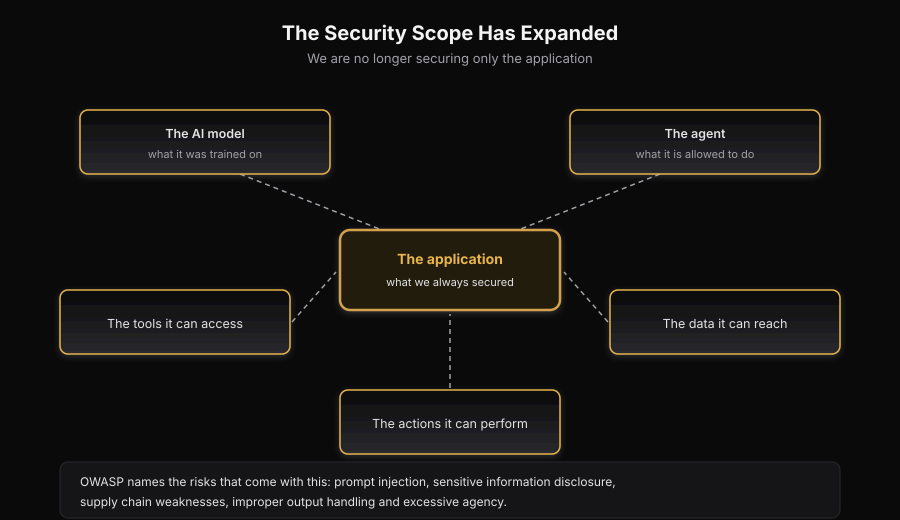
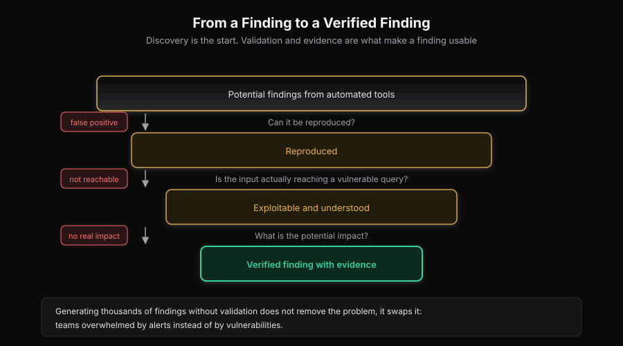
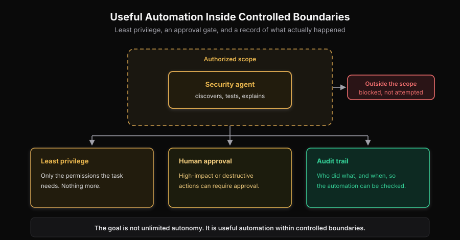

# The New Security Problem: Software Is Built Faster Than Security Can Check It

Cloud platforms, open-source software, CI/CD pipelines and now AI have changed how applications are built. Teams move from an idea to a working product faster than ever. AI assistants generate code, write tests and suggest fixes, and AI agents now run multi-step tasks across development tools, APIs and other systems.

That speed creates a new security problem:

**If software is changing faster than ever, can security keep up?**

Security is still often treated as a point-in-time activity. An application is tested, the findings are fixed, a report is produced, and the application moves on. But the application does not stop changing. Features ship, dependencies update, APIs, permissions and infrastructure change, and AI agents become part of the product. Its security posture keeps changing long after the assessment ends.

This is where **continuous security** matters. It is no longer enough to test the product at intervals. Security has to move into the place where the product actually changes: the pipeline that builds, tests, and deploys it.

## The Gap Between Development Speed and Security

For a long time, security could operate as a checkpoint within the software development lifecycle:

**Build → Test → Security Assessment → Fix → Deploy**

Modern development increasingly looks more like:

**Build → Test → Deploy → Change → Deploy → Change → Deploy**

*Figure 1. Security as a point-in-time checkpoint (top) against how modern delivery actually runs (bottom).*

Imagine an application that was penetration tested in January. The vulnerabilities discovered during the assessment were fixed, and the organization moved forward.

By March, the development team may have introduced several new features, integrated an external API, updated dependencies, changed authentication logic, or modified the cloud configuration.

*Figure 2. A January assessment stays true to January; by March the application underneath the report has changed.*

The original assessment is still useful, but it represents the security state of the application at a particular point in time. It does not automatically tell us what the security state looks like today.

**Software changes continuously, so security needs to continuously validate those changes.**

## The 350-Day Problem

Consider how much of the year a periodic test actually covers.

A traditional penetration test gives a deep, human-led view of a system. It is valuable and hard to replace. But it is also a sample. In most organizations a test lasts a few days, or at most a few weeks. The rest of the year is unobserved.

Snyk puts a number on that gap. In its description of continuous offensive security, the company notes that traditional engagements average about 15 days of coverage each year. That leaves a window of roughly 350 days in which an attacker can probe the application without any scheduled test running.

The point is not that a penetration test is worthless. The point is arithmetic. A test that covers 15 days cannot describe a system that changes on the other 350.

Three things break when testing stays periodic:

1. **Coverage is a sample, not a state.** The report describes the system on the day of the test.
2. **Change is invisible between tests.** New endpoints, dependencies, and permissions do not appear in the old report.
3. **Response time grows.** A weakness introduced in March may wait until the next annual test in January to be found.

The last point is the most expensive. The longer a weakness stays in the system, the more code, configuration, and dependent systems build on top of it.

## Security Is Not a One-Time Event

A system that is secure today can become vulnerable tomorrow because of one new change. That does not make penetration tests, code reviews, audits or red-team exercises irrelevant. The problem is relying on them as the only layer of security. The NIST Secure Software Development Framework makes the same point: integrate security practices through the lifecycle instead of treating security as a separate activity at the end.

The mindset shifts from **"We tested the application"** to **"We have a process that continuously understands and improves the security of the application."** For most teams today, that process has to live in the CI/CD pipeline.

## Why Security Must Move Into the CI/CD Pipeline

The CI/CD pipeline is the one place every change passes through. A developer opens a pull request. A build runs. Tests run. An artifact is produced. A deployment is approved. The pipeline sees all of it.

Security that sits outside the pipeline can only give advice. Security that runs inside the pipeline can make a decision, at the moment the change is small and the context is fresh.

Four properties of the pipeline make it the right control point.

**1. It is where the change is.** A pull request contains the exact diff, the dependency update, the infrastructure change, and the configuration change. The pipeline already knows what changed, who changed it, and why.

**2. It is where the context is.** The pipeline has the source code, the dependency graph, the container image, and the infrastructure definition. It often has the deployment target too. A test that runs there can reason about all of them together.

**3. It is where the fix is cheapest.** A weakness found in a pull request is fixed in one commit, before release. The same weakness found in production is an incident. It needs a hotfix, a rollback decision, and a report.

**4. It is where accountability already exists.** A review, an approval, and a merge are already part of the workflow. A security gate fits into a process people already follow.

The Chief Information Security Officer of GitLab, Chaim Mazal, states the operating rule plainly:

> If the pipeline cannot prove it, the pipeline does not ship it.

That sentence is the difference between advice and control. The pipeline is also the place to prove a fix. A finding should not close because someone said it is fixed. It should close when the pipeline shows that the fix holds.

### Continuous does not mean "run everything on every commit"

A common objection is cost. Running every security tool on every commit is slow and noisy.

Continuous security is not that. It is coverage that matches the change:

- A small documentation change needs almost no security work.
- A dependency update needs a software composition analysis (SCA) check.
- A new endpoint needs an authorization and input test.
- A change to authentication needs a deeper review and a targeted test.
- A change to infrastructure needs a configuration and policy check.

The goal is not maximum tool output. The goal is **a decision at the point of change, based on evidence**.

## What the Leaders Are Saying

The argument for continuous, pipeline-centered security is not only an engineering opinion. Between May and September 2026, security leaders across the industry described the same shift in public.

**Chaim Mazal, Chief Information Security Officer, GitLab**, described the shift this way:

> The operating model is to enforce the security you already have, measure time from detection to verified remediation, and keep customer experience checks in the same build path as security.

Mazal also reported what full coverage looks like when security runs with the pipeline rather than beside it:

> On a recent release, we ran agentic security review across 969 of 997 eligible merge requests, or 97%. A year ago, that level of coverage was inconceivable. Today I treat it as the expectation.

Coverage at that level is not possible with a periodic test. It is only possible when the check runs on the change itself.

**Gadi Evron, CISO-in-Residence for AI at the Cloud Security Alliance**, makes a distinction. To find a problem is not the same as to close it:

> Machine scale discovery without an equally fast path to governed remediation is not progress. It is an inventory problem dressed up as security. The organizations that will hold up under agentic development are the ones that treat detection as the start of a closed loop: policy on every change, remediation in the build path, and a baseline they can re-verify as models improve.

The phrase "a closed loop" is the important one. A finding that does not return to the pipeline for a retest is an open loop.

**Bill Shields, Chief Information Security Officer at Workday**, ties trust to the completeness of that loop:

> A durable security program for agentic software development keeps every agent on lawful rails: an explicit identity, constrained permissions, and a sanctioned path from plan to production. An agent working outside those rails is lawless: no identity, no record, no way to govern what it touched. That discipline has to hold as models improve and agent volume rises.

**Sam Curry, Chief Security Officer at Zscaler**, adds the governance layer:

> Trust in what you ship depends on continuous hardening of the models and development platforms you build on and governance of every change in your software lifecycle. Those layers reinforce each other, and neither substitutes for the other.

The same shift appears on the offensive side of the market. **Manoj Nair, Chief Technology Officer at Snyk**, frames the urgency:

> The attacker side of this equation has already gone agentic — the question is whether you get there first.

If the attack side now works continuously, a defense that works annually is out of step with the threat.

**Janet Worthington, an analyst at Forrester Research**, argues that automated, continuous testing is becoming the practical answer:

> AI-driven penetration testing is emerging as a critical solution. [It is] simulating real-world attacks to expose weaknesses at the speed and scale necessary to combat AI-driven attacks.

And **Nuno Loureiro, Senior Director of Product Strategy at Snyk**, explains why this class of weakness resists a one-time checklist:

> The vulnerability lives in the gap between intended behavior and actual behavior.

That last point matters for the pipeline. A rule can check a version number. Only context can judge intent. Context is exactly what the pipeline has.

## What Continuous Security Looks Like

Continuous security means making security part of the ongoing lifecycle of the product. A modern security feedback loop can look like:

**Develop → Test → Deploy → Monitor → Detect → Validate → Fix → Retest**

*Figure 3. The continuous security feedback loop, drawn as a cycle rather than a checklist.*

During development, teams can use secure coding practices, static analysis, dependency scanning, and secret detection. Before deployment, infrastructure and configuration can be evaluated. After deployment, applications can continue to be monitored and tested.

When a potential vulnerability is identified, it can be investigated and validated. After remediation, the issue can be tested again to confirm that it has actually been resolved.

Mapped onto a real pipeline, the loop has clear stages and clear questions:

| Stage | What runs | The question it answers |
|---|---|---|
| Pre-commit and editor | Secret detection, linting, secure defaults | Did a credential or an unsafe pattern enter the change? |
| Pull request | Static analysis (SAST), SCA, infrastructure-as-code checks | Does this diff introduce a known weakness or an unsafe dependency? |
| Build and artifact | Container and image scans, signed builds, provenance | Is this the artifact we built? |
| Pre-deploy | Policy checks, configuration checks, environment diff | Does this change violate an agreed rule before it reaches users? |
| Runtime | Monitoring, dynamic application security testing (DAST), attack-path analysis | What changed in the running system since the last check? |
| After a fix | Targeted retest and remediation replay | Does the fix actually hold? |

The goal is not simply to find more vulnerabilities. It is to **shorten the distance between a security change and the ability of the organization to detect, understand, and respond to it.**

When security runs in the pipeline, three things change at once:

- **The unit of work becomes the change, not the report.** Each pull request carries its own security result.
- **The record stays current.** The evidence updates as the code updates, so the newest report is not months old.
- **The retest is automatic.** A fix returns to the same pipeline that found the issue, and the pipeline confirms the result.

## Periodic and Continuous Are Not Competitors

It would be a mistake to read this as an argument against deep testing.

A periodic penetration test and a continuous pipeline check do different jobs:

- **The periodic test explores.** A human tester follows intuition, chains findings, and finds the logic flaws no rule describes. It is a deep sample.
- **The continuous check observes.** The pipeline watches every change, validates it, and keeps the record current. It is broad coverage.

You need both. The deep test tells you what a determined attacker could do on the day it runs. The continuous check tells you whether the system still matches the assumptions in that report.

The right mental model is a running record with milestones, not a stack of one-time reports. The annual test becomes a scheduled deep review inside a process that never stops.

## AI Agents Are Changing the Attack Surface

AI agents can do much more than generate code. Depending on their configuration, they interact with tools, APIs, databases, repositories, cloud environments, file systems and applications. Organizations now have to ask:

* What can an AI agent access, and what tools can it use?
* What actions can it perform, and what data can it retrieve?
* How are its actions monitored, and how are its outputs validated?
* What happens if its instructions are manipulated?

OWASP lists the risks that come with generative AI applications, including prompt injection, sensitive information disclosure, supply-chain vulnerabilities, improper output handling and excessive agency. We are no longer securing only the application. We also have to secure the **AI model, the agent, the tools, the data, and the actions** they can reach.

*Figure 4. The scope of security expands from the application to the model, the agent, the tools, the data and the actions.*

Agents also write more of the code. That raises the volume of change the pipeline must check, and the value of a check on each change.

## More Automation Requires More Verification

AI helps security teams work faster: an agent can discover assets, analyze applications and help test them. But **finding something** is not the same as **proving that it is a security issue**.

If an automated system reports a possible SQL injection, someone still has to ask: can it be reproduced, does the input reach a vulnerable query, can it be exploited, what is the impact, and is it a false positive? Tools that produce thousands of unvalidated findings replace one problem with another, because noise overwhelms a team as easily as vulnerabilities do. Effective automation focuses on **validation and evidence**, not only on discovery.

*Figure 5. From a raw finding to a verified finding: each question filters noise before anything reaches a report.*

Verification is also what makes a pipeline gate usable. A gate that blocks a release must be trusted. If it raises false alarms, teams switch it off, and the pipeline loses its security value.

## Keeping Security Automation Under Control

An agent that can find a vulnerability is one thing. An agent that can change systems is another. The more capable the agent, the more its permissions matter. Least privilege still applies: an agent gets only the permissions its task needs, and high-impact or destructive actions need extra verification or human approval.

The goal is not unlimited autonomy. It is **useful automation within controlled boundaries.**

*Figure 6. Useful automation inside controlled boundaries: least privilege, an approval gate for high-impact actions, and an audit trail.*

## Closing the Gap with SecureGraph

This is the gap SecureGraph is built to close.

SecureGraph maps the assets an organization exposes, tests them continuously with security agents that work inside an authorized scope, and verifies each finding before it reaches a person. A verified finding carries its evidence: the asset, the input, the response, and the steps to reproduce it. When a fix lands, SecureGraph replays the original proof against it, so a finding closes on evidence, not on a ticket status.

Automation is not the point on its own. The point is trust. As agents take on more of the work, an organization needs to trust what an agent found, how it reached the finding, what evidence supports it, and what the agent is allowed to do next. That is why verification, scope and human approval are part of the design, not features added later.

## The Honest Limits of Continuous Security

Continuous security is not a free win, and it is not a complete answer. Four limits are worth stating plainly.

**1. More testing can create more noise.** If every check reports everything it suspects, the pipeline becomes a source of alerts rather than decisions. Verification is what keeps continuous testing useful.

**2. Some problems still need a person.** Business-logic flaws often depend on intent that only a human can judge. Continuous checks support that judgment. They do not replace it.

**3. A gate can slow delivery if it is badly designed.** A pipeline that blocks on unverified findings will be switched off within a week. Gates should block on verified, high-confidence findings, and every gate should have a measured cost.

**4. Not all risk lives in code.** People, process, third parties, and physical access remain part of the picture. The pipeline covers the software supply chain and the application. It does not cover everything.

Stating these limits is part of the design. A security program that claims to cover everything usually covers less than it says.

## Conclusion

The faster an application changes, the faster its security posture can change. A vulnerability can appear between two assessments. A new integration can widen the attack surface. An AI agent can bring new capabilities and new risks.

A periodic test samples that system. It cannot watch it. That is why security has to move into the CI/CD pipeline: it is where the change is, where the context is, and where the fix is cheapest, and it is the only point that sees every release.

The objective is not to slow innovation down. It is to let security move alongside it, with automation for scale and people for judgment. Because software is built faster than ever, **security cannot afford to stand still.**

## References

1. National Institute of Standards and Technology (NIST). *Secure Software Development Framework (SSDF) Version 1.1: Recommendations for Mitigating the Risk of Software Vulnerabilities (SP 800-218).*
https://csrc.nist.gov/pubs/sp/800/218/final
2. National Institute of Standards and Technology (NIST). *Artificial Intelligence Risk Management Framework (AI RMF 1.0).*
https://www.nist.gov/itl/ai-risk-management-framework
3. Autio, C., Schwartz, R., Dunietz, J., et al. *Artificial Intelligence Risk Management Framework: Generative Artificial Intelligence Profile (NIST AI 600-1).* NIST, 2024.
https://www.nist.gov/publications/artificial-intelligence-risk-management-framework-generative-artificial-intelligence
4. OWASP GenAI Security Project. *OWASP Top 10 for Large Language Model Applications.*
https://owasp.org/www-project-top-10-for-large-language-model-applications/
5. OWASP GenAI Security Project. *OWASP Top 10 for Agentic Applications.*
https://genai.owasp.org/
6. National Institute of Standards and Technology (NIST). *AI Risk Management Framework Playbook.*
https://airc.nist.gov/airmf-resources/playbook/
7. Mazal, C. *Securing the software factory at machine speed.* GitLab, 18 September 2026. Quotations in this article from Chaim Mazal (GitLab), Gadi Evron (Cloud Security Alliance), Bill Shields (Workday) and Sam Curry (Zscaler) come from this post.
https://about.gitlab.com/blog/securing-the-software-factory-at-machine-speed/
8. Taft, D. K. *AI is shipping code faster than security was built to handle.* The New Stack, 29 May 2026. Quotations from Manoj Nair (Snyk), Janet Worthington (Forrester Research) and Nuno Loureiro (Snyk), and the 15-day and 350-day coverage figures, come from this article.
https://thenewstack.io/snyk-pentesting-ai-agents-security/
