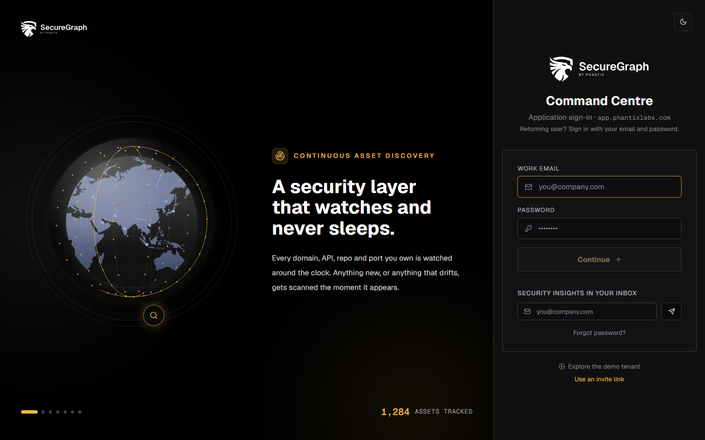
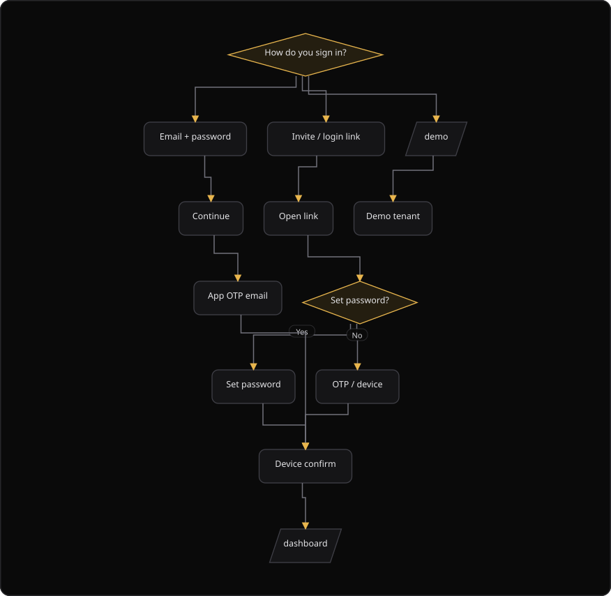
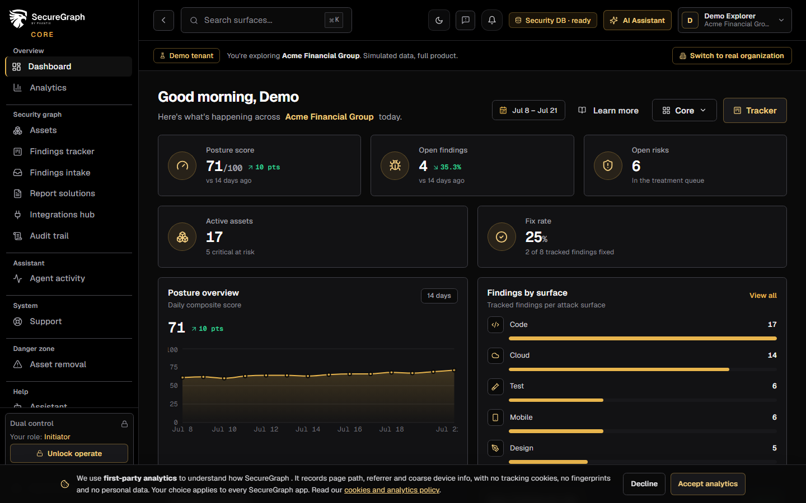

# Command Centre: Sign in

**Where:** Sign-in page (`/login`) at `https://app.phantixlabs.com`
**What:** Starts one operator session for Command Centre. SecureGraph asks for a password and a one-time code from your email.
**Who:** Any operator with an account in the organization.
**Before you start:** An administrator invited you, and the organization has an active service key.

---

## Before you start

- An administrator created your organization user in SecureGraph Platform.
- The organization has an active service key. Without one, the page shows "Company access is not enabled".
- You can open the mailbox for your work email. SecureGraph sends the one-time code to that address.
- Your password has 12 characters or more.
- Five failed sign-ins within 5 minutes lock the form. The button then counts down before it accepts another try.

---

## Process flow

---

## Steps

### Sign in with email and password

1. Open `https://app.phantixlabs.com/login`.
2. Enter your work email in **Work email**.
3. Enter your password in **Password**.
4. Select **Continue**.
5. Enter the 6-digit application login code from your email.
6. Select **Verify and sign in**.
7. Open the confirmation link in your email when the page asks you to confirm a new device.

The confirmation step makes this browser your primary device. No second code is necessary.

### Sign in with a login link

1. Open the login link from your administrator.
2. Read the organization name on the card. SecureGraph validates the link first.
3. Enter a **New password** of 12 characters or more on the first sign-in.
4. Enter the same password in **Confirm password**.
5. Select **Set password and continue**.
6. Enter the 6-digit code from your email.
7. Select **Verify and sign in**.

### Paste a login link

1. Select **Use an invite link** on the sign-in page.
2. Paste the complete login link into the text box.
3. Select **Continue with link**.
4. Read any message. SecureGraph rejects a link that is longer than 250 characters.

### Open Attack, Defend or Code from a link

Attack, Defend and Code have no sign-in page of their own. A link into one of them, for example **Run your first VAPT** on the Platform dashboard, opens the Command Centre sign-in on the way.

1. Follow the link. The sign-in page reads **Sign in to continue to Attack**, or the application the link opens.
2. When you are already signed in to the Command Centre, the page skips the form. It opens the application at the page the link names.
3. When you are not signed in, sign in as usual. SecureGraph then opens the application at that page.

A plain visit to `/login` always shows the form, so you can sign in as another user.

### Open the demo tenant

1. Select **Explore the demo tenant** on the sign-in page.
2. Alternatively, open `https://app.phantixlabs.com/demo`.

The demo tenant holds demo data only. A real organization is never affected.

### After you sign in

SecureGraph opens the application picker at `/choose-app`. Select Command Centre. The dashboard then shows your posture, the open queues and recent activity.

---

## Reference

| Sign-in method | What you supply | Notes |
| --- | --- | --- |
| Email and password | Work email, password, then a 6-digit code | Standard sign-in for a returning user |
| Login link | The link from an administrator, then a 6-digit code | The first sign-in also sets a password |
| Pasted link | The complete login link | The maximum length is 250 characters |
| Demo tenant | Nothing | Demo data only |

A login link holds three parameters:

| Parameter | Meaning |
| --- | --- |
| `org` | The organization slug |
| `u` | The organization user ID |
| `t` | The login token. It has 10 characters or more |

| Control | Behavior |
| --- | --- |
| **Forgot password?** | Opens `/password-reset` |
| **Resend code** | Sends a new 6-digit code |
| **Use a different account** | Returns to the email step |
| Device confirmation link | Expires after 15 minutes |
| **Restart sign-in** | Starts the flow again from the email step |

---

## Troubleshooting

| Symptom | Cause | Fix |
| --- | --- | --- |
| The page shows "Company access is not enabled" | The organization has no active service key | Ask an administrator to create a service key in SecureGraph Platform |
| The button shows "Try again in 60s" | Five failed sign-ins within 5 minutes | Wait for the countdown, then enter the correct password |
| "Password must be at least 12 characters" appears | The new password is too short | Enter a password of 12 characters or more |
| "Passwords do not match" appears | The two password fields differ | Enter the same password in both fields |
| The code is rejected | The code is not the newest one | Select **Resend code**, then enter the newest code |
| "This confirmation link was already used to finish a sign-in" appears | Another browser finished the sign-in with that link | Sign in again to get a fresh link |
| "The confirmation link may have expired" appears | The link is older than 15 minutes | Sign in again from the start |
| "Link is too long" appears | The pasted link is longer than 250 characters | Paste the complete link exactly as it arrived |
| "Missing organization slug (org=...)" appears | The pasted link is incomplete | Paste the whole link, not part of it |

---

## Related

- [02-unlock-operate.md](./02-unlock-operate.md)
- [29-dashboard.md](./29-dashboard.md)
- [../platform/05-issue-app-login-link.md](../platform/05-issue-app-login-link.md)
- [../platform/04-assign-dual-control.md](../platform/04-assign-dual-control.md)
