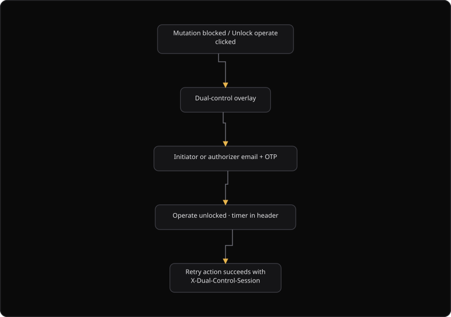

# Command Centre: Unlock operate

**Where:** **Unlock operate** in the header, or the dual-control prompt on a protected action
**What:** Opens one dual-control operate session. A protected write then sends the `X-Dual-Control-Session` header.
**Who:** An initiator or an authorizer. The one-time code always goes to your own account.
**Before you start:** An administrator assigned an initiator and an authorizer in SecureGraph Platform.

---

## Before you start

- SecureGraph Platform lists one initiator and one authorizer for the organization.
- You can open the mailbox for your own organization account.
- You know which action you want to run. The overlay shows the reason for the prompt.
- The action is a write. Reads do not need an operate session.

---

## Process flow

---

## Steps

1. Select **Unlock operate** in the header, or start a protected action.
2. Read the reason in the **Dual-control required** overlay. The reason names the action.
3. Confirm the account in the overlay. SecureGraph sends the 6-digit code to your own work email.
4. Select **Send code**.
5. Enter the 6-digit code from the email.
6. Select **Unlock operate session**.
7. Open the confirmation link in your email when the overlay asks you to confirm a new device.
8. Run the protected action again.
9. Select **Lock session** in the header when you finish.

The header then shows a green operate chip with your name, your role and a countdown. Select **Cancel action** in the overlay to stop without a session.

---

## Reference

| Item in the overlay | Meaning |
| --- | --- |
| **Dual-control required** | The title of the overlay. It opens on every protected action |
| Purpose | The value `dual_control`. It identifies the code type |
| **Who approves** | The name and the title of the initiator and the authorizer |
| Reason | The action that needs the session |
| 6-digit code | The one-time code from your own work email |
| **Cancel action** | Closes the overlay and stops the action |

| Session item | Value |
| --- | --- |
| Header on a protected write | `X-Dual-Control-Session` |
| Session purpose | `dual_control` |
| Idle time | About 3 minutes, as the overlay reports it |
| Device confirmation link | Expires after 15 minutes |
| Header display | An operate chip with a countdown and **Lock session** |

---

## Troubleshooting

| Symptom | Cause | Fix |
| --- | --- | --- |
| The action returns an operate error again | The operate session is missing or ended | Unlock operate, then repeat the action |
| The overlay opens on every write | SecureGraph Platform has no initiator or authorizer | Ask an administrator to assign both roles |
| The code does not arrive | The code went to another address, or the mail is delayed | Read the address in the overlay, then select **Resend code** |
| "Enter the 6-digit code" appears | The code has fewer than 6 digits | Enter all 6 digits |
| The operate chip disappears | The session ended | Unlock operate again |
| "Device confirmed. The dual-control session is active." does not appear | The confirmation link was not opened | Open the link in your email, then wait for the overlay to close |
| The overlay completes on its own | The tenant is the demo tenant | No action is necessary. The demo auto-provisions dual control |

---

## Related

- [01-sign-in.md](./01-sign-in.md)
- [14-authorizer-approvals.md](./14-authorizer-approvals.md)
- [../platform/04-assign-dual-control.md](../platform/04-assign-dual-control.md)
- [../platform/09-unlock-operate.md](../platform/09-unlock-operate.md)
