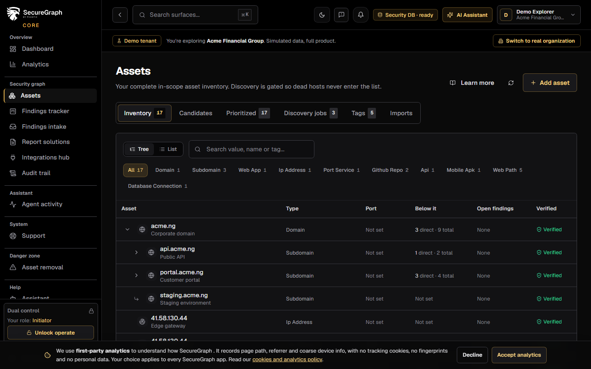
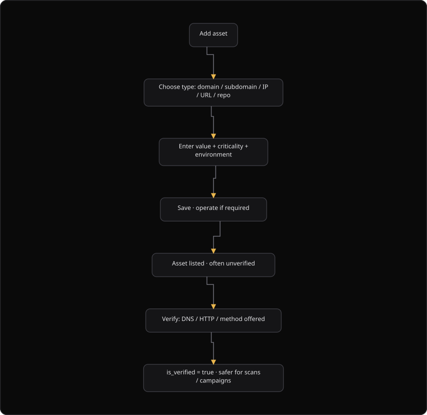
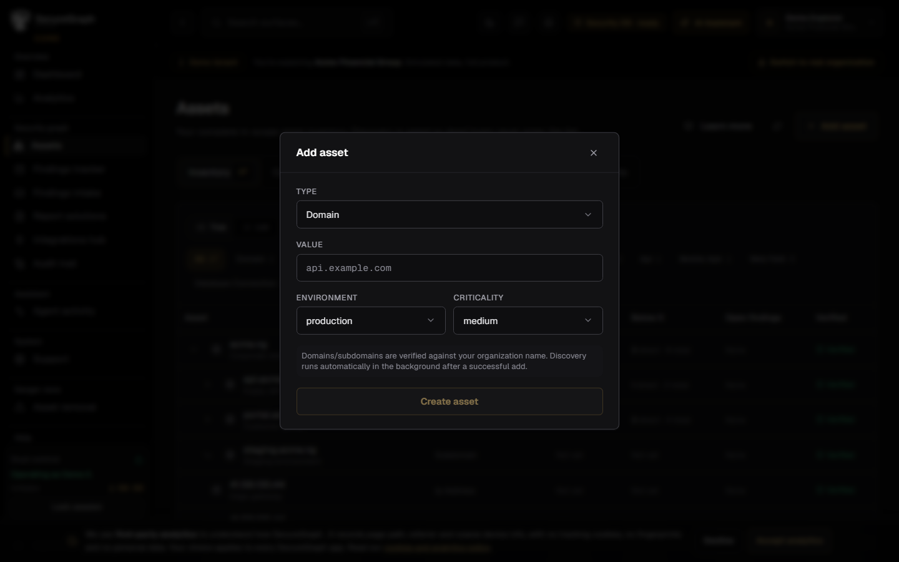
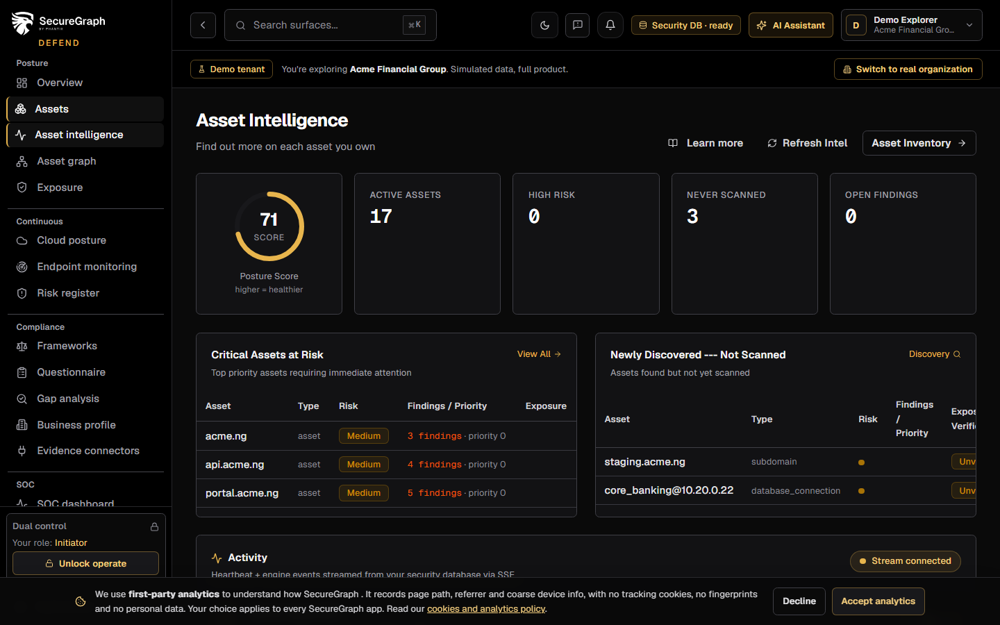

# Command Centre: Add and verify assets

**Where:** **Assets** → **Inventory** (`/assets`)
**What:** Adds an asset to the inventory and proves ownership. Discovery starts in the background after a successful add.
**Who:** Any operator. You need an operate session to add an asset and to verify it.
**Before you start:** Operate mode is unlocked, and your organization owns the asset.

---

## Before you start

- Operate mode is unlocked.
- You know the asset value, for example `api.example.com`.
- The organization owns the asset. SecureGraph verifies a domain or a subdomain against the organization name.
- The security database is available. Otherwise the page shows a banner.
- An unverified asset stays out of scope for work that needs verified targets.

---

## Process flow

---

## Steps

1. Open **Assets**.
2. Select **Add asset**.
3. Unlock operate when the dual-control overlay appears.
4. Select a **Type**. The list holds `domain`, `subdomain`, `web_path`, `ip_address`, `api`, `web_app`, `github_repo` and `other`.
5. Enter the **Value**. SecureGraph also copies the value into **Name**.

6. Select an **Environment**: `production` or `staging`.
7. Select a **Criticality**: `high`, `critical`, `medium` or `low`.
8. Select **Create asset**.
9. Read the result. The asset appears in the inventory, often without a verification chip.
10. Open the asset, then select **Re-verify ownership**.
11. Confirm the verification chip. It shows the method, for example a DNS TXT record or an HTTP probe.
12. Optional: open **Intelligence** for the risk score, the exposure level and the related findings.

### Confirm ownership when SecureGraph asks

1. Read the message "Verification Required" in the add dialog.
2. Select **I confirm my organization owns this asset**.
3. Select **Retry with confirmation**.

### Import assets from a source

1. Open **Assets**.
2. Select the **Imports** tab.
3. Connect GitHub, or import an OpenAPI or Postman specification, or upload a mobile build (APK).
4. Read the result. Imported items land in the same inventory.

A GitHub import needs a connection in SecureGraph Platform or a connected GitHub App.

### Classify an asset on demand

1. Open the asset.
2. Select **Classify**.
3. Read the result. It names the primary surface and the recommended process flow.

SecureGraph classifies an asset on every save. The classification is recomputed, so a metadata change cannot leave a stale `surface:` tag behind. Your own tags are never changed.

---

## Reference

| Field | Allowed values | Notes |
| --- | --- | --- |
| **Type** | `domain`, `subdomain`, `web_path`, `ip_address`, `api`, `web_app`, `github_repo`, `other` | The type decides which discovery job runs |
| **Value** | A host, a URL or a path | A `web_path` sits under a host that you already track |
| **Name** | Text | SecureGraph copies the value when you leave the field empty |
| **Environment** | `production`, `staging` | |
| **Criticality** | `high`, `critical`, `medium`, `low` | The default is `medium` |

You tag an asset with what you know, for example `production` or `pci-scope`. SecureGraph also derives what the asset **is**. A domain can be a web application, a REST API or a GraphQL endpoint, and SecureGraph tests each one differently.

SecureGraph derives tags from the type, the value, the metadata and the imports. These tags sit beside your own tags:

| Prefix | Example | Means |
| --- | --- | --- |
| `surface:` | `surface:graphql_api` | The primary shape to test |
| `cap:` | `cap:file_upload` | A capability that changes the process flow |
| `flow:` | `flow:spa_plus_api` | The test process flow the VAPT planner selects |
| `tech:` | `tech:wordpress` | A detected technology |

Use these tags to filter catalogs and to explain why a campaign tests one asset differently from another. Prefer a verified asset before a scan that can affect production. The classify action uses `POST /api/v1/asset-tags/assets/{id}/classify`. It returns the surface, the capabilities, the confidence and the tags it applied.

| Verification state | Meaning |
| --- | --- |
| A method chip, for example a DNS TXT record | The organization proved ownership |
| `inherited` | Ownership comes from a verified host above the asset in the chain |
| No chip | The asset is unverified. It stays out of verified-only work |

---

## Troubleshooting

| Symptom | Cause | Fix |
| --- | --- | --- |
| "Verification Required" appears in the add dialog | The domain did not match the organization name | Select **I confirm my organization owns this asset**, then select **Retry with confirmation** |
| "Enter a value" appears | The **Value** field is empty | Enter the asset value |
| "Could not add asset" appears | The value or the ownership detail is wrong | Check the value and the ownership detail, then try again |
| The asset shows no verification chip | Verification did not run, or it did not pass | Unlock operate, then select **Re-verify ownership** |
| "No discovery available" appears | The asset type has no discovery job | Use a `domain`, `subdomain`, `web_app`, `api`, `port_service` or `github_repo` asset |
| "A tag named ... already exists" appears | The tag name is in use | Use another tag name |
| The page shows a security database banner | The security database is not ready | Ask an administrator to connect the security database in SecureGraph Platform |
| "No prioritized assets yet" appears on the **Prioritized** tab | No scan has produced risk data | Run a scan, then open the tab again |

---

## Related

- [04-run-discovery.md](./04-run-discovery.md)
- [05-launch-a-scan.md](./05-launch-a-scan.md)
- [31-asset-removal.md](./31-asset-removal.md)
- [35-asset-intelligence.md](./35-asset-intelligence.md)
- [../platform/06-connect-security-database.md](../platform/06-connect-security-database.md)
