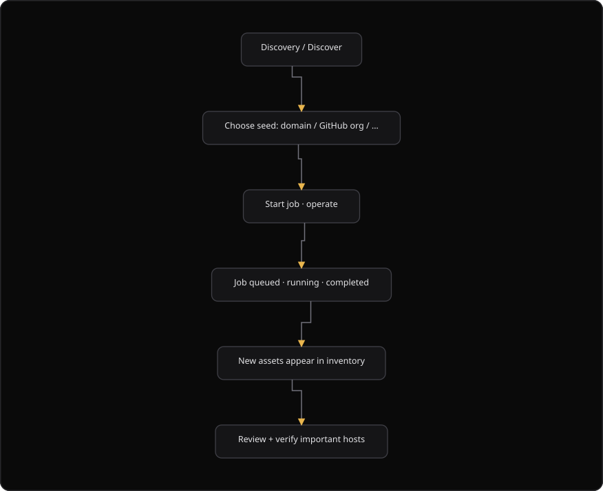

# Command Centre: Run asset discovery

**Where:** **Assets** → **Discovery jobs** (`/assets`)
**What:** Starts discovery jobs that find new hosts and paths. Every result lands in the inventory as an unverified asset.
**Who:** Any operator. You need an operate session to start a job, to retry a job or to promote a candidate.
**Before you start:** At least one asset of a supported type exists, and the security database is ready.

---

## Before you start

- The security database is ready.
- At least one asset exists in the inventory.
- Operate mode is unlocked.
- You accept that discovery sends requests to the target from the SecureGraph network.
- An `ip_address` asset has no automatic discovery. A `port_service` asset under it can be probed again.

---

## Process flow

---

## Steps

1. Open **Assets**.
2. Select the checkbox of each asset you want to discover.
3. Select **Run discovery**.
4. Unlock operate when the dual-control overlay appears.
5. SecureGraph then opens the **Discovery jobs** tab.
6. Watch the status of each job: `pending`, `queued`, `running`, `completed` or `failed`.
7. Read the job card. It lists the subdomains, the priority endpoints, the tools used and the errors.
8. Read the error text on a `failed` or `cancelled` job.
9. Select **Retry** on that job.
10. Refresh the inventory and triage the new unverified assets.
11. Verify the important hosts before a deep scan. See [03-add-and-verify-assets.md](./03-add-and-verify-assets.md).

SecureGraph polls an active job every 10 seconds. The tab also pauses polling while it is hidden.

### Find hidden assets with a passive search

1. Open **Assets**.
2. Select the **Candidates** tab.
3. Select **Find hidden assets**.
4. Enter a domain that the organization owns.
5. Select the sources. With no source selected, SecureGraph uses every enabled source.
6. Select **Resolve each host and flag dangling CNAMEs (takeover risk)** when you want a takeover check.
7. Select **Start search**.
8. Read each staged host in the list.
9. Select **Promote** on a real host. It then enters the inventory.
10. Select **Reject** on a host you do not want. It stays in the audit trail and is never promoted.

A candidate is not scannable until you promote it.

---

## Reference

| Asset type | Job type | What the job finds |
| --- | --- | --- |
| `domain` | `domain_enum` | Subdomains and directories |
| `subdomain` | `subdomain_enum` | Hosts under the subdomain |
| `web_app` or `api` | `directory_enum` | Directories and paths |
| `port_service` | `nmap` | Services on the port |
| `mobile_apk` | `apk_analyze` | Mobile package details |
| `github_repo` | `github_sync` | Repository assets |
| An owned domain, through a passive search | `passive_enum` | Staged hostnames from passive sources |

| Job status | Meaning |
| --- | --- |
| `pending` | The job waits for a worker |
| `queued` | The job holds a place in the queue |
| `running` | The job runs now |
| `completed` | The job finished |
| `failed` | The job stopped with an error. Select **Retry** |
| `cancelled` | The job stopped on request. Select **Retry** |

| Passive source | What it reads |
| --- | --- |
| Common Crawl | Crawl data |
| Wayback | Archived pages |
| Cert Spotter | Certificate transparency |
| crt.name | Certificate transparency |
| urlscan.io | Scan results |
| OTX passive DNS | Passive DNS |
| Mnemonic passive DNS | Passive DNS |

| Candidate field | Meaning |
| --- | --- |
| Resolve state | `resolves`, `dangling`, `unresolved` or `unknown` |
| Takeover risk | `high` when a dangling CNAME points at a deprovisioned service |
| Status | `candidate`, `promoted` or `rejected` |

---

## Troubleshooting

| Symptom | Cause | Fix |
| --- | --- | --- |
| "No discovery available" appears | The selected asset type has no discovery job | Select a `domain`, `subdomain`, `web_app`, `api`, `port_service`, `mobile_apk` or `github_repo` asset |
| "Some jobs failed" appears | Some assets could not start discovery | Open the **Discovery jobs** tab, then select **Retry** on each failed job |
| A job stays `queued` | A worker is busy | Wait. SecureGraph polls every 10 seconds while a job is active |
| A job shows `failed` | The target refused the request, or the security database restarted | Read the error text, then select **Retry** |
| The **Retry** button is absent | The job is not `failed` or `cancelled` | Wait for the job to finish |
| The candidate list is empty | The passive search found nothing, or it still runs | Wait, then select **Find hidden assets** again |
| "Could not start the search" appears | The domain is empty, or the request failed | Enter a domain that the organization owns |
| "Rejection is available on a real organization, not in the demo tenant" appears | The tenant is the demo tenant | Use a real organization for a rejection |
| "No discovery jobs" appears | No discovery job has run | Add a domain or a subdomain asset, then run discovery |

---

## Related

- [03-add-and-verify-assets.md](./03-add-and-verify-assets.md)
- [05-launch-a-scan.md](./05-launch-a-scan.md)
- [31-asset-removal.md](./31-asset-removal.md)
- [35-asset-intelligence.md](./35-asset-intelligence.md)
