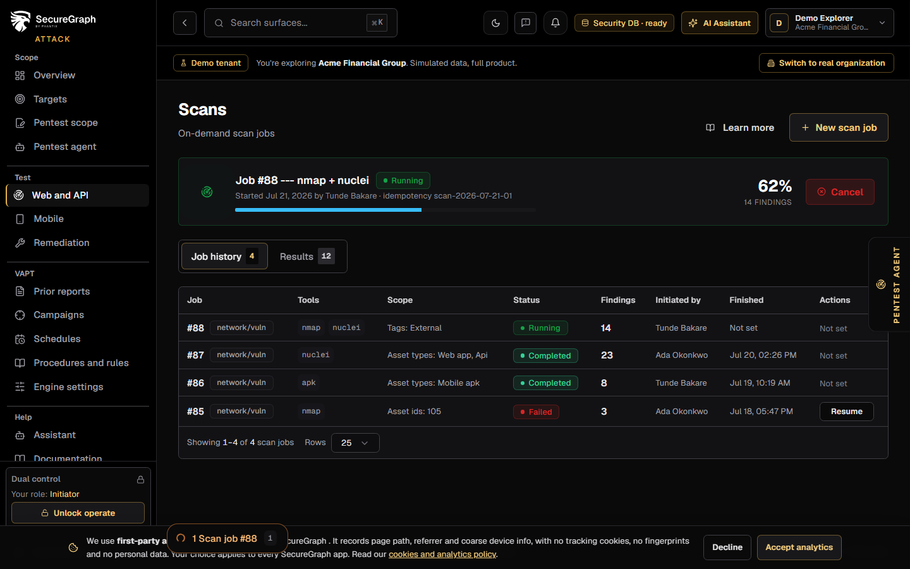
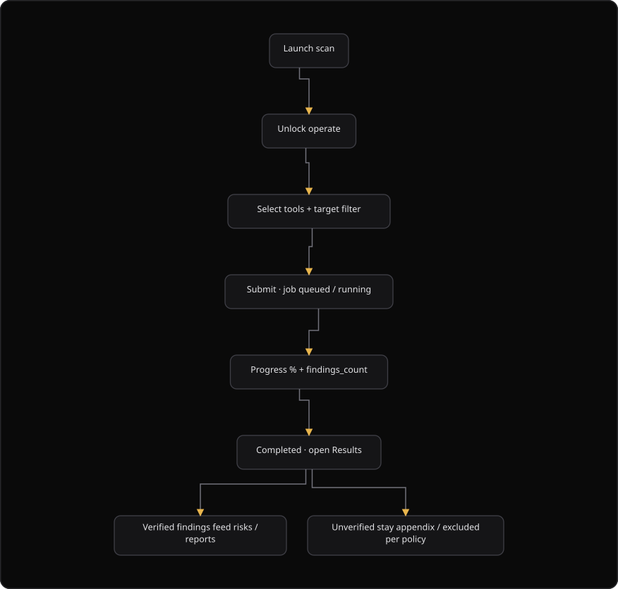

# Command Centre: Launch a scan

**Where:** **Scans** (`/scans`)
**What:** Starts one network or vulnerability scan job against assets in scope. One scan job runs at a time for each organization.
**Who:** Any operator. You need an operate session to start, resume or cancel a scan.
**Before you start:** An asset is in scope, operate mode is unlocked, and the scan slot is free.

---

## Before you start

- Operate mode is unlocked.
- At least one asset matches the target filter.
- No other network scan job is active. SecureGraph allows one active scan job for each organization.
- A target that you confirmed ownership of needs the Acceptable Use Policy and the Rules of Engagement. SecureGraph asks for them once.
- The GitHub analysis job is a separate job family. It does not hold the scan slot.

---

## Process flow

---

## Steps

1. Open **Scans**.
2. Select **New scan job**.
3. Unlock operate when the dual-control overlay appears.
4. Select one or more **Tools**: `nmap`, `nuclei` or `apk`. SecureGraph uses `nmap` when you select none.
5. Select a **Target filter**.
6. Select **Create job**.
7. Read the active job banner. It shows the job ID, the tools, the progress and the finding count.
8. Wait for the status `completed`.
9. Open the **Results** tab.
10. Select a finding and read the evidence and the impact analysis.
11. Select **Verify**, **False positive** or **Reject** as a manual review decision.
12. Add an optional note. The reporting gate then uses this decision.

The active job banner also shows the initiator, the start time and the idempotency key. Select **Cancel** to stop the job.

### Resume a stopped job

1. Open the **Job history** tab.
2. Find a job with the status `interrupted`, `completed_partial` or `failed`.
3. Select **Resume**.
4. Read the result. SecureGraph clones the job and skips the completed work.

### Accept the policy for an owned target

1. Read the **Acceptable Use Policy** and the **Rules of Engagement** in the consent dialog.
2. Accept both documents.
3. Select **New scan job** again, then create the job.

---

## Reference

| Tool | What it does |
| --- | --- |
| `nmap` | Network and service scan |
| `nuclei` | Template-based vulnerability checks |
| `apk` | Mobile package analysis |

| Target filter | Scope |
| --- | --- |
| `tags = external` | Every asset tagged `external` |
| `tags = pci-scope` | Every asset tagged `pci-scope` |
| `types = web_app, api` | Every asset of type `web_app` or `api` |
| `entire inventory` | Every asset |

| Job status | Meaning |
| --- | --- |
| `pending` | The job waits for a worker |
| `queued` | The job is next in line |
| `running` | The job scans now. The banner shows a percentage and a finding count |
| `completed` | The job finished |
| `completed_partial` | The job finished part of the scope. Select **Resume** |
| `interrupted` | The job stopped before it finished. Select **Resume** |
| `failed` | The job stopped with an error. Select **Resume** when the server allows it |
| `cancelled` | An operator cancelled the job |

| Verification status | Meaning |
| --- | --- |
| `auto_verified` | SecureGraph confirmed the finding from the evidence |
| `manually_verified` | An operator confirmed the finding |
| `unverified` | No confirmation. The finding stays out of a verified-only report |
| `rejected` | The finding is not accepted |
| `false_positive` | The finding is not a real weakness |

The tool guard allows `http` and `https` targets only. It blocks private ranges and cloud metadata, and it defends against DNS rebinding. Tool execution prefers Docker isolation with one lock for each organization.

A time budget and host dedupe can skip a host that a job already scanned. The campaign documents under [23-vapt-schedules.md](./23-vapt-schedules.md) describe both settings.

---

## Troubleshooting

| Symptom | Cause | Fix |
| --- | --- | --- |
| "Scan slot locked" appears | Another network scan job is active | Wait for the job, or select **Cancel** |
| A 409 error appears | Another job holds the organization lock | Wait, then start the job again |
| The consent dialog appears after **Create job** | The target has confirmed ownership only | Accept the Acceptable Use Policy and the Rules of Engagement, then create the job again |
| "Scan failed" appears | The request failed, or a target is not allowed | Read the message, then check the target against the tool guard |
| A job shows `failed` or `interrupted` | The job stopped before it finished | Select **Resume**. SecureGraph skips the completed work |
| **Resume** is absent for a job | The job is not resumable | Create a new scan job |
| The results list is empty | The job found nothing, or the filter hides the rows | Clear the search, then set the verification filter to `all` |
| A **Verify** decision has no effect | The finding already holds that status | Choose another decision, or read the current status |
| A GitHub analysis job does not block a scan | GitHub analysis is a separate job family | No action is necessary |

---

## Related

- [03-add-and-verify-assets.md](./03-add-and-verify-assets.md)
- [04-run-discovery.md](./04-run-discovery.md)
- [06-run-vapt-campaign.md](./06-run-vapt-campaign.md)
- [11-generate-reports.md](./11-generate-reports.md)
- [12-findings-tracker.md](./12-findings-tracker.md)
