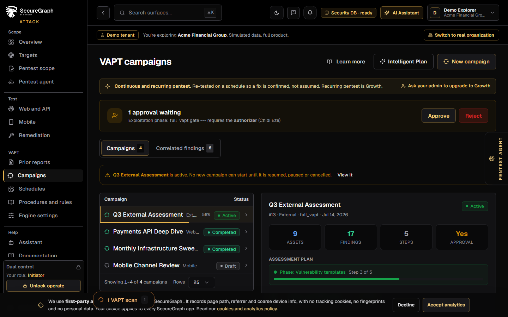
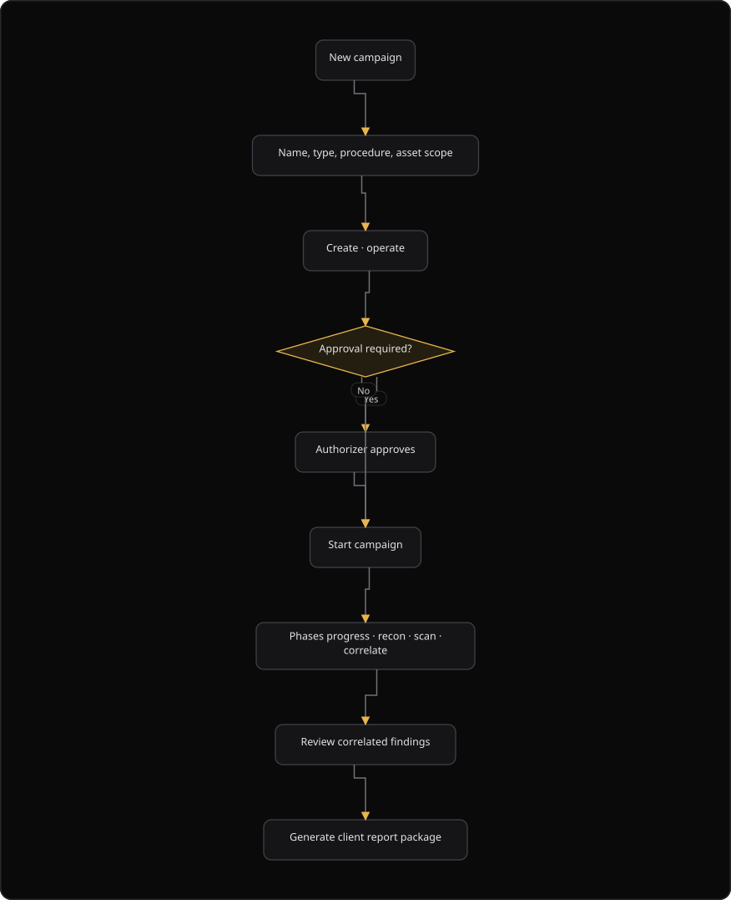
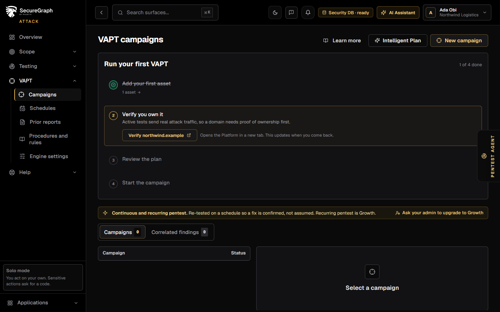

# Command Centre: Run a VAPT campaign

**Where:** **VAPT Campaigns** (`/vapt`)
**What:** Runs a vulnerability assessment and penetration testing (VAPT) campaign against assets in scope. The campaign follows the process flow of each asset.
**Who:** Any operator. An authorizer approves a campaign that needs approval.
**Before you start:** Assets are in scope, operate mode is unlocked, and no other campaign is active.

---

## Before you start

- Operate mode is unlocked.
- The target assets exist in the inventory. The planner reads the inferred surface of each asset.
- No other campaign is `active`, `pending_approval` or `paused`. SecureGraph allows one campaign at a time for each organization.
- A Full VAPT campaign needs authorizer approval before it runs.
- On the Free plan, the shared pool holds 10 campaigns for each day across every free organization. One organization gets 1 request for each week.

---

## Process flow

---

## Steps

### Run your first VAPT

Until a campaign has started, **VAPT Campaigns** shows **Run your first VAPT**. It leads through four steps and ticks each one from your data, so you can leave and come back.

1. **Add your first asset.** Select **Add an asset**. **Targets** opens with the add dialog. Save the domain, IP address or app, and SecureGraph returns you to **VAPT Campaigns**.
2. **Verify you own it.** Select **Verify** with your domain. The Platform opens in a new tab at the domain check. The step ticks when you come back. An IP address needs no domain check.
3. **Review the plan.** Select **Review the plan**. Read the proposed steps, turn off any vulnerability type you do not want, and select **Create draft campaign**.
4. **Start the campaign.** Select **Start** with the draft name. An authorizer approves the campaign when one is required.

### Create a campaign

1. Open **VAPT Campaigns**.
2. Select **New campaign**.
3. Unlock operate when the dual-control overlay appears.
4. Enter a **Name**.
5. Select a **Type**: `web_scan`, `infra_scan`, `api_scan`, `full_vapt` or `mobile_dynamic`.
6. Select a **Procedure**.
7. Select a **Research depth**: **Standard** or **Extended proof-of-concept**.
8. Select the authorization boxes when the procedure asks for them. The login bruteforce option needs the text `BRUTEFORCE` as confirmation.
9. Select **Create**. The campaign then starts as a `draft`.
10. Open the campaign and read the plan: the steps, the vulnerability types and the process flows.
11. Select **Start**.
12. Wait for the authorizer when the status is `pending_approval`.
13. Watch the phase progress: recon, scan and correlate.
14. Open the findings and verify the important items.
15. Generate the report package. See [11-generate-reports.md](./11-generate-reports.md).

### Run an intelligent plan

1. Select **Intelligent Plan**.
2. Wait for the plan. It shows the vulnerability types of each step.
3. Read the review dialog. It names the inferred surfaces and the process flow of each step.
4. Turn off any vulnerability type that you do not want.
5. Select **Create draft campaign**.
6. Review the plan, then select **Start**.

The generated plan holds one row for each step. Each row names the `process_flow` of the step, the vulnerability-type substeps and the checks that SecureGraph selected from the live catalog.

The plan is a proposal. Generate a plan with `POST /api/v1/vapt/plan`. Execute a modified plan with `POST /api/v1/vapt/plan/execute`. Do not start a plan directly.

---

## Reference

| Campaign field | Allowed values |
| --- | --- |
| **Type** | `web_scan`, `infra_scan`, `api_scan`, `full_vapt`, `mobile_dynamic` |
| **Procedure** | `web_scan`, `web_app_scan_only`, `full_vapt`, `infra_scan`, `api_scan`, `webhook_graphql_scan`, `caido` |
| **Research depth** | **Standard** or **Extended proof-of-concept** |

| Campaign status | Meaning |
| --- | --- |
| `draft` | The campaign exists and waits for a start |
| `pending_approval` | An authorizer must approve the campaign |
| `active` | The campaign runs now |
| `paused` | An operator paused the campaign |
| `completed` | The campaign finished |
| `failed` | The campaign stopped with an error |
| `cancelled` | An operator cancelled the campaign |

A campaign holds one row for each step. Each row shows the class of weakness that the step tests, the duration limit and the host dedupe setting.

### Test process flows

The campaign does not run one generic scan. The inferred surface of each asset selects a **process flow**, so a web application, a REST API and a GraphQL endpoint are tested differently. The planner turns off a phase that an estate cannot exercise, for example browser XSS and screenshots on an API-only scope. It turns on the phases it can run, for example GraphQL introspection, broken object level authorization (BOLA), insecure direct object reference (IDOR) and OpenAPI fuzzing.

| Surface | Process flow |
| --- | --- |
| Web application | Crawl, XSS, upload, screenshots, authentication |
| REST and OpenAPI | Route discovery, schema fuzzing, BOLA, JWT |
| GraphQL | Introspection, operation discovery, authorization |
| Infrastructure | Network and service scan, plus templates |

### Retest after remediation

**Retest** re-checks whether a finding still holds after a fix. It runs the deterministic findings check first. Only when that check cannot decide does the AI engine judge the finding from its stored evidence. The user interface shows which engine decided.

| Retest outcome | Result |
| --- | --- |
| **Resolved** | SecureGraph marks the finding a false positive and clears the human review flag |
| **Still present** | SecureGraph flags the finding for human review |
| **Inconclusive** | No status change. A human keeps the finding |

Retest is a finding action inside the campaign detail. It does not start a new campaign.

---

## Troubleshooting

| Symptom | Cause | Fix |
| --- | --- | --- |
| A 409 error names another campaign | Another campaign is `active`, `pending_approval` or `paused` | Pause or cancel the active campaign, then start again |
| "Can't do that right now" appears | The server refused the action | Read the message, then pause or cancel the active campaign |
| The status is `pending_approval` | The campaign needs an authorizer | The authorizer approves it in **Authorizations** |
| The action is parked for an authorizer | The action needs dual control | Approve it from **Authorizations** |
| "Enter a campaign name" appears | The **Name** field is empty | Enter a name |
| "Bruteforce authorization" appears | The confirmation text is missing | Enter `BRUTEFORCE` in the confirmation dialog |
| The quota strip shows 0 of 10 | The shared free pool is empty | The request is queued. It runs when the pool rolls over |
| "Create failed" appears | The request failed | Read the message, then create the campaign again |
| A retest shows **Inconclusive** | Neither engine could decide | Leave the finding for a human reviewer |

---

## Related

- [11-generate-reports.md](./11-generate-reports.md)
- [14-authorizer-approvals.md](./14-authorizer-approvals.md)
- [23-vapt-schedules.md](./23-vapt-schedules.md)
- [26-pentest-scope.md](./26-pentest-scope.md)
- [33-remediation.md](./33-remediation.md)
