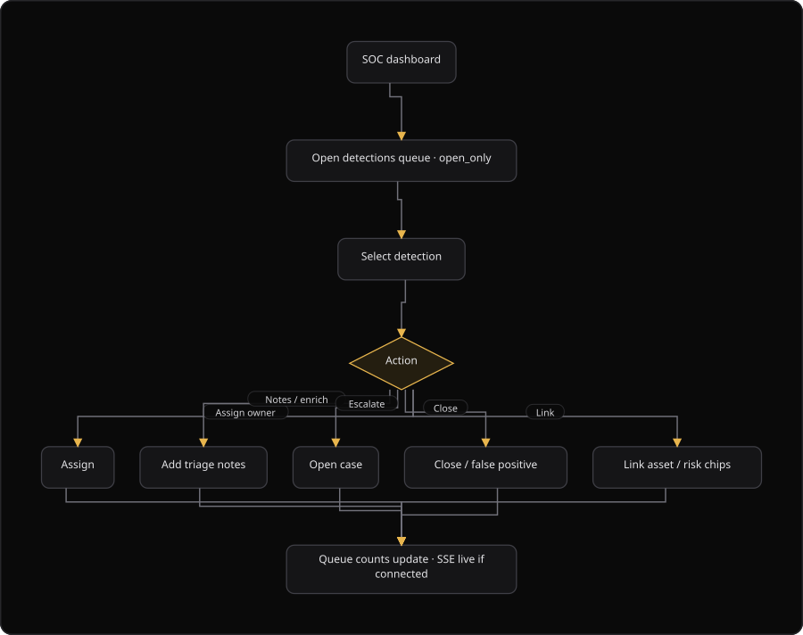

# Command Centre: Triage SOC detections

**Where:** **SOC Monitor** (`/soc`)
**What:** Triages security operations center (SOC) detections. You can acknowledge, assign, escalate, link or close a detection.
**Who:** Any operator. Every triage action writes to the security database.
**Before you start:** The SOC section is enabled for the organization.

---

## Before you start

- The **SOC Monitor** section is enabled for the organization. Otherwise the page shows a locked section.
- The security database is available.
- You know the detection ID when you open a deep link.
- Closing a detection writes a reason. The default reason is "False positive or resolved".

---

## Process flow

---

## Steps

1. Open **SOC Monitor**.
2. Read the three summary cards: **Open queue**, **Critical open** and **Posture**.
3. Read the open count for each severity in the strip.
4. Filter the queue by **status** and by **severity**, or search a title, a summary or an assignee.
5. Select a detection. A deep link uses `/soc?id=` plus the detection ID.
6. Read the evidence, the correlator, the asset and the risk of the detection.
7. Select **Acknowledge** to move the detection from `open` to `acknowledged`.
8. Select **Assign to me** to set the owner.
9. Select **Escalate to case** to open an incident case. SecureGraph links the detection to the case.
10. Select **Close** when the detection is done. SecureGraph writes "False positive or resolved" as the reason.
11. Open the **Cases** tab to work a multi-detection incident.
12. Add a timeline note to a case when the case detail supports it.

The **Triage queue** tab loads open detections only, up to 200 rows. SecureGraph updates the counts from the live stream when the stream is connected.

### Work a case

1. Open the **Cases** tab.
2. Select **Open case** to create a case without a detection.
3. Enter a title, a summary, a severity and an assignee.
4. Select **Create case**.
5. Open the case and read the linked detections and the timeline notes.
6. Select a status: `open`, `investigating`, `contained` or `closed`.
7. Add a note to record each step of the investigation.

---

## Reference

| Tab | Content |
| --- | --- |
| Overview | Detection trend, posture and the intelligence panels |
| Triage queue | The open detections |
| Cases | The incident cases, with a count |
| Availability | The endpoint checks and the heartbeat agent |
| Rules | The detection rules, with a count |
| Adapters | The connectors, with a count of configured adapters |

| Detection status | Meaning |
| --- | --- |
| `open` | No operator has reviewed the detection |
| `acknowledged` | An operator saw the detection |
| `assigned` | The detection has an owner |
| `escalated` | The detection is linked to a case |
| `closed` | The detection is done |

| Case status | Meaning |
| --- | --- |
| `open` | The case is new |
| `investigating` | An analyst works the case |
| `contained` | The impact is contained |
| `closed` | The case is done |

| Detection field | Meaning |
| --- | --- |
| Asset | The linked asset ID, or "Not set" |
| Risk | The linked risk ID, or "Not set" |
| Correlator | The rule that matched |
| Assignee | The owner reference, for example `user:12` |
| Source | Where the detection came from, for example `correlator`, `manual` or `enrichment` |
| Occurrences | The number of times the same detection fired |

Severity values are `critical`, `high`, `medium` and `low`.

---

## Troubleshooting

| Symptom | Cause | Fix |
| --- | --- | --- |
| "Assign failed" appears | The assignment request failed | Retry. The toast reports the message |
| "Escalate failed" appears | The escalation request failed | Retry. A detection that is `escalated` or `closed` cannot escalate again |
| "Already escalated" appears | The detection already has a case | Open the case from the case chip |
| The queue counts do not change | The live stream is disconnected | Open another tab, then return to **Triage queue** |
| "Case title required" appears | The case form has no title | Enter a title |
| A detection stays `open` with no owner | No operator acknowledged it | Select **Acknowledge**, then select **Assign to me** |
| The detection list is empty | The queue holds open detections only | Clear the status filter to see every status |
| A critical detection is unowned in the strip | The detection is `open` or `acknowledged` | Assign an owner before you close the working day |

---

## Related

- [08-availability-monitoring.md](./08-availability-monitoring.md)
- [25-soc-operations.md](./25-soc-operations.md)
- [29-dashboard.md](./29-dashboard.md)
- [36-incidents.md](./36-incidents.md)
