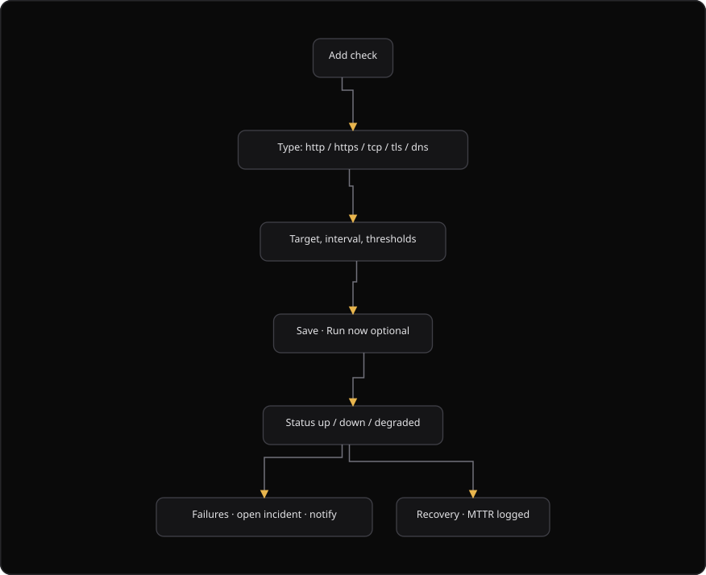
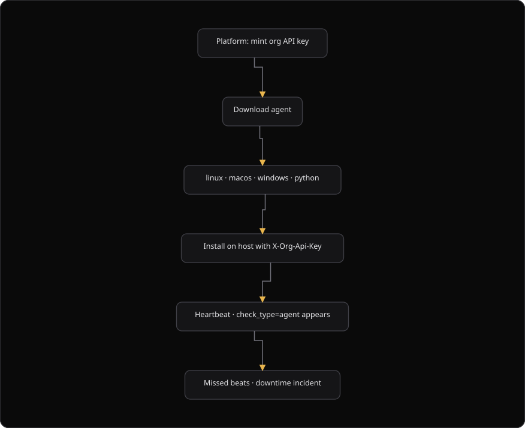

# Command Centre: Availability monitoring and heartbeat agent

**Where:** **Continuous** → **Endpoint monitoring** (`/endpoint-monitoring`), and **Availability** inside **SOC Monitor**
**What:** Watches an endpoint with an outbound check, or with a heartbeat from a private host. A failure opens an incident and records the time to repair.
**Who:** Any operator. You need an operate session to save, run or delete a check on the endpoint monitoring page.
**Before you start:** The target is reachable, and you know the expected response.

---

## Before you start

- The **SOC Monitor** section is enabled for the organization.
- You know the URL, the host and the port, or the hostname of the target.
- You know the expected status code and a keyword in the body when the check is `http` or `https`.
- Operate mode is unlocked for a write on the endpoint monitoring page.
- A private host needs an organization service key. Never put a personal sign-in token on a server.

---

## Process flow

### Outbound checks

### Private host agent

---

## Steps

### Add a check

1. Open **SOC Monitor**.
2. Select **Availability**.
3. Select **Add check**. On the endpoint monitoring page, select **New monitor** instead.
4. Enter a **Name**.
5. Select a **Check type**: `http`, `https`, `tcp`, `tls` or `dns`.
6. Enter the **Target**. Use a URL, `host:port` or a hostname.
7. Set the **Interval** in seconds. The allowed range is 30 to 900.
8. Set the **Failures to down** value. The allowed range is 1 to 20.
9. Select a **Severity when down**: `critical`, `high`, `medium` or `low`.
10. Optional for `http` and `https`: set the **Expected HTTP status** and the **Expected keyword**.
11. Select **Create check**. On the endpoint monitoring page, select **Create monitor**.
12. Select **Run now** on the check row.
13. Confirm the status: `up`, `down` or `degraded`.

### Install the heartbeat agent

1. Open the **Availability** tab in **SOC Monitor**.
2. Read the **Download heartbeat agent** card. It states that SecureGraph does not use a VPN.
3. Download the package for your operating system: Linux, macOS, Windows or Python-only.
4. Read the `sha256` value of the package.
5. Open the install commands accordion.
6. Run the install command with your organization service key.
7. Confirm that the new check `agent://hostname` shows the status `up`.

The agent sends the heartbeat with the `X-Org-Api-Key` header. The endpoint is `/api/v1/soc/availability/heartbeat`.

### Work an incident

1. Open the **Incidents** tab.
2. Read the incident duration and the `issue_type` value.
3. Select **Acknowledge** to record the acknowledgement time.
4. Select **Mark false positive** to exclude the incident from the mean time to repair (MTTR) and the service level agreement (SLA).
5. Read the recovery row. SecureGraph records the MTTR when the endpoint recovers.

---

## Reference

| Check type | What it tests |
| --- | --- |
| `http` | An HTTP request to a URL |
| `https` | An HTTPS request to a URL |
| `tcp` | A TCP connection to `host:port` |
| `tls` | The TLS certificate of a host |
| `dns` | A DNS lookup for a hostname |

| Check field | Limit |
| --- | --- |
| **Interval** | 30 to 900 seconds. The default is 120 |
| **Timeout** | 1 to 60 seconds. The default is 8 |
| **Failures to down** | 1 to 20. The default is 3 |
| **Successes to up** | The number of good probes before recovery. The default is 2 |
| **Severity when down** | `critical`, `high`, `medium` or `low` |
| **Notify down**, **Notify recovery** | On or off |

| Dialog | SOC Monitor → Availability | Endpoint monitoring page |
| --- | --- | --- |
| Create button | **Add check** | **New monitor** |
| Dialog title | **Add monitor** | **New endpoint monitor** |
| Submit button | **Create check** | **Create monitor** |
| Edit button | **Save check** | **Save changes** |

An endpoint monitor on the endpoint monitoring page adds these fields:

| Field | Values |
| --- | --- |
| **Method** | `GET`, `HEAD`, `POST`, `PUT`, `PATCH`, `DELETE`, `OPTIONS` |
| **Auth type** | `none`, `bearer`, `basic`, `api_key`, `cookie` |
| **Latency threshold (ms)** | A number in milliseconds |
| **TLS expiry warn (days)** | The warning threshold. The default is 14 |
| **Required JSON keys** | A comma-separated list |
| Security checks | Check TLS, check auth enforced, check response drift |
| **Endpoint is public (allow unauthenticated)** | On or off |

| Status | Meaning |
| --- | --- |
| `up` | The check passes |
| `down` | The check fails `failures_to_down` times in a row |
| `degraded` | The check passes, but a security check fails or the latency exceeds the threshold |
| `unknown` | No probe has run yet |

| Agent download | File name |
| --- | --- |
| Linux (systemd) | `phantix-heartbeat-linux.tar.gz` |
| macOS (launchd) | `phantix-heartbeat-macos.tar.gz` |
| Windows (Task Scheduler) | `phantix-heartbeat-windows.zip` |
| Python-only | `phantix_heartbeat.py` |

| Operate requirement | Scope |
| --- | --- |
| No operate session | Create, edit and delete a check in **SOC Monitor** → **Availability** in version 0.2 |
| Operate session | Save, run, delete, acknowledge and false positive on the endpoint monitoring page |

Downloads are reads. Any external tool, for example Uptime Kuma, Healthchecks or Alertmanager, can open and close an MTTR incident through the availability webhook of the organization. Both the webhook and the organization API key are available from the Integrations Hub.

---

## Troubleshooting

| Symptom | Cause | Fix |
| --- | --- | --- |
| A check stays `down` after the endpoint recovers | The recovery threshold is not reached | Wait for the number of good probes in **Successes to up** |
| "Saving an endpoint monitor requires a dual-control operate session" appears | Operate mode is locked | Unlock operate, then save again |
| The agent does not appear in the list | The host cannot reach SecureGraph, or the key is wrong | Check the host network and the `X-Org-Api-Key` value |
| The install command fails | The organization service key is missing | Create a service key in SecureGraph Platform, then run the command again |
| A download shows `sha256: Not set` | The catalog holds no checksum for that package | Read the walkthrough and follow the check policy of your organization |
| "Could not update" appears | The incident action failed | Retry. The toast reports the message |
| Incidents stay open with no owner | No operator acknowledged them | Select **Acknowledge** |
| The MTTR value is lower than expected | An incident is marked false positive and excluded from the SLA | Open the incident and read the flag |
| "No open incidents" appears while a check is `down` | The check has not failed `failures_to_down` times | Wait for the failure threshold |

---

## Related

- [07-triage-soc.md](./07-triage-soc.md)
- [25-soc-operations.md](./25-soc-operations.md)
- [29-dashboard.md](./29-dashboard.md)
- [36-incidents.md](./36-incidents.md)
