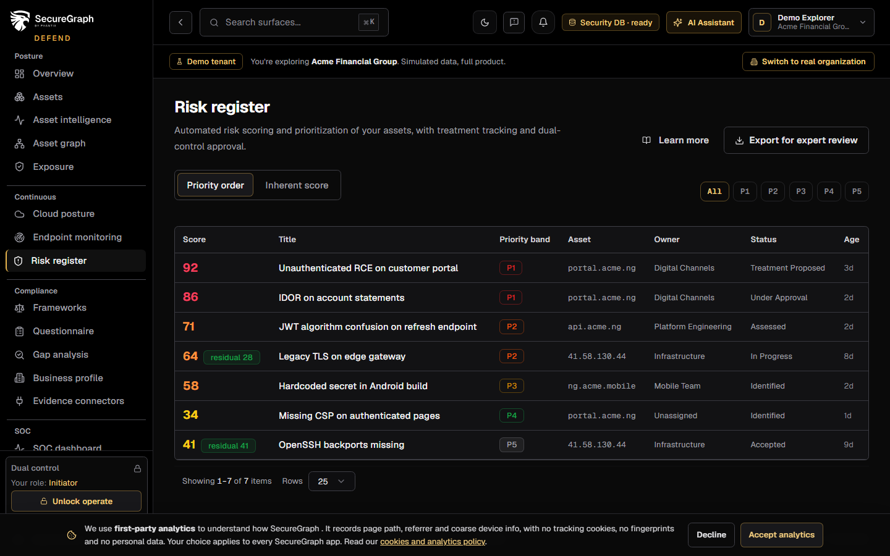
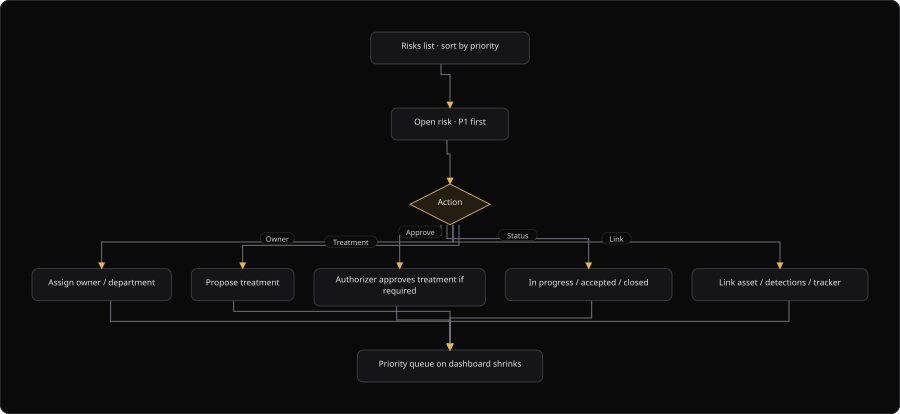

# Command Centre: Manage risks

**Where:** **Risks** (`/risks`)
**What:** Works the risk register in priority order. You can assign an owner, propose a treatment and accept or close a risk.
**Who:** Any operator for a read. An owner assignment and a treatment need an operate session.
**Before you start:** Findings exist, and SecureGraph scored at least one risk.

---

## Before you start

- Assets and findings exist. SecureGraph builds each risk from them.
- Operate mode is unlocked for a write.
- The authorizer is available. A treatment approval needs the dual-control session of the authorizer.
- You know the owner department from the allowed list.

---

## Process flow

---

## Steps

1. Open **Risks**.
2. Select a tab: **Priority order** or **Inherent score**.
3. Filter by priority band: **All**, `P1`, `P2`, `P3`, `P4` or `P5`.
4. Open a risk. A deep link uses `/risks?id=` plus the risk ID.
5. Read the four score tiles: **Inherent**, **Residual**, **Likelihood** and **Impact**.
6. Read the risk scoring breakdown and the priority factors.
7. Unlock operate when the dual-control overlay appears.
8. Select an **Owner department**.
9. Select **Assign owner**.
10. Select **Propose treatment** to record a treatment plan against the risk.
11. Ask the authorizer to approve or reject the treatment.
12. Read the treatment chip in the risk header. It shows the current treatment status.
13. Track the status of the risk until it is closed or accepted.
14. Select **View history** to read every recorded change.
15. Select **Export for expert review** to download `risks-export.json`.

Residual risk is recalculated on propose, approve and complete.

---

## Reference

| Field | Meaning |
| --- | --- |
| **Inherent** | The score before treatment |
| **Residual** | The score after treatment |
| **Likelihood** | A value from 1 to 4 |
| **Impact** | A value from 1 to 4 |
| **Priority band** | `P1` to `P5` |
| **Owner department** | One value from the allowed list |
| Treatment status | `proposed`, `approved` or `completed` |
| **Age** | The number of days since SecureGraph created the risk |

| Priority band | Label |
| --- | --- |
| `P1` | P1 · Immediate |
| `P2` | P2 · This week |
| `P3` | P3 · This month |
| `P4` | P4 · Planned |
| `P5` | P5 · Backlog |

| Owner department | Allowed values |
| --- | --- |
| Every department | `IT`, `Security`, `Finance`, `Operations`, `Legal`, `Compliance`, `Engineering`, `Executive`, `Other` |

| Risk status | Meaning |
| --- | --- |
| `identified` | SecureGraph created the risk |
| `assessed` | The risk has a score |
| `treatment_proposed` | A treatment plan exists |
| `under_approval` | An authorizer reviews the treatment |
| `in_progress` | The fix is in progress |
| `accepted` | The organization accepts the risk |

| Export route | Result |
| --- | --- |
| `/risks/export?format=json` | The file `risks-export.json` |

The owner write uses `owner_department` or `owner_user_id`. A bare `owner` value is ignored by the API and is never stored.

---

## Troubleshooting

| Symptom | Cause | Fix |
| --- | --- | --- |
| "Owner department must be one of ..." appears | The department is not in the allowed list | Select a department from the list |
| "Choose an owner department" appears | No department is selected | Select a department, then select **Assign owner** |
| "Proposing risk treatment requires a dual-control operate session" appears | Operate mode is locked | Unlock operate, then select **Propose treatment** again |
| "Export failed" appears | The download failed | Check the connection, then select **Export for expert review** again |
| The residual score does not change | The treatment is not approved or complete | Ask the authorizer to decide the treatment |
| A risk has no owner | No operator assigned one | Select an **Owner department**, then select **Assign owner** |
| "No history entries" appears | SecureGraph recorded no change | Continue. History appears after the first write |
| "No rule factors" appears in the breakdown | The score uses no rule factor | Read the findings counts panel instead |
| The list is empty | No finding has produced a risk | Run a scan or a campaign, then open **Risks** again |

---

## Related

- [03-add-and-verify-assets.md](./03-add-and-verify-assets.md)
- [07-triage-soc.md](./07-triage-soc.md)
- [12-findings-tracker.md](./12-findings-tracker.md)
- [14-authorizer-approvals.md](./14-authorizer-approvals.md)
- [33-remediation.md](./33-remediation.md)
