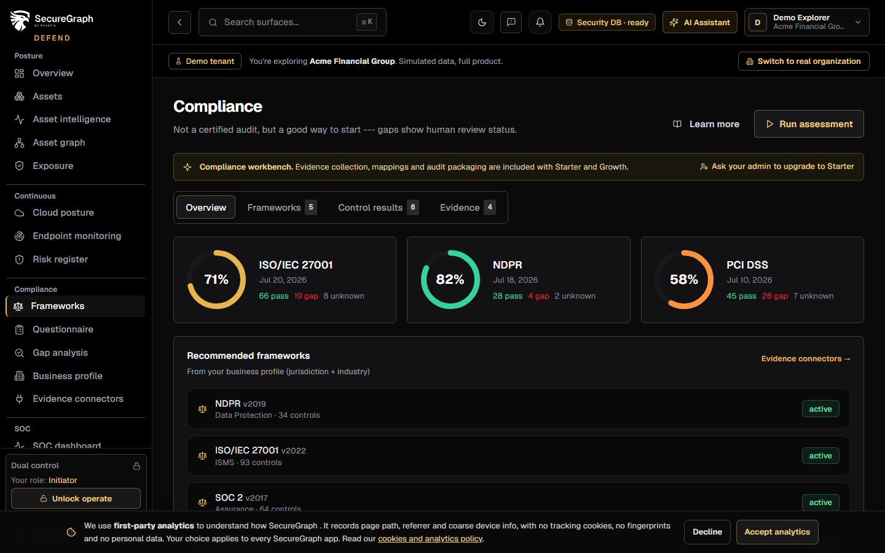
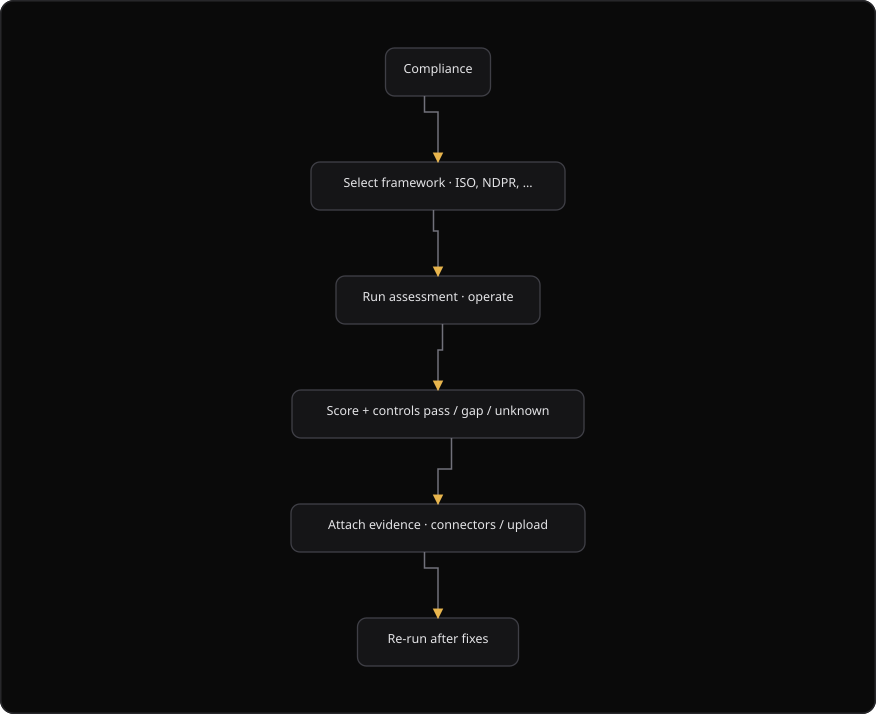

# Command Centre: Run a compliance assessment

**Where:** **Compliance** (`/compliance`)
**What:** Scores the controls of a framework against the questionnaire and the posture of the organization. Each control is a pass, a gap or unknown.
**Who:** Any operator. You need an operate session to run an assessment and to register evidence.
**Before you start:** The compliance section is enabled, and at least one framework is available.

---

## Before you start

- The compliance section is enabled for the organization.
- SecureGraph loaded at least one framework.
- Assets and verified findings exist when you select **Include posture**.
- The questionnaire is complete when you select **Include questionnaire**.
- Operate mode is unlocked.

An assessment is not a certified audit. It shows where to start, and each gap shows its human review status.

---

## Process flow

---

## Steps

1. Open **Compliance**.
2. Read the score ring and the control counts for each framework.
3. Select **Run assessment**.
4. Unlock operate when the dual-control overlay appears.
5. Select a **Framework** in the **Run merged assessment** dialog.
6. Select **Include questionnaire (self-attestation)** to use the questionnaire answers.
7. Select **Include posture (verified findings and asset signals)** to use the posture.
8. Select **Run assessment**.
9. Read the result: the score, the passed controls, the gaps and the unknown controls.
10. Select the **Frameworks** tab and read each control.
11. Select **Add manual evidence** for a control that needs evidence.
12. Select a **Framework** and a **Control**.
13. Select an **Evidence type**.
14. Select a **Status**: `unknown`, `pass` or `gap`.
15. Enter a **Title** and a **Description**.
16. Select **Register evidence**.
17. Select **Run assessment** again after a fix.
18. Track the score over time on the compliance card of the dashboard.

### Connect an evidence source

1. Open **Compliance**.
2. Select **Evidence connectors**.
3. Connect a source that collects evidence automatically.
4. Run the assessment again. The new evidence then counts toward the control.

---

## Reference

| Control status | Meaning |
| --- | --- |
| `pass` | The organization meets the control |
| `gap` | The organization does not meet the control |
| `unknown` | SecureGraph cannot decide. A human must review |

| Control source | Meaning |
| --- | --- |
| `questionnaire` | The answer comes from the self-attestation |
| `posture` | The answer comes from the verified findings and the asset signals |
| `merged` | SecureGraph combined both sources |

| Assessment field | Meaning |
| --- | --- |
| `framework_id` | The framework that the assessment scored |
| `framework_name` | The display name of the framework |
| `status` | `completed` or `running` |
| `score` | The percentage for the framework |
| `controls_passed` | The number of passed controls |
| `controls_gap` | The number of gaps |
| `controls_unknown` | The number of unknown controls |
| `include_questionnaire` | The questionnaire was part of the score |
| `include_posture` | The posture was part of the score |

| Evidence type | Content |
| --- | --- |
| `policy` | A written policy |
| `attestation` | A signed statement |
| `scan_report` | A scan or campaign report |
| `training_record` | A record of training |
| `contract` | A contract or an agreement |
| `other` | Any other evidence |

| Evidence status | Meaning |
| --- | --- |
| `collected` | A connector collected the evidence |
| `manual` | An operator registered the evidence |
| `failed` | The collection failed |

A framework lists a version and a control count, and it can be recommended for the organization.

---

## Troubleshooting

| Symptom | Cause | Fix |
| --- | --- | --- |
| "Pick a framework" appears | No framework is selected | Select a framework in the dialog |
| "Running a compliance assessment requires a dual-control operate session" appears | Operate mode is locked | Unlock operate, then run the assessment again |
| "Framework and control are required" appears | The evidence form is incomplete | Select a framework and a control |
| "Evidence failed" appears | The request failed | Read the message, then register the evidence again |
| "Assessment failed" appears | The request failed | Read the message, then run the assessment again |
| The score does not change after a fix | The new evidence is not registered | Register the evidence, then run the assessment again |
| Many controls show `unknown` | Neither source covers the control | Add manual evidence, or complete the questionnaire |
| The page shows no frameworks | The compliance section is disabled, or the load failed | Check the connection, then select **Retry** |
| "We could not load compliance frameworks" appears | The request failed | Check the connection, then select **Retry**. Your session stays signed in |

---

## Related

- [09-manage-risks.md](./09-manage-risks.md)
- [11-generate-reports.md](./11-generate-reports.md)
- [24-compliance-review.md](./24-compliance-review.md)
- [27-admin-and-audit.md](./27-admin-and-audit.md)
