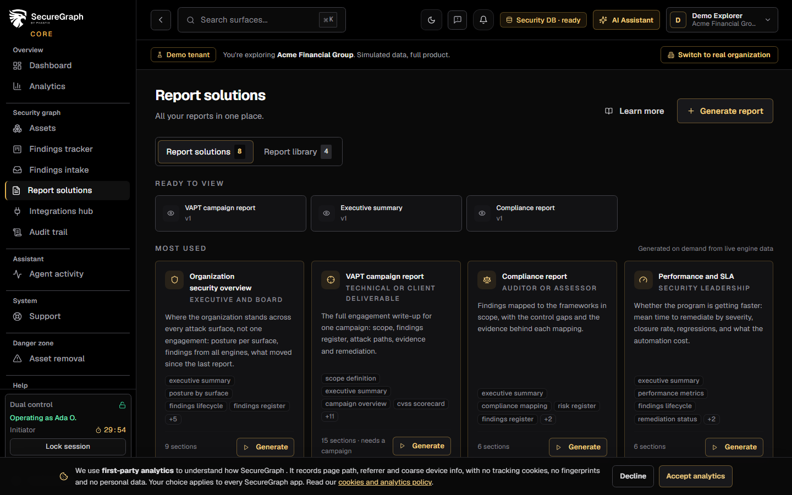
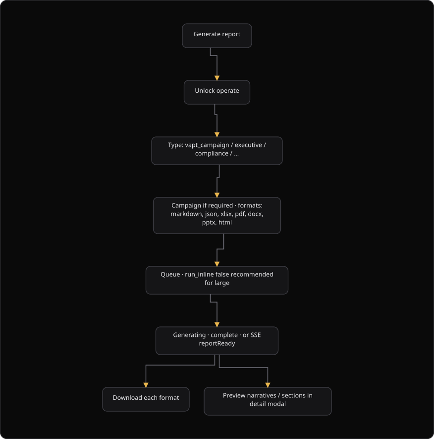

# Command Centre: Generate reports

**Where:** **Reports** → **Report library** (`/reports`)
**What:** Creates one report file for the organization from verified findings. The report engine reads every engine and writes only the findings that passed the verification gate.
**Who:** Any operator. Generation needs an operate session, and dual control when your organization configured it.
**Before you start:** A campaign exists for a campaign-scoped report type. Operate mode is unlocked, or an authorizer is available.

---

## Before you start

- The assets and the campaign are in scope. A report reads only the data of your organization.
- A campaign-scoped type, such as `vapt_campaign`, needs a selected campaign. Every other type reads the whole organization.
- Operate mode is unlocked. The generate action needs a dual-control operate session.
- The report holds only `auto_verified` and `manually_verified` findings. Unverified findings are appendix-only, and the platform excludes rejected findings.
- Reports are retained per report type. Each type keeps its own `max_versions_per_type` most recent versions. The default is 3.

---

## Process flow

---

## Steps

1. Select **Reports**, then select the **Report library** tab.
2. Select **Generate report**. The console opens the generate dialog.
3. Select a **Report type**. The list comes from the served catalog, so a new type appears without an application update.
4. Select a **Campaign** when the type is campaign-scoped. An organization-scoped type shows a note instead of the picker.
5. Read the **Verification gate** panel. It counts reportable, auto-verified, manual, unverified, rejected, and excluded findings.
6. Select the **Formats** for the deliverable. The choices are `markdown`, `json`, `csv`, `xlsx`, `pdf`, `docx`, `pptx`, and `html`.
7. Clear **Run inline** for a large campaign. The export then runs in the background and does not time out.
8. Select **Generate**. Unlock operate when the console asks.
9. Confirm **Generate verified-only** when the gate reports unverified findings. Select **Verify findings** first to open the tracker.
10. Wait until the status reads `complete`. The status moves through `queued`, `generating`, and `complete`, or it ends as `failed`.
11. Select the report row to open the detail. Read the AI Executive Summary, the sections, and the output files.
12. Select a format button to download that artifact. Select **View PDF** or **View** to open the full report in the viewer.

---

## Reference

### Report types

The catalog decides which types the page offers. A type carries `requires_campaign`.

| Field | Means |
| --- | --- |
| `report_type` | The identifier of the report type, for example `vapt_campaign`, `executive`, `compliance`, `tracker`, or `agi_session`. |
| `title` | The label shown in the type list. |
| `audience` | The reader the type serves, shown after the title. |
| `use_case` | The short note under the picker. |
| `requires_campaign` | `true` for a campaign-scoped type. The picker then needs a campaign. |

### Formats

| Format | File extension | Notes |
| --- | --- | --- |
| `markdown` | `.md` | The source form. Also useful for an internal review. |
| `json` | `.json` | The structured form. |
| `csv` | `.csv` | One row for each finding. |
| `xlsx` | `.xlsx` | The spreadsheet form. |
| `pdf` | `.pdf` | Follows the standard vulnerability assessment and penetration testing (VAPT) template. A PDF request can also produce a PPTX file. |
| `docx` | `.docx` | Follows the standard VAPT template. |
| `pptx` | `.pptx` | The board deck. The page labels the button **Deck**. |
| `html` | `.html` | The browser form. |

### Report status values

The report engine uses this set. Do not expect another value.

| Status | Means |
| --- | --- |
| `queued` | The request is accepted and waits for a worker. |
| `generating` | A worker writes the report. The row shows a progress bar. |
| `complete` | The artifacts exist. The download buttons appear. |
| `failed` | The export did not finish. Generate the report again. |

The stream also sends a `reportReady` event when a report completes.

### Verification gate counts

The panel reads the counts from `GET /reports/verification-gate` before generation.

| Count | Means |
| --- | --- |
| `reportable` | The findings that enter the report. |
| `auto_verified` | The findings that the platform verified on its own. |
| `manually_verified` | The findings that a human verified. |
| `unverified_pending` | The findings that still need verification. |
| `rejected` | The findings that a reviewer rejected. |
| `excluded_from_report` | The findings that stay out of the deliverable. |
| `needs_acknowledgement` | `true` when unverified findings exist. The server then answers `409` with `verification_pending` until you acknowledge. |

### Limits

- One generation request creates one report version.
- The retention limit is `max_versions_per_type` for each type. The oldest version of that type is archived with a `ReportArchived` alert.
- An overview report never displaces a VAPT report, because the limit is per type.
- Only `auto_verified` and `manually_verified` findings enter the report. Unverified findings are appendix-only, and the platform excludes `rejected`, `false_positive`, and `reachability` rows.

---

## Troubleshooting

| Symptom | Cause | Fix |
| --- | --- | --- |
| The console says "Please select a campaign" | The chosen report type is campaign-scoped and no campaign is selected | Select a campaign, then select **Generate** again |
| The dialog says "Unverified findings remain" | The verification gate found unverified findings | Select **Generate verified-only**, or select **Verify findings** |
| The request answers `409` with `verification_pending` | The report needs an acknowledgement of the unverified findings | Confirm the acknowledgement dialog, then generate again |
| A format shows "pptx failed" or "pdf failed" | The renderer for that format failed during the export | Open the detail for the error text, then generate the report again |
| The download answers `report_artifact_missing` | The stored artifact is gone | Generate the report again, or download another format |
| The report stays in `generating` | The export is large and runs in the background | Wait, then refresh. Do not generate a second copy |
| The gate panel says "Verification gate unavailable" | The gate endpoint did not answer | Generate again. The gate is a preview, and the server checks it again |

---

## Related

- [12-findings-tracker.md](./12-findings-tracker.md) for the live board that the report reads.
- [06-run-vapt-campaign.md](./06-run-vapt-campaign.md) for the campaign that a campaign-scoped report needs.
- [10-compliance-assessment.md](./10-compliance-assessment.md) for a compliance report type.
- [14-authorizer-approvals.md](./14-authorizer-approvals.md) for a parked action that needs an authorizer.
