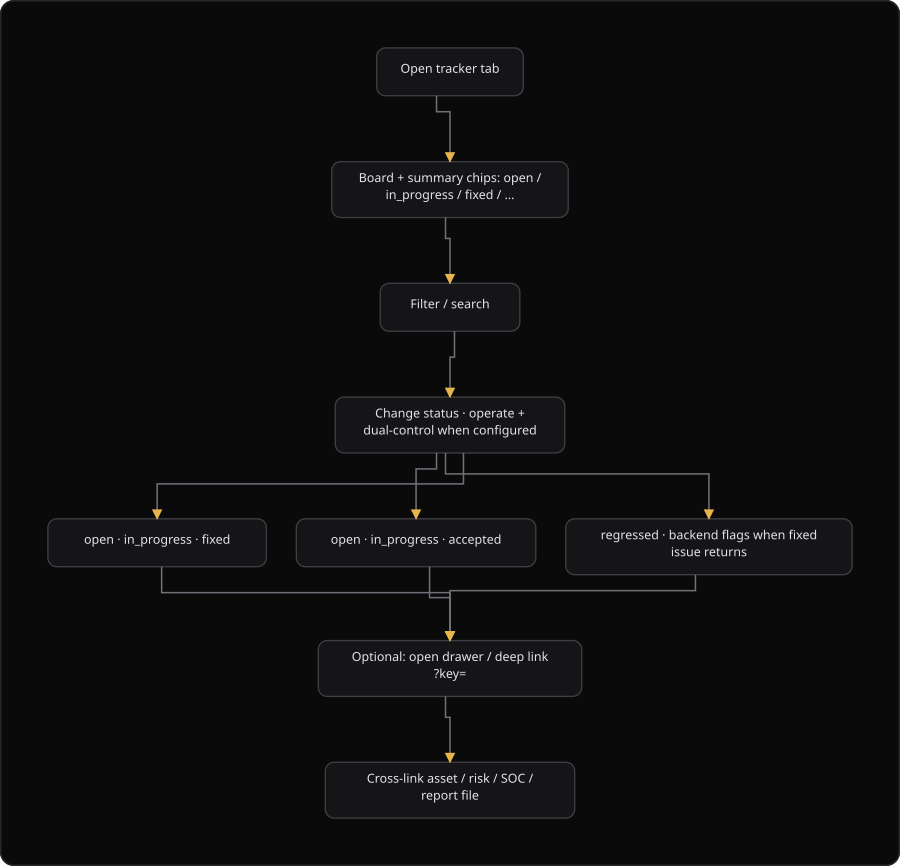

# Command Centre: Findings tracker

**Where:** **Security graph** → **Findings tracker** (`/tracker`)
**What:** Shows the live board for every tracked finding. It is not a generated file, so it never holds a PDF or an HTML export.
**Who:** Any operator. A status change needs an operate session, and dual control when your organization configured it.
**Before you start:** Findings exist on the board. A status change needs an operate session, or an authorizer is available.

---

## Before you start

- The board holds the findings that scans, campaigns, and agent sessions produced. A finding stays until someone fixes it or accepts it.
- Operate mode is unlocked for a status change. A status change needs a dual-control operate session.
- A unit retest needs an operate session when dual control is configured.
- Downloads live in the **Report library** tab. This tab never renders a PDF or an HTML file.
- The URL holds the view, so you can share a filtered board with a teammate.

---

## Process flow

---

## Steps

1. Select **Security graph**, then select **Findings tracker**.
2. Review the summary chips. **Open work**, **In progress**, **Regressed**, **Overdue**, and **Fixed** show the counts.
3. Select a chip to filter the board. Select the chip again to clear the filter.
4. Enter a value in the search box. The box filters on key, finding, asset, owner, and campaign.
5. Select **Unassigned only** to see the findings without an owner.
6. Select an evidence level to split the board by verification state: **Auto-verified**, **Human-verified**, or **Unverified**.
7. Select a column header to sort the board. The columns are Key, Finding, Severity, Asset, Owner, Due, Evidence, Status, and Age.
8. Select the status list on a row to change the status. Unlock operate when the console asks.
9. Select the retest button on a row to run a unit retest of one finding.
10. Enter a **Tool override** and a **Note** in the retest dialog when they help, then select **Run unit retest**.
11. Open a deep link with `?key=<finding_key>` to highlight one finding. The page clears the status filter first.
12. Select an asset value to open the asset in the inventory. Use the library tab for a file download.

---

## Reference

### Status values

The board uses this set. Do not use another value.

| Status | Means |
| --- | --- |
| `open` | Not started. |
| `in_progress` | A fix is in progress. |
| `fixed` | The fix is confirmed. The finding is closed. |
| `accepted` | The organization accepts the risk. The finding is closed. |
| `retest_failed` | The fix did not hold. The finding stays open. |
| `regressed` | The finding was fixed and appeared again. |

A status moves `open` to `in_progress` to `fixed`, or to `accepted`. The platform sets `regressed` when a fixed finding returns.

### Evidence values

Evidence is a separate axis from the status. An unverified finding stays off a client report, but it stays on the board as open work.

| Evidence | Means |
| --- | --- |
| `auto_verified` | The platform verified the finding on its own. |
| `manually_verified` | A human verified the finding. |
| `unverified` | The finding waits for a decision. It is appendix-only in a report. |

### Board columns

| Column | Means |
| --- | --- |
| **Key** | The finding key, for example a `PHX-` identifier. The key is unique. |
| **Finding** | The title. The tooltip also shows the campaign, the priority, and the surface. |
| **Severity** | `critical`, `high`, `medium`, `low`, or `info`. |
| **Asset** | The asset value. The link opens the inventory. |
| **Owner** | The person who owns the fix. The cell reads **Unassigned** when the field is empty. |
| **Due** | The `target_fix_date`. An overdue date is marked **Overdue**. |
| **Evidence** | The verification state. |
| **Status** | The status list. |
| **Age** | The days since the first detection. The tooltip shows the last update. |

### Unit retest

| Field | Means |
| --- | --- |
| **Tool override** | Runs the retest with one named tool family, for example `nmap`, `nuclei`, `web`, or `mobile`. Leave it empty to use the tool family that flagged the finding. |
| **Note** | A short note for the record, for example "fix applied, expect a clean retest". |
| **Result** | `confirmed` closes the finding as `fixed`. `failed` keeps it open as `retest_failed`. An inconclusive result leaves the status unchanged. |

The retest scans only the asset of that finding. A clean result closes the finding automatically as `fixed`.

---

## Troubleshooting

| Symptom | Cause | Fix |
| --- | --- | --- |
| The status does not change, and the console says "Dual-control required" | The change needs a dual-control operate session | Unlock operate, or ask an authorizer to approve the change |
| The board reads "Nothing matches this view" | The filters exclude every finding | Select **Show every finding**, or set the status to **Any status** |
| The retest button is disabled | The finding status is `fixed` or `accepted` | Set the status to `open`, then run the retest |
| The retest says "still matches. It stays open." | The fix did not hold | Keep the status `retest_failed` and return the finding to the owner |
| The retest says "inconclusive" | The scan did not settle the finding | Read the evidence, then run the retest again or change the status by hand |
| A deep link with `?key=` does not highlight the row | A filter hides the finding, or the key is not in this view | Clear the filters, or check the key |
| The owner field is empty for every row | No owner is set on the finding | Set the owner in the source that created the finding. The board reads the field, and it does not invent a value |

---

## Related

- [11-generate-reports.md](./11-generate-reports.md) for the verified-only policy that reads this board.
- [09-manage-risks.md](./09-manage-risks.md) for the risk register that a finding can feed.
- [30-findings-intake.md](./30-findings-intake.md) for the intake queue that creates tracked findings.
- [06-run-vapt-campaign.md](./06-run-vapt-campaign.md) for the campaign that produced the finding.
