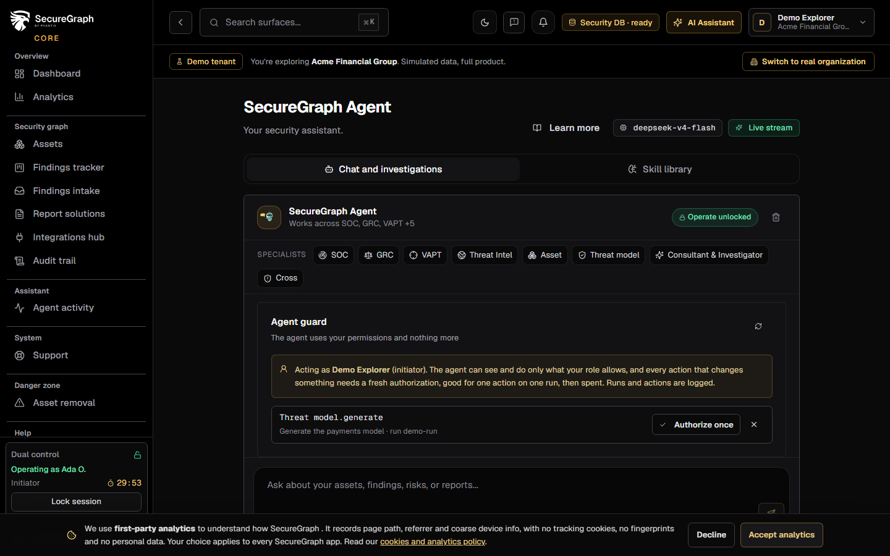
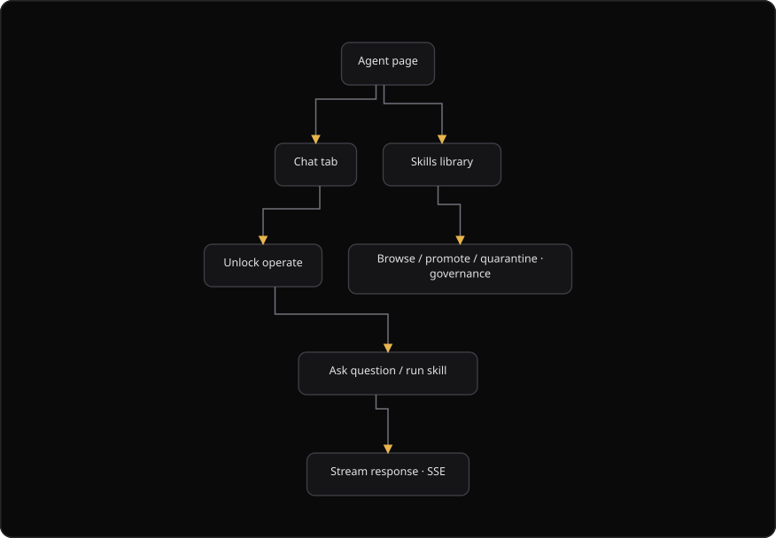

# Command Centre: Use Phantix Agent

**Where:** **Assistant** → **SecureGraph Agent** (`/assistant`) and **Autonomous Pentest Agent** (`/pentest-agent`)
**What:** Gives you a security assistant that reads the data of your organization and answers questions about it. The agent works as the signed-in user and inherits no authority of its own.
**Who:** Any operator. Chat, an investigation, and a skill change need an operate session, and dual control when your organization configured it.
**Before you start:** Your plan includes the agent, and an administrator left the agent enabled for the organization. Operate mode is unlocked, or an authorizer is available.

---

## Before you start

- Your plan includes the SecureGraph Agent. A plan without the entitlement answers `402` with `ai_agent_plan_required`.
- The organization enabled the agent. An administrator controls this setting in the AI settings of the Platform.
- Operate mode is unlocked. Chat needs a dual-control operate session.
- The agent names the assets and the resources it may read. Confirm the scope card when the console shows it.
- The agent never changes a finding and never changes a risk score. Every interaction is audited.

---

## Process flow

---

## Steps

1. Select **Assistant**, then open the **SecureGraph Agent**.
2. Check the badge next to the title. **Live stream** means the answer arrives as it is written. **Enabled** means the answer arrives after it is complete.
3. Select the **Chat and investigations** tab.
4. Enter a prompt, or select a suggested prompt, for example "Summarize my current security posture".
5. Confirm the data scope when the console shows the scope card. Select the assets and the resources, then confirm.
6. Unlock operate when the console asks. Accept the answer and read the tool traces under it.
7. Select a specialist domain, then read the answer and the skills that ran.
8. Select the **Skill library** tab to review the skills.
9. Select **Promote**, **Quarantine**, or **Retire** on a skill. Unlock operate when the console asks.
10. Select the model picker to change the model for the surface. The picker saves the choice and reloads the status.

---

## Reference

### Tabs

| Tab | Shows |
| --- | --- |
| **Chat and investigations** | The conversation, the tool traces, and the specialist domains. |
| **Skill library** | The skills, their state, and the governance actions. |

### Specialist domains

| Domain | Purpose |
| --- | --- |
| VAPT | Campaign write-ups. VAPT means vulnerability assessment and penetration testing. |
| SOC | Triage assist. SOC means security operations center. |
| GRC | Explain gaps. GRC means governance, risk, and compliance. |
| Threat model | Model and explain design threats. |
| Threat Intel | Correlate indicators. |
| Asset | Exposure brief. |
| Cross | A global ask across the domains. |

### Skill states

The library uses this set. A change of state needs a dual-control operate session.

| State | Means |
| --- | --- |
| `candidate` | The skill waits for review. A candidate skill runs in shadow mode. |
| `active` | The skill may run. A human promotes it after review. |
| `quarantined` | The skill never runs. |
| `retired` | The skill is out of the active set. The change is reversible. |

A skill is minted only after anonymization and a review. Auto-promotion happens only in a lab.

### Limits

- The agent answers only what your role allows. A change of state needs a fresh, single-use authorization.
- The conversation stays in the browser, up to the last 60 messages.
- Model choices are per surface: `general` for the SecureGraph Agent, and `pentest` for the Autonomous Pentest Agent.
- This page is not the staff AGI management surface. Staff engagements and containers are a different tool.

---

## Troubleshooting

| Symptom | Cause | Fix |
| --- | --- | --- |
| The page reads "SecureGraph Agent is disabled" | An administrator turned the agent off for the organization | Ask an administrator to enable the agent in the AI settings of the Platform |
| The console says "Upgrade required" | The plan lacks the agent entitlement, and the server answered `402` with `ai_agent_plan_required` | Upgrade on the Platform, then try the prompt again |
| The console shows a scope card | The agent needs an explicit data scope before it reads organization data | Select the assets and the resources, then confirm the scope |
| The console says "Dual-control required" | Chat needs a dual-control operate session | Unlock operate, or ask an authorizer |
| A skill does not change state | The governance change needs a dual-control operate session | Unlock operate, then select the action again |
| The transcript is empty after a reload | The messages are stored for one browser only | Continue in the same browser, or start a new prompt |
| The answer names no skill | No skill matched the prompt | Restate the prompt with a named asset, campaign, or finding |

---

## Related

- [17-autonomous-pentest.md](./17-autonomous-pentest.md) for the agent that walks a pentest methodology loop.
- [20-agent-activity.md](./20-agent-activity.md) for the record of every agent action.
- [14-authorizer-approvals.md](./14-authorizer-approvals.md) for an action that is parked for an authorizer.
- [16-threat-models.md](./16-threat-models.md) for the evidence-graded threat model surface.
