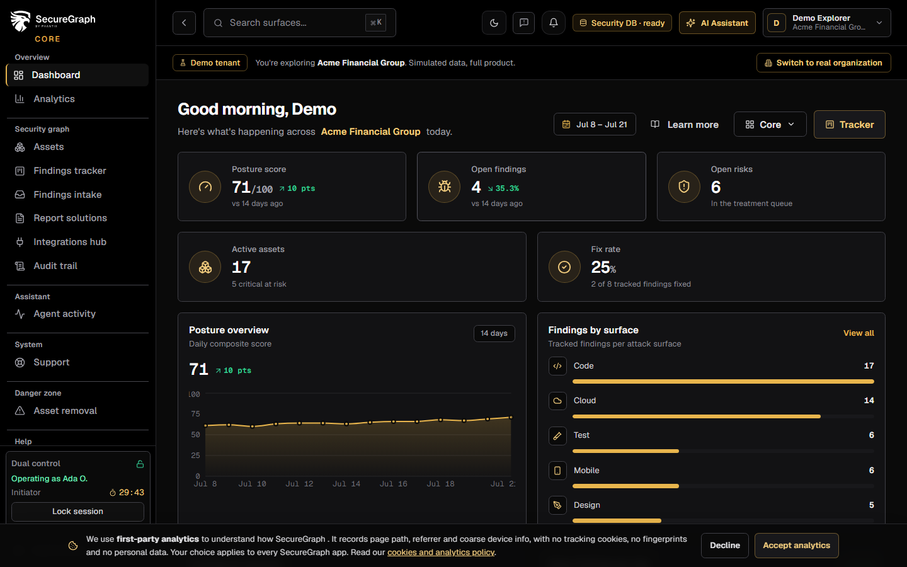
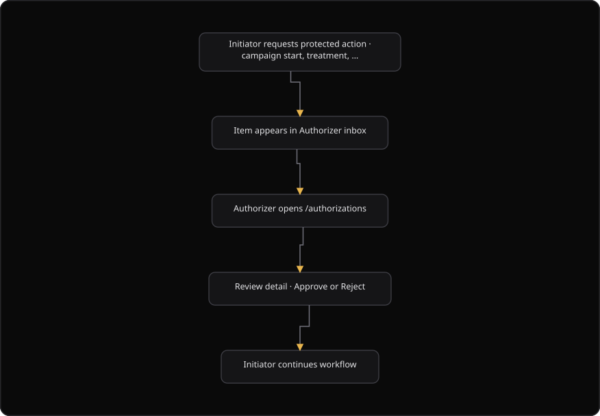

# Command Centre: Authorizer approvals

**Where:** **Authorizations** → `/authorizations`
**What:** Reviews the protected actions that wait for approval. An approver decides each item, and the initiator then continues the workflow.
**Who:** A user who is marked as an authorizer on the Platform. The action needs the role that the item names.
**Before you start:** Your user is an authorizer, and at least one action is parked in the inbox.

---

## Before you start

- Your user is marked as an authorizer on the Platform. The Platform assigns this role, and this page only reads it.
- The inbox holds the parked items for your organization. The header shows the pending count.
- A rejection needs a reason of at least 2 characters. The platform records the reason on the audit trail.
- The item names the role it needs. Confirm that you hold that role before you decide.
- VAPT means vulnerability assessment and penetration testing.
- Dual control must be configured for a dual-control item to reach the inbox.

---

## Process flow

---

## Steps

1. Sign in as the **authorizer** user.
2. Open **Authorizations**. The dashboard badge also links here when it is shown.
3. Read the **Control roles** card. It names the initiator and the authorizer for dual control.
4. Select a channel filter to narrow the queue: **All**, **Dual Control**, **VAPT**, or **Risk**. Each filter shows its count.
5. Select a pending item to review it.
6. Read the title, the summary, the action key, the required role, and the campaign or risk reference.
7. Select **Approve** to allow the action, or select **Reject** to refuse it.
8. Enter the reason when you reject. Use at least 2 characters. The platform records the reason.
9. Confirm that the item left the inbox. The initiator can then continue the workflow.
10. Open **What requires an authorizer?** to read the catalog of protected actions.

---

## Reference

### Channels

The inbox groups the items by channel.

| Channel | Label | Holds |
| --- | --- | --- |
| `dual_control` | Dual Control | A protected action that dual control parked. |
| `vapt` | VAPT Campaign | A campaign start that waits for approval. VAPT means vulnerability assessment and penetration testing. |
| `risk` | Risk Treatment | A risk treatment that waits for approval. |

### Item fields

| Field | Means |
| --- | --- |
| **Title** | The name of the action. |
| **Summary** | The short statement of what the action does. |
| **Action key** | The identifier of the action type, shown in a monospace font. |
| **Requires** | The role that the action needs. |
| **Campaign** | The campaign name, when the item is a campaign item. |
| **Risk** | The risk number, when the item is a risk item. |

### Decision paths

The item carries its own decision paths. The page reads them and does not build a route.

| Channel | Approve body | Reject body |
| --- | --- | --- |
| `vapt` | `{ "approve": true }` | `{ "approve": false, "rejection_reason": "<reason>" }` |
| Any other | `{}` | `{ "reason": "<reason>" }` |

### Catalog

The **What requires an authorizer?** panel reads `GET /authorizer/catalog`. It answers the question "why did this item land in my inbox?".

| Column | Means |
| --- | --- |
| **Action** | The label of the protected action. |
| **Key** | The action key. |
| **Description** | What the action does and why it is protected. |

### Linked surfaces

| Surface | Route | Shows |
| --- | --- | --- |
| VAPT Campaigns | `/vapt` | The campaigns and their state. |
| Risk Register | `/risks` | The risks and their treatments. |
| Audit Trail | `/audit` | The pending actions and the decision record. |

---

## Troubleshooting

| Symptom | Cause | Fix |
| --- | --- | --- |
| The queue reads "All clear" | No action waits for approval | None. The inbox is empty |
| The console says "A reason is required" | The rejection reason is shorter than 2 characters | Enter a reason with at least 2 characters, then reject again |
| The console says "No decision path" | The item carries no approve or reject path | Select the refresh, then try again. Report the item when it still fails |
| The console says "Approve failed" or "Reject failed" | The server refused the decision, or the session is not an authorizer session | Confirm your role, then select the refresh and decide again |
| The item stays in the inbox after a decision | The inbox did not reload | Select the refresh. The platform writes the decision before the reload |
| The **Control roles** card is hidden | Dual control is not configured for the organization | Ask an administrator on the Platform |
| The item says "requires `<role>`" and you do not hold the role | The action needs a different role | Sign in as a user with that role, or ask that user to decide |

---

## Related

- [06-run-vapt-campaign.md](./06-run-vapt-campaign.md) for the campaign that a VAPT approval releases.
- [09-manage-risks.md](./09-manage-risks.md) for the risk treatment that a Risk approval releases.
- [16-threat-models.md](./16-threat-models.md) for the delivery action that parks for an authorizer.
- [27-admin-and-audit.md](./27-admin-and-audit.md) for the audit trail and the people settings.
