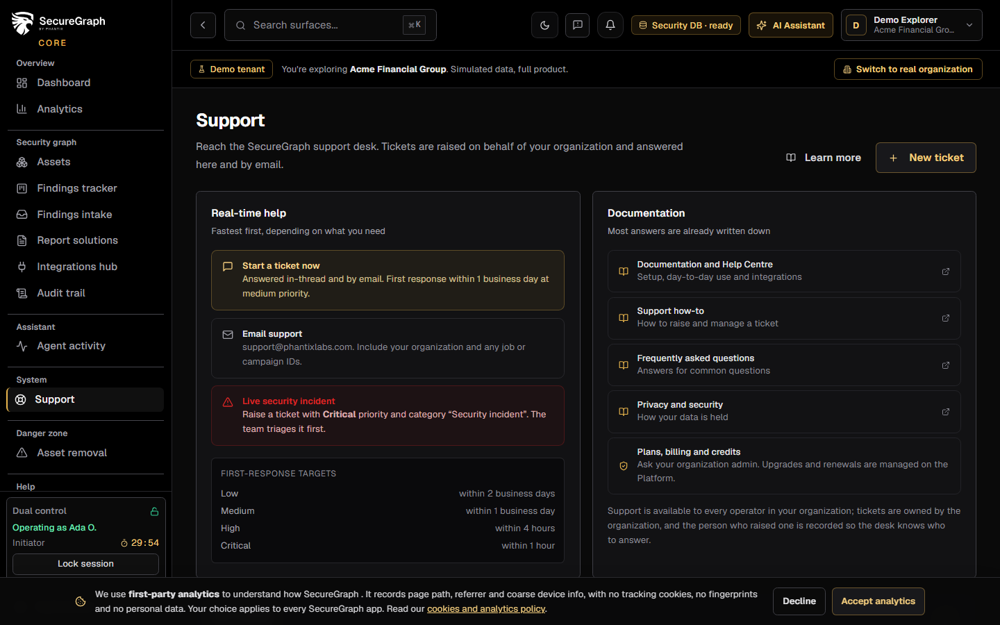
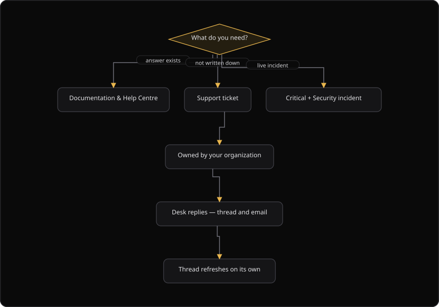

# Command Centre: Get help and open a support ticket

**Where:** **Support** → `/support`, or the **Support** switch in the assistant at the bottom right of every page
**What:** Raises a support ticket for your organization, and follows the thread with the support desk. Anyone in the organization can raise one, not only an administrator.
**Who:** Any operator. A ticket is submitted on behalf of your organization, and the platform records you as the submitter.
**Before you start:** You know the subject, the category, and the priority of the issue. The thread also needs alert email for email updates.

---

## Before you start

- Support is available to every operator. A ticket is owned by your organization and shared with your teammates. Staff answer from the staff portal.
- The platform records the submitter, so the desk knows who to answer.
- The subject needs at least 3 characters, and the details need at least 1 character.
- Email updates depend on the alert Simple Mail Transfer Protocol (SMTP) setting of your organization.
- A ticket that is `resolved` or `closed` is read-only. Open a new ticket when the issue returns.

---

## Process flow

---

## Steps

1. Select **Support**, or select the **Support** switch in the assistant at the bottom right.
2. Select **Start a ticket**. The console opens the new ticket dialog.
3. Enter a **Subject**. Use a short summary of the issue.
4. Select a **Category**: **General question**, **Technical issue**, **Billing and plan**, **Security incident**, **Onboarding and setup**, or **Other**.
5. Select a **Priority**. The dialog shows the first-response target for the priority you pick.
6. Enter the **Details**. State what happened, what you expected, and any job, campaign, or model identifiers. A screenshot helps. The detail is the difference between one reply and three.
7. Select **Submit ticket**. The console records the reference, for example `PHX-1001`.
8. Read the reply from the desk. The thread refreshes on its own every 10 seconds.
9. Enter a reply in the thread and select **Send**. A reply needs an open ticket.
10. Select **Refresh** to load the thread at once, or select a ticket in the list to open it.
11. Send an email to `support@phantixlabs.com` when you cannot use the console. Include your organization and the identifiers.

---

## Reference

### Help channels

| Channel | Use it for |
| --- | --- |
| **Start a ticket** | Anything that is not already answered. The first response follows the priority you pick. |
| **Email** | `support@phantixlabs.com`. Include your organization and any job, campaign, and model identifiers. |
| **Documentation** | Setup, how-tos, and frequently asked questions. Most answers are already written down. |
| **Critical priority** | A live incident. Select the **Security incident** category, and the desk triages the ticket first. |

### Categories

| Category | Use it for |
| --- | --- |
| `general` | A general question. |
| `technical` | A technical issue. |
| `billing` | A billing or plan question. |
| `security_incident` | A live security incident. |
| `onboarding` | Onboarding and setup. |
| `other` | Anything else. |

### Priorities and first-response targets

The dialog shows the target before you submit, so the expectation is set up front.

| Priority | Hint | First response |
| --- | --- | --- |
| `critical` | A live security incident or an outage. | Within 1 hour. |
| `high` | The issue blocks a task today. | Within 4 hours. |
| `medium` | Something is degraded. | Within 1 business day. |
| `low` | A question or a cosmetic issue. | Within 2 business days. |

### Ticket list columns

| Column | Means |
| --- | --- |
| **Subject** | The ticket subject. |
| **Messages** | The number of messages on the ticket. |
| **Category** | The category you selected. |
| **Priority** | The priority you selected. |
| **Status** | The ticket state. |
| **Age** | The time since the last activity on the ticket. |

### Ticket status values

| Status | Means |
| --- | --- |
| `open` | The desk received the ticket and no one answered yet. |
| `in_progress` | The desk works on the ticket. |
| `resolved` | The desk answered and closed the issue. The thread is read-only. |
| `closed` | The ticket is closed. The thread is read-only. |

### The thread

- The thread reloads every 10 seconds while a ticket is open.
- A reply from the desk appears without a page reload.
- A `resolved` or `closed` ticket takes no reply. Open a new ticket instead.
- The assistant at the bottom right has an **Agent** and **Support** switch. Support mode offers **Open a support ticket**, **Support center**, **Documentation and Help Centre**, and email.

---

## Troubleshooting

| Symptom | Cause | Fix |
| --- | --- | --- |
| The console says "Add a subject and details" | The subject is shorter than 3 characters, or the details are empty | Add a subject and the details, then submit again |
| The thread does not update | The poll paused, or the ticket is `resolved` or `closed` | Select **Refresh**. A closed ticket stays read-only |
| The console says "This ticket is resolved. Open a new ticket." | The ticket is `resolved` or `closed` | Open a new ticket for the returning issue |
| Email updates do not arrive | The alert SMTP setting is not configured | Ask an administrator to configure alert email |
| The reply box is hidden | The ticket is `resolved` or `closed` | Open a new ticket |
| The new ticket dialog does not open from the assistant | The `?new=1` link did not load the page | Open **Support** from the navigation, then select **Start a ticket** |
| The desk asks for an identifier you do not have | The identifier was not in the first message | Add the identifier to the thread. A ticket, job, or campaign identifier shortens the exchange |

---

## Related

- [01-sign-in.md](./01-sign-in.md) for the sign-in step that opens a session.
- [27-admin-and-audit.md](./27-admin-and-audit.md) for the organization settings that control alert email.
- [20-agent-activity.md](./20-agent-activity.md) for the record of agent actions that a ticket may reference.
- [11-generate-reports.md](./11-generate-reports.md) for a report that the desk may request.
