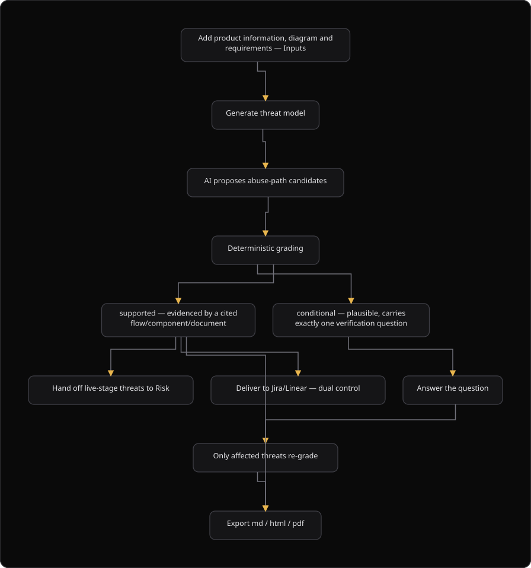

# Command Centre: Threat models

**Where:** **Threat models** → `/threat-models`
**What:** Derives evidence-graded, stage-aware threats from the context of a product project: components, trust boundaries, flows, and documents. A threat model is a hypothesis, and it is not a scanner result.
**Who:** Any operator. Generate, answer, export, hand off, and deliver actions need an operate session, and separate approval when the action is protected.
**Before you start:** A product project exists with at least one input: product information, an architecture diagram, or requirements.


---

## Before you start

- A product project exists. Select **New product** to create one.
- At least one input exists: product information, a `.drawio` architecture diagram, or requirements and design notes.
- The Inputs checklist reads **Ready to generate**. The panel names the input that is still missing.
- Operate mode is unlocked for generate, answer, export, hand off, and deliver.
- Delivery needs an authorizer. The platform parks the action and does not push it at once.

---

## Process flow



---

## Steps

1. Select **Threat models**, then select **New product**, or select an existing product row.
2. Select **Inputs** on the product row. The Inputs panel opens as a readiness checklist.
3. Enter the **Product information**: purpose, users, data handled, classification, compliance scope, entry points, trust boundaries, objectives, assumptions, and out-of-scope items.
4. Upload a `.drawio` architecture diagram, or paste the requirements and the design notes.
5. Check that the panel reads **Ready to generate**. The model needs at least one input.
6. Select **Generate**. The request is `POST /threat-models`, the answer is `202` with a `task_id`, and the model builds asynchronously. The list then refreshes from `GET /threat-models?project_id=`.
7. Select an existing row to open the model.
8. Review the `supported` threats first. Each one cites a flow, a component, or a document chunk.
9. Review the `conditional` threats next. Each one carries exactly 1 verification question.
10. Answer a verification question in the **Verification questions** card. Only the threats that depend on that question re-grade.
11. Set the **owner** type and the owner reference on a threat, and set the **disposition**.
12. Select **Export** and choose `md`, `html`, or `pdf`.
13. Select **Hand off** for a `live` model to send the `supported` threats to the Risk Engine. The platform does not raise an accepted threat again.
14. Select **Deliver** to Jira or Linear. The delivery parks for an authorizer, and it is not pushed at once.
15. Select the **Inputs** button again when the context changes, then generate the model again.

---

## Reference

### The two grades

The grade is the product. The platform shows nothing as confirmed unless a cited flow, a component, or a document chunk supports it.

| Grade | Means | What the console shows |
| --- | --- | --- |
| `supported` | A citation evidences the threat. | A finding-strength item. |
| `conditional` | The threat is plausible, and evidence is missing. | Its 1 verification question, with a way to answer it. |

There is no control that sets a grade. The platform computes the grade from the evidence. A conditional threat with 0 or 2 questions is an upstream defect. Report it, and do not render it. An older payload can show the legacy alias `speculative`, and a refuted candidate shows `refuted`.

### Inputs

A model reasons over the inputs of the product. The Inputs panel is a readiness checklist.

| Input | What it is | How you supply it |
| --- | --- | --- |
| **Product information** | Purpose, users, data handled, classification, compliance scope, entry points, trust boundaries, objectives, assumptions, out-of-scope items | The structured form. The platform saves it as a `product_information` document. |
| **Architecture diagram** | Components, trust boundaries, flows | Upload a `.drawio` file. |
| **Requirements and design notes** | Security requirements, roles, data classification | Paste the text. |
| **Trust boundaries** | The zones that the diagram marks as trusted or untrusted | Parsed from the diagram. |
| **Data flows** | The direction-aware flows between components | Parsed from the diagram. |

The model needs at least one of these inputs: product information, a diagram, or requirements. The full graph editor stays at **Product Context** (`/context`), and the Inputs panel links to it.

### Stages

The stage changes the framing of the model, and not the data.

| Stage | The model describes |
| --- | --- |
| `planned` | Design decisions to take, and not defects to fix. For example "Consider scoping payout to the owning account". |
| `in_build` | The design and the build together. |
| `live` | The deployed product. A `supported` threat can transfer to the Risk Engine. |

A model must not read as a design review in one place and an incident report in another.

### Disposition values

Set the disposition on each threat with `PATCH /threats/{id}`. There is no grade control on this route.

| Disposition | Means |
| --- | --- |
| `open` | The threat takes no decision yet. |
| `accepted` | The organization accepts the threat. |
| `mitigated` | A control reduces the threat. |
| `transferred` | The threat transfers to another owner. |
| `closed` | The threat takes no further action. |

The disposition list in the model detail also offers `dismissed`.

### Owner values

| Owner type | Means |
| --- | --- |
| `user` | One named user. |
| `team` | One team. |
| `component` | One component of the product. |
| `external` | An owner outside your organization. |

The owner reference is a number, for example a user identifier.

### Export and delivery

| Action | Route | Notes |
| --- | --- | --- |
| Export | `POST /threat-models/{id}/export` | The formats are `md`, `html`, and `pdf`. A `pdf` answer of `503` means the renderer is not installed on the deployment. Offer `md` or `html` instead. |
| Deliver | `POST /threat-models/{id}/deliver` | The request carries `only_supported: true`, so an unsettled conditional threat stays out of the tracker. |
| Answer | `POST /threat-models/{id}/clarify` | The answer re-grades only the threats that depend on the question. |

### What the engine does not do

| The engine does not | The owner of that action |
| --- | --- |
| Prove a threat. A threat is a hypothesis until a scanner or a VAPT campaign confirms it. | Scanners and VAPT own execution. |
| Write a finding or a risk. A `live` `supported` threat goes to the Risk Engine as input, and the Risk Engine decides. | The Risk Engine. |
| Push a ticket. | The Integrations Hub pushes the ticket, under dual control. |

### The delivery answer

`POST /threat-models/{id}/deliver` does not deliver. The platform parks the action for an authorizer.

```json
{ "detail": "Sensitive action requires authorizer approval",
  "pending": true, "pending_id": 481, "status": "pending",
  "authorizer_inbox": "/api/v1/authorizer/inbox" }
```

Treat `202` with `pending: true` as **sent for approval**, and never as "delivered". The push happens when the authorizer approves the action.

---

## Troubleshooting

| Symptom | Cause | Fix |
| --- | --- | --- |
| The generate request answers `503` | No worker is available, and nothing started | Try the request again. Do not wait |
| The panel does not read **Ready to generate** | At least one input is missing | Add product information, upload a diagram, or paste the requirements |
| The model produces no threats | The model still builds, or the inputs are thin | Wait, then add product information or a diagram and generate again |
| A verification question stays open | The answer was "unknown", or it did not settle the question | Answer with a concrete fact. The response field `still_open` marks this case |
| The export of `pdf` answers `503` | The renderer is not installed on the deployment | Export `md` or `html` instead |
| The console reads "sent for approval" after **Deliver** | The delivery is parked for an authorizer | Wait for the authorizer. The push happens after approval |
| The console reads "Partly delivered" | The tracker rejected some items | Read the rejected items, correct them, and deliver again |
| A conditional threat shows 0 or 2 questions | An upstream defect in the model | Report the model. Do not change the grade by hand |

---

## Related

- [37-product-context.md](./37-product-context.md) for the graph editor that holds components and flows.
- [14-authorizer-approvals.md](./14-authorizer-approvals.md) for the delivery action that parks for an authorizer.
- [21-code-security.md](./21-code-security.md) for the code review surface that shares the product context.
- [09-manage-risks.md](./09-manage-risks.md) for the Risk Engine that receives a `live` `supported` threat.
