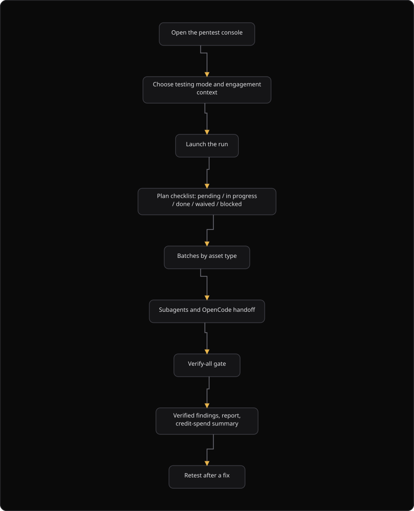

# Command Centre: Autonomous pentest agent

**Where:** **Phantix Agent** → **Autonomous pentest** console
**What:** Runs a human-gated agent that walks a methodology loop against an approved scope: reconnaissance, discovery, vulnerability testing, exploitation, authenticated testing, and reporting. The agent decides which owner each task belongs to, delegates independent work in parallel, and drives the run to verified findings and a report.
**Who:** Any operator. A state-changing step parks for an authorizer, and the run needs an operate session.
**Before you start:** The asset scope and the allowlist are approved and immutable, the testing mode is chosen, and the account list matches the mode.

---

## Before you start

- An engagement exists with an approved scope and an approved allowlist. The scope and the allowlist are immutable.
- A testing mode is chosen: `blackbox`, `greybox`, or `whitebox`.
- The engagement context matches the mode. A `greybox` or `whitebox` run needs one test account for each role.
- A `whitebox` run needs the source paths and the repository details.
- Operate mode is unlocked. Every state-changing step parks for an authorizer.
- The plan includes the Autonomous Pentest Agent, and an administrator left the agent enabled.

---

## Process flow

---

## Steps

1. Open **Phantix Agent**, then select the **Autonomous Pentest Agent** console.
2. Choose the **Testing mode**. The mode decides what the agent may look at.
3. Fill the **Engagement context**. The fields answer the questions of the agent up front.
4. Select **Launch**. The run starts against the approved scope.
5. Read the **Pentest plan** checklist. It shows the methodology steps and the plan that the model wrote.
6. Watch the live stream. Each batch, each subagent, and each event appears as it happens.
7. Wait for the **Verify-all gate**. It routes every finding to a verdict before the report.
8. Read the report. It leads with verified findings and closes with the credit-spend summary.
9. Select **Retest** on a finding after a fix. The deterministic check runs first.
10. Select the pencil, then **Engagement settings**, to change the mode or the context. The scope and the allowlist stay immutable.
11. Select **Pause** to stop the loop, and select **Resume** to continue. The plan keeps the last known statuses.

---

## Reference

### Testing modes

The mode decides what the agent tests and what it does not ask you mid-run.

| Mode | Give the agent | It does |
| --- | --- | --- |
| **Blackbox** | Nothing but the scope | Discovers the surface from live traffic and infers business rules from observed behavior. |
| **Greybox** | Test accounts, one for each role, API docs, and the inventory | Skips discovery and attacks the seams that credentials unlock. Cross-role insecure direct object reference (IDOR), tenant isolation, and workflow abuse. |
| **Whitebox** | Source, configs, and infrastructure as code (IaC) | Reads code paths first, targets sinks, and confirms that the deployed build matches the reviewed code. |

`greybox` is the default mode.

### Engagement context

The fields under the mode picker answer the questions of the agent up front, so the run does not stop to ask. Leave a field blank, and the agent asks only when the run reaches that point.

| Field | What it answers |
| --- | --- |
| Process flows | How the application is meant to be used. |
| Critical workflows | The 2 or 3 flows that matter most. |
| Out-of-scope behavior | What the agent must not touch. |
| Rate and volume ceiling | The request rate and the hours that are allowed. |
| Active exploitation authorized | Whether the agent may deliver payloads, brute-force, and inject. |
| Self-service registration open | Whether the agent may create its own test accounts. |
| Test accounts | One account for each role, in the form `email:password@login-url`. |
| API spec URLs | The OpenAPI or Swagger URLs. |
| Tenancy model | The single-tenant or multi-tenant model, and one cross-tenant identifier pair. |
| Source and repository paths | Where the agent can read source. |
| Repository | The repository URL and the deployed commit or tag. |
| Known and accepted risks | The issues that are already triaged. |
| Config and secret locations | Where config and secrets live. |
| Fix and deploy lifecycle | How a fix lands, so the agent can replay the proof of concept (PoC). |

You can change the mode and the context after you create the engagement. The scope and the allowlist stay immutable.

### The plan checklist

The console shows a **Pentest plan** checklist that updates as the agent works. Part of it is the fixed methodology, and part is **Plan (model)**: the to-do list that the agent writes for itself.

| Icon | Status | Means |
| --- | --- | --- |
| ○ | `pending` | Not reached. |
| ◐ (pulsing) | `in_progress` | Running now. |
| ✓ (struck) | `satisfied` | Done. |
| ⚠ | `blocked` | Waiting on an approval or missing information. |
| ⊖ | `waived` | Skipped, with a reason. |

Items advance when the agent runs a matching probe or records a finding, so the list reflects real work. The progress bar and the "N of M steps done" count cover the methodology steps and the plan of the agent. Each step also shows a coverage line, for example "N of M assets".

The checklist is pinned above the live stream in the drawer and in the attack-tree pane of the fullscreen console.

The backend `session.job` field drives the checklist, and the platform exposes it as `public_progress_view`. It mirrors what the runner completed, and it does not guess.

### Attack-tree phases and steps

Each phase is one node in the attack tree with a **title** and up to **5 steps**. The steps are the loops that the agent runs inside that phase. Their names are distinct grouped labels, and they never repeat the phase title, so a node renders as one title with up to 5 subtitles.

| Phase (title) | Steps (subtitles) |
| --- | --- |
| Reconnaissance | Scope and resolution · DNS and subdomains · Ports and services · Tech fingerprint · Crawl and JS surface |
| Discovery | Content and paths · API and GraphQL · Headers, CORS and exposure · Trust boundaries · Access matrix |
| Vulnerability testing | Signature and CVE · Injection and SSRF · Access control · Upload and file handling · Logic and protocol |
| Exploitation | Takeover and redirect · PoC verification · Attack chaining · Mobile analysis · Credential validation |
| Authenticated testing | Authenticated flows · Privilege and multi-account |
| Reporting | Findings verification · Evidence consolidation · Remediation mapping · Report generation · Credit-spend summary |

A phase spends at most **5 loops** before the agent advances. When the budget of a phase is spent before every step finishes, the console emits a `phase_advanced` event with the reason `phase_budget_exhausted`. The platform then marks the remaining steps `waived`. Reconnaissance and discovery can never balloon into hours. The terminal **Reporting** phase is the exception: the platform never force-advances it, because its verification steps are the completion gate.

Reconnaissance does not start from zero. The agent seeds reconnaissance from the engines, including assets, prior scans, and known risks, and it probes only the gaps.

### Discovery phases

Before vulnerability testing, the agent runs two discovery phases.

- **Trust boundaries**: derives anonymous, user, admin, and proxy zones from the product context and the provisioned test accounts.
- **Auth and access matrix**: builds a principal by endpoint matrix, with IDOR and authorization test tags, and read-only probes.

Without labeled test accounts the matrix is a guess. With them, "user A to user B" and "user to admin" become concrete cells.

### Batches by asset type

The agent never walks 40 assets one at a time. The asset engine groups assets by type, and the agent tests in batches by type, largest batch first. Each type follows its own process flow, and the agent tests every applicable skill and vulnerability class for that type.

| Asset type | Process flow |
| --- | --- |
| `web_app` and `url` and `api` | Recon → Discovery → Vuln → Exploit → Auth → Report |
| `domain` and `subdomain` | Recon → Discovery → (Exploit) → Report |
| `ip_address` and `port_service` | Recon → Vuln → Report |
| `mobile_apk` | Recon → Exploit (mobile analysis) → Report |
| `github_repo` | Discovery → Exploit (source review, through OpenCode) → Report |
| `cloud_resource` and `aws_account` and similar | Discovery → Vuln → Report |

The live stream shows a `parallel_dispatch` event when the agent fans several independent read-only probes or subagents out at once.

### Subagents

Every subagent is read-only, single-turn, streamed, and self-terminating. A subagent can never change state, and it never triggers an approval gate. The agent never waits on a subagent that fails to finish. Work that needs more than one turn, a write, or a missing capability goes to the **OpenCode handoff**, the only multi-turn subagent.

| Subagent | Can do | Cannot do |
| --- | --- | --- |
| **Recon subagent** | Read-only surface mapping (`http_get`, `dns_lookup`, `nmap_top`), trust boundaries, and the access matrix | Produce findings |
| **Pi helper** | Mid-turn triage, search, and bounded read probes that unblock the agent | Write or edit, and run past one turn |
| **Autofix subagent** | Suggest ordered, class-specific fix steps as advice | Touch the tested system |
| **Verify-all gate** | Route every finding to the exploit auditor, the candidate verifier, or an exemption before the report | Silently upgrade a finding |
| **OpenCode handoff** | Multi-turn contractor work, for example source review, Android package (APK) reversing, and Frida, under the same scope | Escape the engagement scope |

The platform reports nothing without a verdict. An exploit-bearing finding goes to the exploit auditor, a low-signal finding goes to the candidate verifier, and an informational finding is exempt.

### Seeding the agent

An administrator can seed, for each organization, the guidance that the pentest agent obeys. No code change is needed.

| Seed | What it does |
| --- | --- |
| **Prompt** | Free-form direction that the platform prepends as "Operator guidance" in the system prompt of the agent, for example "confirm real impact before you report". |
| **Process flows** | Per-asset-type flows that override the defaults, so you design the phases that the agent walks for `web_app`, `api`, `mobile_apk`, and similar. The platform labels an organization-designed flow as such in the batch plan. |
| **Detection rules** | `{name, when, severity, note}` entries that the agent applies during triage. |

Every provided pentest tool is seeded and available to the agent across all organizations. The set covers the scanners, the vulnerability assessment and penetration testing (VAPT) research adapters, and the built-in runner tools. An administrator sees the full set on the staff tool-manager page.

These seeds live on the AGI context pack of the organization, together with pinned and blocked skills and the rules of engagement (ROE). An administrator edits them from the staff AGI context-pack surface, or seeds them in bulk.

### Prioritized skill library

The agent does not sift every one of the approximately 850 imported Anthropic skills on each run. The library is prioritized down to the high-value set: used skills, high-scoring skills, priority-tagged skills, and coverage-critical skills. The verification pack is always kept. The platform retires the rest, and the change is reversible. Selection and search see only the prioritized set. An organization-pinned skill is always kept.

### Live streaming and events

| Item | Behavior |
| --- | --- |
| Session lifetime | The session continues when you close or leave the tab. Open the rail again to continue from the last transcript. |
| OpenCode relay | Assistant tokens arrive as they are produced, and each tool shows as `[OpenCode] running <tool>`. An organization can turn the relay off with `OPENCODE_STREAM_EVENTS=false`. Completion, result, and finding promotion do not depend on the relay. |
| Parallel work | Independent read-only work runs in parallel and emits `parallel_dispatch`. |
| Phase budget | Each phase is capped at 5 loops and emits `phase_advanced` with the reason `phase_budget_exhausted`. |
| Credit readout | The run emits `ai_credit_spend` with the token totals and the estimated AI credits. The billing ledger stays authoritative. |
| Blocked step | A blocked step names the reason: an open approval or a missing information request. |

### Reporting and credits

The **Reporting** phase leads with **Findings verification**. The verify-all gate runs before the report engine sees a finding. The phase ends with a **Credit-spend summary**. Every report therefore opens on verified findings and closes on the cost.

The console receives an `ai_credit_spend` event when the run completes. The event carries the token totals and the estimated AI credits for the session.

---

## Troubleshooting

| Symptom | Cause | Fix |
| --- | --- | --- |
| A step shows ⚠ and reads `blocked` | The step waits on an approval or missing information | Decide the approval in **Authorizations**, or supply the missing information |
| A phase advances and marks steps `waived` | The phase spent its budget of 5 loops, and the reason is `phase_budget_exhausted` | Read the waiver reason, then widen the phase or accept the result |
| The run stops on a state-changing action | The action is parked for an authorizer | Approve the action in **Authorizations**. Subagents never raise this gate |
| No live OpenCode output appears | The relay is off, because the organization set `OPENCODE_STREAM_EVENTS=false` | The final result still lands. Ask an administrator to enable the relay for live output |
| The agent asks a question mid-run | An engagement context field is empty | Fill the field in **Engagement settings**, then continue the run |
| The plan checklist is empty | No `session.job` progress arrived yet | Wait for the first job event |
| The credit total is higher than expected | Each phase spends up to 5 loops, and parallel work consumes credits | Read the `ai_credit_spend` summary, then compare with the billing ledger |
| The mode cannot be changed | The scope and the allowlist are immutable | Change the mode and the context only. Start a new engagement for a new scope |

---

## Related

- [13-use-phantix-agent.md](./13-use-phantix-agent.md) for the SecureGraph Agent chat surface.
- [14-authorizer-approvals.md](./14-authorizer-approvals.md) for the gate that a state-changing step raises.
- [06-run-vapt-campaign.md](./06-run-vapt-campaign.md) for the deterministic findings check that runs before an AI verdict on a retest.
- [16-threat-models.md](./16-threat-models.md) for the evidence-graded threat surface that shares the product context.
