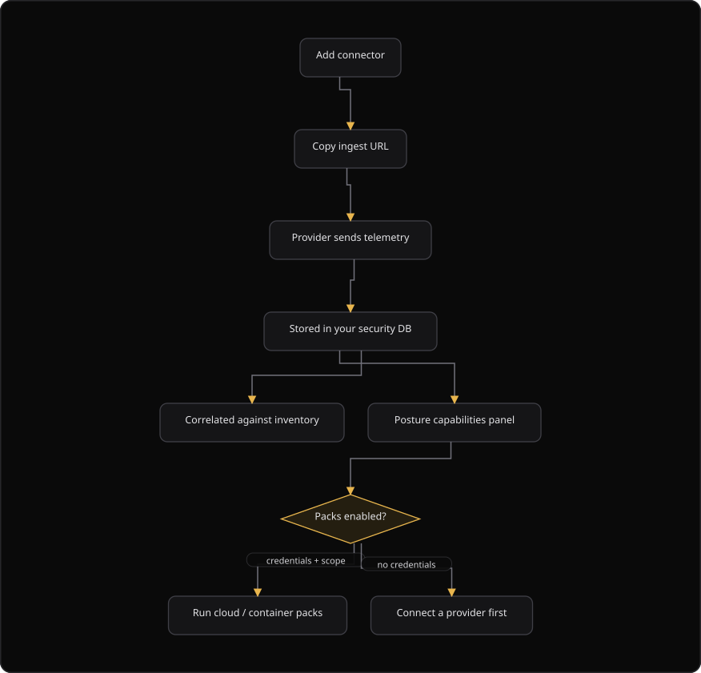

# Command Centre: Cloud posture

**Where:** **Cloud Posture** → `/cloud`
**What:** Connects cloud, virtual private server (VPS), and platform as a service (PaaS) providers, and receives log-drain telemetry. The page also reports 5 posture capabilities. These are the packs that can run, the network exposure, the Transport Layer Security (TLS) health, the host baselines, and the containment of execution.
**Who:** Any operator. A connector change needs an operate session, and dual control when your organization configured it.
**Before you start:** A provider account exists, and you can reach the webhook or the log-drain setting of that provider.

---

## Before you start

- A provider account exists, and you can open its webhook or log-drain setting.
- Operate mode is unlocked. Every connector change needs a dual-control operate session. This covers create, rotate, toggle, and delete.
- The scanner tool pack is on your plan. Without it, the posture panel says so and offers **Retry**.
- The security database is bootstrapped. Without the bootstrap, the exposure inventory reports that it needs the schema upgrade.
- Telemetry and the exposure inventory stay in your security database.

---

## Process flow

---

## Steps

1. Select **Cloud Posture**, then select **Add connector**.
2. Select a provider. Filter the list by category or search by name. The list shows webhook providers, account providers, and live API pollers.
3. Enter a **Label** for the connector, then select **Create connector**.
4. Copy the **Webhook secret**. The console shows the secret once and never again.
5. Copy the **Ingest URL** into the webhook or the log drain of the provider.
6. Select **Done**. The connector appears in the connectors tab.
7. Select the **Pause** or **Enable** action to change the state of a connector.
8. Select the **Rotate** action when the secret was visible in a shared channel, then copy the new secret.
9. Select the **Poll** action on a live API connector to read the provider API at once. The action is read-only.
10. Select the **Delete** action to stop ingest. The platform keeps the events that it already stored.
11. Select the **Events** tab to see the connectors, or open **Threat Intel** for the indicator correlation board.
12. Read the **Posture capabilities** panel for the packs, the exposure, the TLS posture, the host baselines, and the execution state.

---

## Reference

### Connector fields

The connectors tab shows one row for each connector.

| Column | Means |
| --- | --- |
| **Label** | The name you gave the connector. |
| **Provider** | The provider name. |
| **Status** | `Active` or `Paused`. |
| **Ingest URL** | The address that receives the telemetry. The cell reads **Not set** when no address exists. |
| **Actions** | Pause or enable, poll, rotate the secret, copy the ingest URL, and delete. |

### The five posture capabilities

| Capability | What it answers |
| --- | --- |
| **Cloud and container packs** | Whether the pack can run, and the reason when it is held. |
| **Network exposure** | The reachable hosts, the ports, and the services, with the first-seen and the last-seen time. |
| **TLS posture** | The legacy protocols, the weak ciphers, and the certificate issues on public endpoints. |
| **CIS-style host targets** | The host baselines that are available, and how many matched. CIS means Center for Internet Security. |
| **Execution** | The Docker isolation, the concurrency, and the one-active-scan-per-organization slot. |

Each capability is a live answer, and not a stored badge. A held pack shows the code that the scanner returned.

A connector is the credential that the posture packs read from. Without a connector, no cloud pack can run, and the panel says so instead of running a pack that can see nothing.

| Reason code | Means |
| --- | --- |
| `cloud_credentials_required` | No connector provides the credentials that the pack needs. |
| `container_runtime_unavailable` | The container runtime is not available on the deployment. |

### Network exposure

| Column | Means |
| --- | --- |
| **Host** | The host that the scan observed. |
| **Port** | The port and the protocol, for example `443/tcp`. A TLS service shows a `tls` chip. |
| **Service** | The service on the port. The cell reads **Not set** when the scan identified no service. |
| **First seen** | The first scan that observed this port and service on this host. |
| **Last seen** | The most recent scan that still found it. |

The exposure summary shows 4 counts.

| Count | Means |
| --- | --- |
| Reachable hosts | The hosts that answered during a scan. |
| Open ports and services | The ports and services that are open now. |
| New (7d) | The ports and services that appeared in the last 7 days. |
| Quiet 30d | The ports and services that no scan observed in the last 30 days. |

A closed port is kept, and the platform does not delete it, so the question "was exposed, now it is not" stays answerable. A port that no scan probed stays unknown, and the platform never guesses that it is closed.

| State | Means |
| --- | --- |
| `open` | A scan observed the port or service. |
| `closed` | A later scan probed the port and it was gone. |

### TLS posture

The panel groups the findings by issue code.

| Issue code | Means |
| --- | --- |
| `legacy_protocol` | The endpoint accepts a legacy protocol. |
| `weak_cipher` | The endpoint accepts a weak cipher. |
| `certificate_expired` | The certificate expired. |
| `certificate_expiring_soon` | The certificate expires soon. The panel also shows the days remaining. |
| `certificate_self_signed` | The certificate is self-signed. |
| `certificate_hostname_mismatch` | The certificate does not match the host name. |
| `certificate_weak_signature` | The certificate uses a weak signature. |

### Execution

| Field | Means |
| --- | --- |
| `docker_isolated` | `true` when each tool runs in a Docker container. |
| `one_active_scan_per_org` | `true` when one scan runs at a time for each organization. |
| `global_scan_concurrency` | The number of global tool slots. |
| `tool_lock_redis_enabled` | `true` when the lock uses Redis. |
| `tool_lock_fail_open` | `true` when the lock fails open, and `false` when it fails closed. |

### Webhook signature headers

| Provider | Header |
| --- | --- |
| Vercel | `x-vercel-signature` |
| GitHub | `X-Hub-Signature-256` |
| Any other | `X-SecureGraph-Signature: sha256=<hmac>` |

---

## Troubleshooting

| Symptom | Cause | Fix |
| --- | --- | --- |
| A pack is held with `cloud_credentials_required` | No connector provides credentials for that provider | Add a connector for the provider, then refresh |
| A pack is held with `container_runtime_unavailable` | The container runtime is not available on the deployment | Ask an administrator to enable Docker isolation |
| The posture panel is missing and offers **Retry** | The scanner tool pack is absent, or the panel did not load | Select **Retry**, or add the scanner tool pack to the plan |
| The exposure section says the schema upgrade is required | The exposure inventory table does not exist on the security database | Complete the bootstrap on the security database connection |
| The webhook secret is lost | The console showed the secret once | Rotate the secret, then update the provider |
| Ingest stopped | The connector is paused or deleted | Enable the connector, or add it again |
| Events arrive but the exposure list is empty | The platform correlates telemetry against a scan result | Wait for the next scan, or launch a scan |
| A provider is missing from the list | The provider is not in the category filter, or it is not on this deployment | Clear the filter, or search by name |

---

## Related

- [19-threat-intel.md](./19-threat-intel.md) for the indicator board that reads this telemetry.
- [22-posture.md](./22-posture.md) for the broader posture view.
- [03-add-and-verify-assets.md](./03-add-and-verify-assets.md) for the assets that the exposure list correlates against.
- [05-launch-a-scan.md](./05-launch-a-scan.md) for the scan that observes a port or service.
