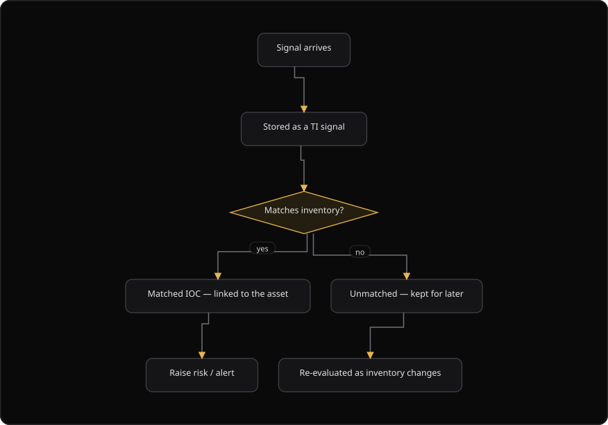

# Command Centre: Threat intelligence

**Where:** **Threat Intel** → `/threat-intel`
**What:** Looks up an indicator of compromise (IOC) and correlates it against your own inventory. The platform matches an indicator to the assets that you actually have, and never to a generic feed dump.
**Who:** Any operator. A lookup and a reputation scan need an operate session.
**Before you start:** At least one cloud connector delivers telemetry, or you have an indicator to correlate by hand.

---

## Before you start

- A connector delivers telemetry, or you know the indicator that you want to correlate.
- Operate mode is unlocked for a reputation scan.
- The platform stores the correlation in your security database. It shares nothing between organizations.
- A reputation scan needs a VirusTotal API key on the server.
- A threat intelligence hit is context, and it is not a finding. A scanner or a campaign owns execution. A confirmed issue becomes a finding through those engines.

---

## Process flow

---

## Steps

1. Select **Threat Intel**. The page reads the correlation dashboard and the signal list.
2. Read the summary cards: **Matched IOCs**, **Unmatched IOCs**, **Events (24h)**, **Open detections**, and **Connectors**.
3. Enter an indicator in the correlation box. Use an IP address, a domain, a URL, an email address, or a hash.
4. Select **Correlate**, or press Enter. The platform records a correlation signal for your organization.
5. Read the match state first, and then the signals that produced it.
6. Select a signal row to open the detail drawer. The drawer shows the first-seen time, the last-seen time, the occurrences, the identifier, and the evidence.
7. Select **Open asset** in the drawer to open a matched asset in the inventory.
8. Select the **Events** tab to read the connector events that produced the signals.
9. Select the **Reputation** tab to read the reputation results.
10. Select **Run reputation scan** to start a reputation scan. Accept the consent dialog when it appears.
11. For a confirmed match, raise a risk, or hand the indicator to the agent for a write-up.
12. Select **Manage connectors** to open **Cloud Posture** and change the telemetry sources.

---

## Reference

### Board sections

| Section | Means |
| --- | --- |
| **Matched IOCs** | An indicator that resolved to an asset in your inventory. |
| **Unmatched IOCs** | No current asset matches. The platform keeps the indicator and re-checks it as the inventory grows. |
| **Signals** | The individual indicator rows, each with a source and a severity. |
| **Events** | The raw connector or scan events that produced the signals. |
| **Reputation** | The results of a reputation scan, with the tool that produced them. |

The platform claims a match only when a signal and an asset genuinely line up. It does not silently drop an unmatched indicator, because an unmatched indicator is the early warning before an asset appears.

### Summary cards

| Card | Means |
| --- | --- |
| Matched IOCs | The number of indicators that matched an asset. |
| Unmatched IOCs | The number of indicators with no asset match. |
| Events (24h) | The number of connector events in the last 24 hours. |
| Open detections | The number of open detections. |
| Connectors | The number of configured connectors. |

### Signal columns

| Column | Means |
| --- | --- |
| **Indicator** | The IOC value. A new signal carries a `NEW` chip. |
| **Type** | The indicator type. |
| **Severity** | `critical`, `high`, `medium`, `low`, or `info`. |
| **Source** | The source that produced the signal. The cell reads **Not set** when the source is absent. |
| **Matches** | The number of matched assets, or the label **Unmatched**. |
| **Occurrences** | The number of times the platform observed the indicator. |
| **Last seen** | The most recent observation. |

### Event columns

| Column | Means |
| --- | --- |
| **Event** | The event title and the summary. |
| **Provider** | The provider that delivered the event. |
| **Severity** | The event severity. |
| **Kind** | The event kind. |
| **Mapped engines** | The engines that the event maps to. |
| **Received** | The time the platform received the event. |

### Reputation columns

| Column | Means |
| --- | --- |
| **Finding** | The title of the reputation result. |
| **Tool** | The tool that produced the result. The default is `yaml_ti`. |
| **Severity** | The result severity. |
| **IOC** | The indicator value. |
| **Created** | The time the platform created the result. |

### Detail drawer fields

| Field | Means |
| --- | --- |
| **First seen** | The first observation of the indicator. |
| **Last seen** | The most recent observation. |
| **Occurrences** | The number of observations. |
| **ID** | The signal identifier. |
| **Evidence** | The stored evidence for the signal, in JSON. |
| **Matched assets** | One **Open asset** button for each matched asset. |

A lookup records a correlation signal for your organization. It does not only read.

---

## Troubleshooting

| Symptom | Cause | Fix |
| --- | --- | --- |
| The page reads "No threat signals yet" | No connector delivered telemetry | Connect a cloud, VPS, or PaaS webhook on **Cloud Security** |
| The signals tab reads "No signals" | No lookup ran, and no telemetry arrived | Correlate an indicator, or wait for connector telemetry |
| The events tab reads "No connector events" | No webhook delivered telemetry | Check the connector state and the ingest URL on **Cloud Security** |
| The reputation tab reads "No reputation results" | No reputation scan ran, or the server VirusTotal API key is absent | Select **Run reputation scan**. Ask an administrator for the API key when the scan still returns nothing |
| An indicator stays **Unmatched** | No asset in the inventory matches the indicator | Keep the indicator. The platform re-checks it as the inventory grows |
| The same lookup records another signal | Every lookup records a correlation signal | Read the existing signal row instead of repeating the lookup |
| The correlation box rejects the value | The value is empty | Enter a value, then select **Correlate** |

---

## Related

- [18-cloud-security.md](./18-cloud-security.md) for the connectors that deliver the telemetry.
- [09-manage-risks.md](./09-manage-risks.md) for the risk that a confirmed match can raise.
- [13-use-phantix-agent.md](./13-use-phantix-agent.md) for the agent that writes up a confirmed match.
- [03-add-and-verify-assets.md](./03-add-and-verify-assets.md) for the inventory that the platform correlates against.
