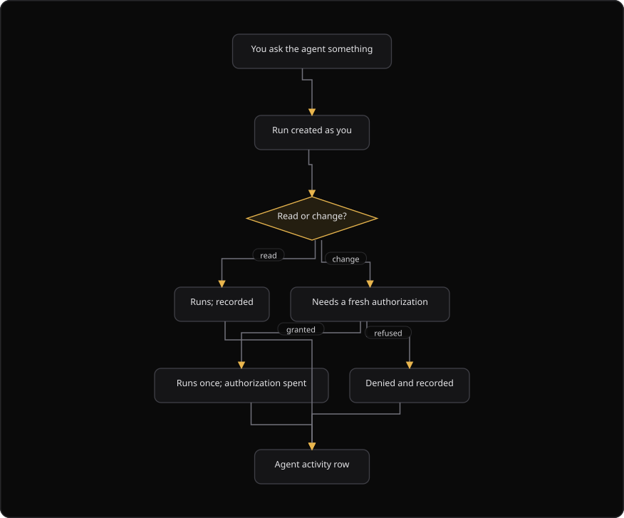

# Command Centre: Agent activity

**Where:** **Agent activity** → `/agent-activity`
**What:** Records every action that the agent took for your organization. It records the run, the domain, your intent, the user who asked, the authorization, and the outcome. The page shows allowed actions and denied actions together.
**Who:** Any operator. The page is read-only, and the agent acts as the signed-in user.
**Before you start:** The agent ran at least one action for your organization.

---

## Before you start

- The agent ran at least one action. A read action and a change action both create a row.
- Your role allows you to read the audit record of the organization.
- The rows live in the platform audit store, in `ai_audit_logs`. They never live in your security database.
- The agent acts as the signed-in user and inherits no authority. Every change action needs a fresh, single-use authorization.

---

## Process flow

---

## Steps

1. Select **Agent activity**. The page loads the most recent actions.
2. Read the **When** column. The column shows the relative time and the first 8 characters of the run identifier.
3. Select the **All outcomes** list to filter by outcome: **Completed** or **Denied and failed**.
4. Select the **All domains** list to filter by the specialist domain.
5. Enter a tool name in the tool box, for example `threat_model.generate`, to filter by tool.
6. Read the **Domain**, **Action**, **Intent**, **Asked by**, and **Outcome** columns.
7. Select a row to expand it. The row then shows the parameters, the refusal reason, and the evidence and response hashes.
8. Select **Refresh** to reload the list at once.
9. Select **Prev** and **Next** to move through the pages. Each page holds 50 actions.

---

## Reference

### Row columns

| Column | Means |
| --- | --- |
| **When** | The moment the action ran, with the run identifier beneath. |
| **Domain** | The specialist that acted. |
| **Action** | The exact tool call, in a monospace font. The cell reads **Not set** when the tool is absent. |
| **Intent** | What you asked for, in your words. |
| **Asked by** | The user the agent acted as, with the role. The cell reads `org-level` when no named user exists. |
| **Outcome** | `done` or `denied`. A denied row shows the reason on expand. |

### Domains

| Domain value | Label | Specialist |
| --- | --- | --- |
| `cross` | Chief | The global ask across the domains. |
| `threat_model` | Threat modeling | Threat modeling. |
| `soc` | SOC | Security operations center. |
| `grc` | GRC | Governance, risk, and compliance. |
| `vapt` | VAPT | Vulnerability assessment and penetration testing. |
| `ti` | Threat intel | Threat intelligence. |
| `asset` | Asset | The asset inventory. |
| `code` | Code | Code security. |
| `verify` | Verification | The verification gate. |
| `consultant` | Consultant | The consultant role. |

### Filters

| Filter | Values |
| --- | --- |
| Outcome | `all`, `completed`, `failed`. The label for `failed` is **Denied and failed**. |
| Domain | `all`, or one domain value. |
| Tool | A free-text tool name. |

### Row detail

| Field | Means |
| --- | --- |
| `params` | The parameters of the action. Sensitive parameters are redacted before the platform writes the row. |
| `error` | The refusal reason for a denied action. |
| `context` | The identifiers for the action, for example the evidence and response hashes. |

### Limits and live updates

- The page holds 50 rows for each page.
- The page polls every 30 seconds.
- The page also subscribes to the stream `/org/command-center/stream`.
- The stream sends `activityRecorded` for every agent action, `agiActionRecorded` for an AGI step, and `agiFindingRecorded` for a recorded finding. The page refreshes on each arrival.

### Why a denial is not an error

The agent acts as the signed-in user and inherits no authority. It can do only what your role allows. Every action that changes something needs a fresh, single-use authorization bound to one action on one run.

A `denied` row therefore means that a control held. The reason tells you which control held. The reason is a missing authorization, a role without the permission, or a tool outside the policy of the domain.

---

## Troubleshooting

| Symptom | Cause | Fix |
| --- | --- | --- |
| A row reads `denied` | A control held: a missing authorization, a role without the permission, or a tool outside the policy of the domain | Read the reason on expand. Unlock operate, or request the approval |
| The list does not update | The stream is unavailable, and the poll runs every 30 seconds | Wait for the poll, or select **Refresh** |
| The page reads "Agent activity unavailable" | The endpoint did not answer | Select **Refresh**, or check the connection |
| The page reads "No agent actions yet" | The agent has not run an action | Ask the agent to read something or to change something |
| A parameter shows redacted text | The platform redacts sensitive parameters before it writes the row | Use the evidence and response hashes in `context` to confirm the action |
| The run identifier looks short | The table shows the first 8 characters of the identifier | Open the row and read the full identifier in `context` |
| A denied run produced no result | The agent continues with what it may read | Read the `error` field. The denial is the control, and the run continues with allowed reads |

---

## Related

- [13-use-phantix-agent.md](./13-use-phantix-agent.md) for the agent that produces these rows.
- [17-autonomous-pentest.md](./17-autonomous-pentest.md) for the pentest run that also records actions.
- [14-authorizer-approvals.md](./14-authorizer-approvals.md) for the approval that releases a change action.
- [27-admin-and-audit.md](./27-admin-and-audit.md) for the audit trail and the platform audit store.
