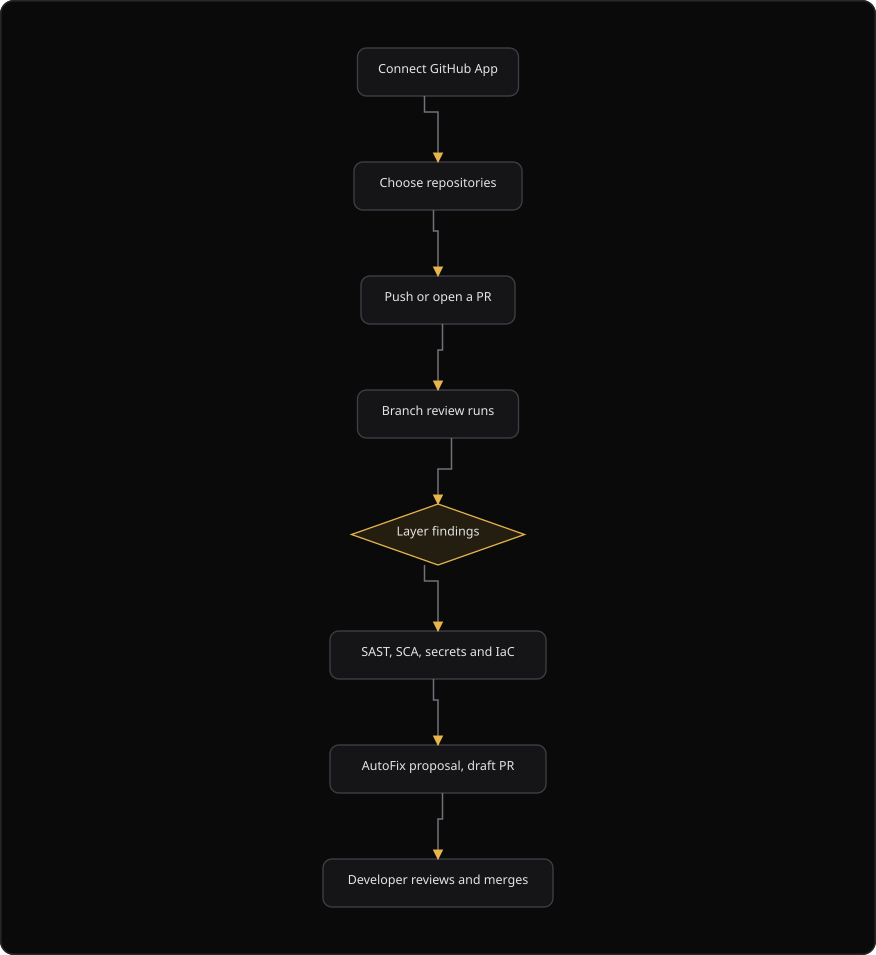

# Command Centre: Code security

**Where:** **Code** → **Security review** (`/code-review`), **Repositories** (`/code-review/repositories`), **Pull requests** (`/code-review/pull-requests`), **Providers** (`/code-review/providers`), **AutoFix** (`/code-review/autofix`), **Continuous PR** (`/code-review/continuous-pr`)
**What:** Connects source-control repositories, runs branch and pull request reviews, proposes AutoFix patches, and opens Continuous PR drafts. SecureGraph analyzes code in an ephemeral clone and never stores the source.
**Who:** Any operator. A write action needs operate mode. Connect, disconnect and Continuous PR need dual control.
**Before you start:** The GitHub App is installed, or an SCM connector is installed in the Integrations Hub. The branch-review wallet holds credits.

---

## Before you start

- The GitHub App is installed on the account that owns the repositories.
- Operate mode is unlocked for a write action.
- An authorizer is available when dual control applies.
- The branch-review wallet holds credits. A branch review is credit-metered.
- The repository is in the set the GitHub App can read.

---

## Process flow

---

## Steps

1. Open **Code**. The **Security review** section opens first.
2. Select **Connect** on the GitHub row, or install a connector in **Providers**.
3. Wait for the provider chip to read `connected`.
4. Open **Repositories**. The table lists each repository, the branch, the review state and the visibility.
5. Turn review on for a repository, then push a commit or open a pull request on the watched branch.
6. Open **Pull requests** to read every run. The table shows the repository, the ref, the SHA, the size tier, the status and the time.
7. Open **AutoFix** to read the gates: scope, no-op check, re-validation and credits.
8. Open the detail of a verified finding and generate the fix guidance.
9. Open **Continuous PR**, choose a repository, paste the finding as JSON and select **Open Continuous PR**.
10. Wait for an authorizer to approve the parked request. The pull request opens as a draft.
11. Ask a developer to review and merge the draft pull request. SecureGraph never merges it.

---

## Reference

### Sections

| Section | Route | Shows |
| --- | --- | --- |
| **Security review** | `/code-review` | The block that is wrong, the reason, the fix and the draft pull request |
| **Repositories** | `/code-review/repositories` | Repositories the GitHub App can read and review |
| **Pull requests** | `/code-review/pull-requests` | Every branch-review run |
| **Providers** | `/code-review/providers` | The GitHub App and Integrations Hub source-control connectors |
| **AutoFix** | `/code-review/autofix` | Block-scoped verified fixes for human review |
| **Continuous PR** | `/code-review/continuous-pr` | Prepare a same-repo branch and open a draft pull request |

### Provider status values

| Status | Meaning |
| --- | --- |
| `active` | The connector is connected and ready. The page shows `connected` |
| `pending_auth` | The OAuth flow is not finished. Select **Finish auth** |
| `error` | The connector reported an error |
| `degraded` | The connector is connected and not healthy |
| `not connected` | No installation exists |
| `coming soon` | The connector is in the catalog and is not installable yet |

### Branch-review run status values

| Status | Meaning |
| --- | --- |
| `reviewed` | The reviewer processed the push and returned a review |
| `charged` | The run was metered against the branch-review wallet |
| `reserved` | The credit is reserved and the run is not complete |
| `failed` | The run did not complete |

### GitHub App write scopes

| Scope | When it is requested |
| --- | --- |
| `contents:write` | On demand, when a run needs to write repository content |
| `pull_requests:write` | On demand, when a run needs to open a pull request |

The App asks for these scopes on demand. It does not hold them by default. When a run needs one, the response names the scope and gives the re-consent URL.

### Webhook paths and signature headers

| Provider | Path | Signature header |
| --- | --- | --- |
| GitHub | `/github/webhook` | `X-Hub-Signature-256` |
| GitLab | `/gitlab/webhook` | `X-Gitlab-Token` |
| Gitea | `/gitea/webhook` | `X-Gitea-Signature` |

Point the provider webhook at `{API_BASE}` plus the path in the table.

### Rules

- Only verified findings reach AutoFix. An unverified heuristic can never open a pull request.
- The app signs the commit before it pushes the commit.
- The pull request always opens as a draft. A developer merges it. SecureGraph never merges on your behalf.
- Work happens in an ephemeral clone. The clone is removed afterwards, and the source never lands on the platform.
- Branch review and pull request safety run before merge, not after an incident.
- AutoFix is credit-metered. You are never billed to view or export results.

---

## Troubleshooting

| Symptom | Cause | Fix |
| --- | --- | --- |
| **Repositories** says "Repositories unavailable" | The repository list did not load | Select **Retry** |
| The repository list is empty | The GitHub App can read no repository | Install the App, or sync repositories from the Platform portal |
| The provider chip reads `pending_auth` | The OAuth flow stopped before the callback | Select **Finish auth** and complete the consent screen |
| **Open Continuous PR** reports `permission_required` | The App lacks a write scope on the repository | Open the link in the message and grant the scope |
| **Open Continuous PR** reports `free_model_agreement_required` | The model agreement is not accepted | Open the link in the message and accept the agreement |
| A run shows `failed` | The reviewer did not complete the push | Push again, then select **Refresh** |
| A toast says "Sent for approval" | Dual control parked the install or the disconnect | Approve the request in **Authorizations** |
| The wallet chip is absent | The wallet endpoint returned no balance | Check the security database connection, then select **Refresh** |

---

## Related

- [16-threat-models.md](./16-threat-models.md)
- [33-remediation.md](./33-remediation.md)
- [37-product-context.md](./37-product-context.md)
- [14-authorizer-approvals.md](./14-authorizer-approvals.md)
