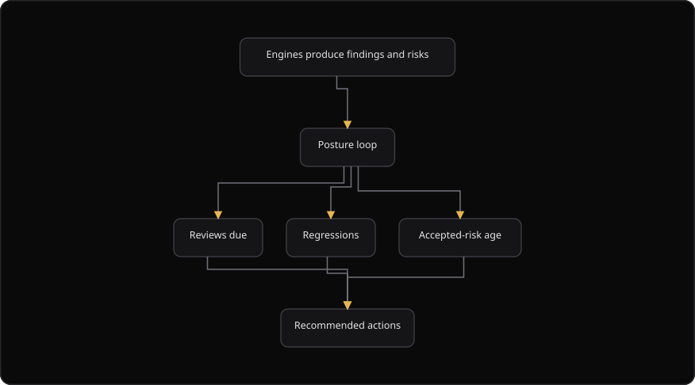

# Command Centre: Posture

**Where:** **Posture** (`/posture`)
**What:** The continuous loop, assembled from every engine rather than one scan. It shows what is due for review, what regressed, and the trend of accepted risk.
**Who:** Any operator. **Resurface due** and **Publish learning feed** change state.
**Before you start:** A scan, a review or an assessment landed in the security database. Accepted risks exist with a review date.

---

## Before you start

- At least one engine produced a finding or a risk.
- An accepted risk has a review date. The **Accepted risks due** counter reads that date.
- A product project exists, when you check **Context drift**.
- The security database is connected. The page reads the posture snapshot from it.

---

## Process flow

---

## Steps

1. Open **Posture**.
2. Read the counters first: **Overall posture**, **Findings-adjusted**, **Asset posture**, **Open findings**, **Accepted risks due** and **Drift items**.
3. Read the **Surfaces** table. A row shows the score, the reportable count, the critical count and the high count for one surface.
4. Work **Accepted risks due for re-review** first. An acceptance is a decision and not a silence.
5. Select **Resurface due** to return the due risks to triage. The toast reports the count.
6. For each item, re-accept it with a new interval, or reopen it as work.
7. Check **Regressions**. A returning issue means the earlier fix was incomplete.
8. Choose a **Product project** and read **Context drift**. A drifted model means the design changed.
9. Select **Publish learning feed** to send resolved risks to the loop. The toast reports the count.
10. Export or hand off anything that needs a report.

---

## Reference

### Counters

| Counter | Shows |
| --- | --- |
| **Overall posture** | The score from 0 to 100 across every surface. The hint names the source |
| **Findings-adjusted** | The overall score after open critical and high findings are deducted |
| **Asset posture** | The asset-risk score from the Dashboard |
| **Open findings** | The open count. The hint carries the critical count |
| **Accepted risks due** | The number of accepted risks past the review date |
| **Drift items** | The number of projects whose design changed |

### Score colors

| Score | Color |
| --- | --- |
| 80 or more | Green |
| 55 to 79 | Gold |
| Below 55 | High-severity color |

### Panels

| Panel | Means |
| --- | --- |
| **Reviews due** | Accepted risks whose next review date has arrived |
| **Regressions** | A closed issue that came back |
| **Accepted-risk age** | How long the team carried the risk without a new examination |
| **Trend** | Whether posture is improving, flat or drifting |

### Posture sources

| `posture_source` value | Meaning |
| --- | --- |
| `findings` | The score reads tracked findings |
| `scan_evidence` | The score reads reportable scan evidence |
| `none` | No evidence exists yet |

### Reviews-due table

| Column | Shows |
| --- | --- |
| **Risk** | The title of the accepted risk |
| **Level** | The risk level |
| **Residual** | The residual risk score, or the residual level |
| **Accepted** | When the risk was accepted |
| **Review due** | The review date that has arrived |

### Rules

- Posture reads the engines. It does not re-scan.
- An accepted risk that is never revisited is the most common way a posture quietly rots. The loop exists to prevent that.

---

## Troubleshooting

| Symptom | Cause | Fix |
| --- | --- | --- |
| The **Surfaces** table is empty | No scan, review or assessment landed yet | Run a scan or a VAPT campaign, then select **Refresh** |
| **Accepted risks due** is empty | No accepted risk passed its review date | Check the review intervals in the risk register |
| **Resurface due** says "Could not resurface" | The request failed | Select **Refresh**, then try again |
| **Context drift** says "Select a project to compute drift" | No product project is selected | Choose a project in the picker |
| **Drift items** stays 0 | The model matches the product context | No action. The model is current |
| A score reads "Not set" | The engine returned no score | Check the security database connection |
| A surface row shows a count and no score | The surface has no score yet | Run a scan against that surface |

---

## Related

- [09-manage-risks.md](./09-manage-risks.md)
- [12-findings-tracker.md](./12-findings-tracker.md)
- [35-asset-intelligence.md](./35-asset-intelligence.md)
- [06-run-vapt-campaign.md](./06-run-vapt-campaign.md)
