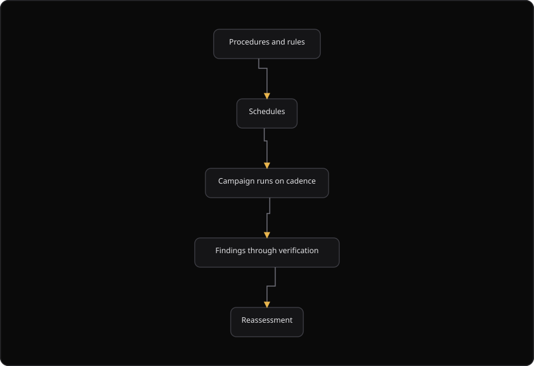

# Command Centre: VAPT schedules, procedures and settings

**Where:** **VAPT** → **Schedules** (`/vapt/schedules`), **Procedures and rules** (`/vapt/procedures`), **Settings** (`/vapt/settings`)
**What:** The cadence, the rules of engagement, and the engine configuration behind VAPT campaigns.
**Who:** Any operator. A schedule change is a mutating action and needs operate mode. Dual control applies.
**Before you start:** Operate mode is unlocked, or an authorizer is available. A procedure exists in the catalog.

---

## Before you start

- Operate mode is unlocked, or an authorizer is available.
- The scoped assets are verified. An unverified asset is not in scope.
- A procedure exists in the procedure catalog.
- Continuous and recurring pentest is a Growth capability.

---

## Process flow

---

## Steps

1. Open **VAPT** → **Schedules**.
2. Read the four counters: **Schedules**, **Total runs**, **Failures** and **Next run**.
3. Select **New schedule**.
4. Enter a **Schedule name** and an optional **Description**.
5. Select a **Procedure**, or keep **Adaptive procedure** on.
6. Set the **Timezone**.
7. Set the **Cadence**. Select a preset, or enter an interval such as `1d`, `7d` or `12h`.
8. Select **Create schedule**. The toast names the schedule and its cadence.
9. Select the **Blackout** row action. Enter the **Start** time, the **End** time and the days.
10. Select **Add blackout**. Windows are appended, so existing windows stay in place.
11. Read the row: **Status**, **Procedure**, **Cadence**, **Timezone**, **Blackouts**, **Last run**, **Next run**, **Runs** and **Failures**.
12. Open **Procedures and rules** to read the catalog, the correlation rules and the mined candidates.
13. Open **Settings** to set the mining consent and the AI planner threshold.

---

## Reference

### Schedule fields

| Field | Means |
| --- | --- |
| **Target and scope** | The assets and environments this schedule may touch |
| **Cadence** | How often the campaign repeats |
| **Procedure** | Which rules of engagement apply |
| **Next run** | When the loop fires next |
| **Timezone** | The clock for the cadence and the blackout windows |
| **Blackouts** | Windows where automated runs are suppressed |
| **Adaptive procedure** | The schedule picks the procedure on each run |

A schedule without a procedure is a scan without rules. Set the procedure first.

### Schedule status values

| Status | Meaning |
| --- | --- |
| **Active** | The schedule runs on its cadence |
| **Paused** | The schedule does not run |
| **Skipping next** | The next run is skipped. The schedule stays active |

### Blackout fields

| Field | Values |
| --- | --- |
| **Start** | A time of day |
| **End** | A time of day |
| **Days** | Weekday names. Leave empty for every day |

### Procedures and correlation

| Table | Columns |
| --- | --- |
| Procedures | Name, Key, Category, Phase, Steps, Status |
| Correlation rules | Name, Description, Severity, Source |
| Mined candidates | Pattern, Description, Frequency, Confidence |

A procedure status is `Active` or `Inactive`. A procedure with a `required_role` shows a "needs role" chip.

Procedures are versioned, so a change to a rule does not rewrite what a past campaign was allowed to do.

### AI planner threshold values

| Value | Meaning |
| --- | --- |
| `off` | Never consult the AI planner. Procedures run exactly as written |
| `critical` | Only for critical findings. This is the smallest AI involvement |
| `high` | Critical and high findings |
| `medium` | Critical, high and medium findings |
| `low` | Almost everything except informational noise |
| `always` | Consult the AI planner on every finding |

### Engine settings

Engine settings tune the behavior of the engine for your environment: the concurrency, the timeouts and the depth of the assessment. The **Settings** page holds the mining consent and the AI planner threshold. Change them with the same care as a scope. A longer timeout is harmless. A wider scope is not.

### Adaptive procedures

A schedule can pick its procedure from the assets it will touch. On each run the scope is classified and the procedure whose process flow matches is selected. The classification covers a web application, an API, GraphQL, infrastructure and cloud.

To pin a schedule to one procedure, turn off **Adaptive procedure** in the **New schedule** modal. It is on by default. You can also set `campaign_config.adaptive_procedure: false`. The schedule is then left exactly as configured. An `adaptive` chip marks schedules that choose per run.

### Continuous reassessment

A campaign can reassess continuously, so a fixed issue is re-tested rather than assumed fixed. Reassessment re-runs the relevant checks and updates the state of the finding. It does not create a duplicate.

### Mined candidates

Mined candidates are not active rules. The engine returns them for human review only. Staff handle promotion. Nothing on the page is active.

---

## Troubleshooting

| Symptom | Cause | Fix |
| --- | --- | --- |
| **Create schedule** does nothing | A required field is empty | Enter a **Schedule name** and select a **Procedure** |
| The toast says "Creating a recurring VAPT schedule requires an operate session" | Operate mode is locked | Unlock operate, or ask an authorizer |
| **Schedules unavailable** appears | The schedule list did not load | Select **Retry** |
| **Next run** reads "Not set" | The schedule has no next run | Check the cadence and the timezone |
| **Failures** is not 0 | One or more runs failed | Open the schedule and read the run history |
| The `adaptive` chip is absent | Adaptive procedure is off | Turn on **Adaptive procedure**, or set `campaign_config.adaptive_procedure` to true |
| A blackout did not suppress a run | The window start, the end or the days are wrong | Correct the window and add it again |
| **catalog unavailable** appears on **Procedures and rules** | The catalog endpoint failed | Select **Retry** |
| The candidates panel is empty | Mining consent is off, or no pattern met the frequency threshold | Grant mining consent in **Settings** |
| The **AI planner threshold** does not change | Operate mode is locked | Unlock operate, or ask an authorizer |

---

## Related

- [06-run-vapt-campaign.md](./06-run-vapt-campaign.md)
- [26-pentest-scope.md](./26-pentest-scope.md)
- [05-launch-a-scan.md](./05-launch-a-scan.md)
- [17-autonomous-pentest.md](./17-autonomous-pentest.md)
