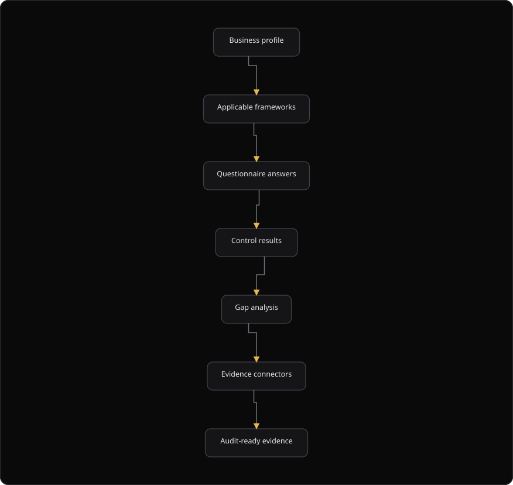

# Command Centre: Compliance review

**Where:** **Compliance** → **Frameworks** (`/compliance`), **Questionnaire** (`/compliance/questionnaire`), **Gap analysis** (`/compliance/gaps`), **Business profile** (`/compliance/profile`), **Evidence connectors** (`/compliance/connectors`)
**What:** Shows the frameworks that apply, the questions that scope them, and the gaps they reveal. It also shows the business profile that drives them and the connectors that collect evidence.
**Who:** Any operator. A compliance assessment and an evidence record need operate mode with dual control.
**Before you start:** The business profile is complete. Framework recommendations and the questionnaire scope depend on it.

---

## Before you start

- The **Business profile** holds the primary country, the industry and the data handled.
- Operate mode is unlocked for a compliance assessment or an evidence record.
- An authorizer is available when dual control applies.
- The security database is connected. The gap analysis and the evidence connectors read it.

---

## Process flow

---

## Steps

1. Open **Compliance** → **Business profile**.
2. Enter the **Primary country**, the **Industry**, the **Data retention** in days and the data handled.
3. Add the **Cloud providers** and the **Customer countries**.
4. Select **Save**. The framework recommendations refresh from the profile.
5. Read **Recommended frameworks**. The list comes from the jurisdiction and the industry. For example, a Nigerian fintech gets the CBN and NDPA set, not a generic ISO list.
6. Open **Questionnaire** and select **Declare your role**. Enter a role of at least 2 characters.
7. Answer each question. Every answer is attributed to you and to the role.
8. Open **Gap analysis**. Read **Uncovered controls** and **Gaps by risk**.
9. Select **Map findings to controls** to refresh the mapping. The toast reports the findings and the frameworks.
10. Open **Evidence connectors**, configure a connector and collect the evidence.
11. Open **Frameworks** and read a control row: **Control**, **Title**, **Category**, **Source**, **Evidence**, **Status** and **Recommendation**.

---

## Reference

### Where each answer lives

| Page | What it is for |
| --- | --- |
| **Frameworks** | Which frameworks apply and their control coverage |
| **Questionnaire** | The scoping questions that decide applicability |
| **Gap analysis** | Controls you are not meeting, with the mapping that proves it |
| **Business profile** | Sector, jurisdictions and data handled. Drives framework selection |
| **Evidence connectors** | Live collection into your security database |

### Business profile fields

| Field | Example |
| --- | --- |
| **Primary country** | `NG` |
| **Industry** | Fintech |
| **Data retention (days)** | A number of days |
| **Customer countries** | `NG, GH, KE` |
| **Cloud providers** | Where the workloads run |
| **Data handled** | Each item pulls in a different control set |

### Control status values

| Status | Meaning |
| --- | --- |
| `pass` | Evidence demonstrates the control |
| `gap` | The control is not met |
| `unknown` | The engine has no result yet |

### Gap analysis columns

| Column | Shows |
| --- | --- |
| **Control** | The control identifier |
| **Framework** | The framework identifier |
| **Reference** | The control reference |
| **Category** | The control category |
| **Risk** | The risk of the uncovered control |

### Questionnaire behavior

The question set is the merged set for whichever frameworks apply to the organization. Questions are framework-tagged. Answer text is attributed to the role you declare and to your user. Staff can edit a question in the staff portal, so the page shows what the engine will assess.

### Evidence connectors

A connector is configured, then collected. The **Configuration (JSON)** field holds the connector settings. A collection stores the evidence items in your security database.

### Scope and limits

- Compliance gaps are produced from Compliance Engine mappings only.
- A control failure is never invented. Every gap names the control and the mapping behind it.
- Certification remains yours. SecureGraph builds the case and is not the auditor.

---

## Troubleshooting

| Symptom | Cause | Fix |
| --- | --- | --- |
| **Recommended frameworks** is empty | The profile is incomplete, or it is not saved | Complete the profile and select **Save** |
| The questionnaire says "No questions here" | No framework resolved, or the filter excludes the questions | Save the profile, then select **Rebuild** |
| The questionnaire asks you to state your role | The answering role is not recorded | Select **Declare your role** and enter a role of at least 2 characters |
| A gap names no control | The mapping is stale | Select **Map findings to controls** |
| **Gap analysis unavailable** appears | The gap endpoint failed | Check the security database connection, then select **Refresh** |
| A toast says "Running a compliance assessment requires a dual-control operate session" | Operate mode is locked | Unlock operate, or ask an authorizer |
| An evidence record fails with "Framework and control are required" | A required field is empty | Select a framework and a control |
| **Evidence connectors** lists no connector | The deployment has no evidence adapter | Register an adapter, or record the evidence by hand |
| A profile save fails with a 400 status | The profile is not complete | Complete the required fields and save again |

---

## Related

- [10-compliance-assessment.md](./10-compliance-assessment.md)
- [09-manage-risks.md](./09-manage-risks.md)
- [11-generate-reports.md](./11-generate-reports.md)
- [12-findings-tracker.md](./12-findings-tracker.md)
