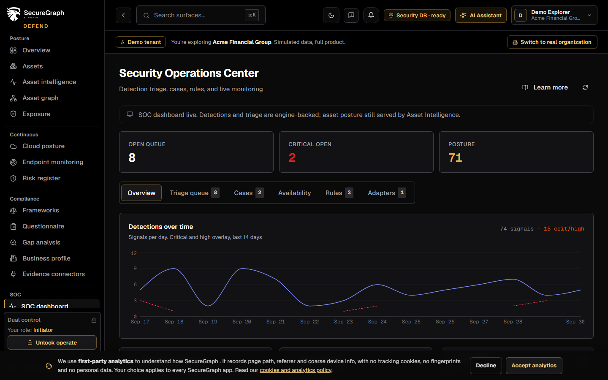
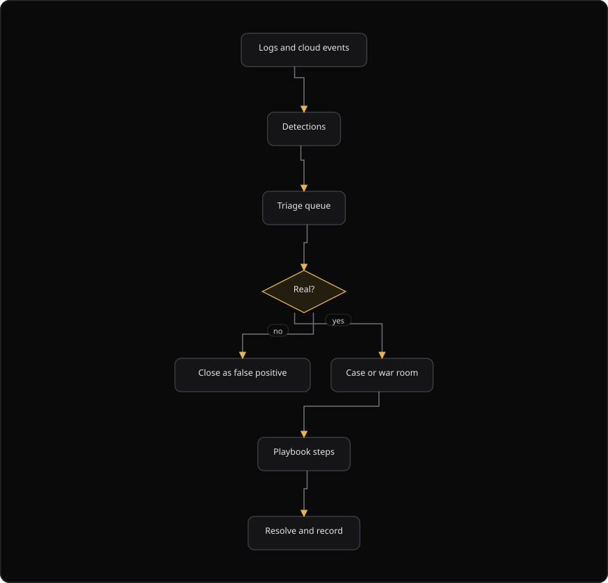

# Command Centre: SOC operations

**Where:** **SOC** → **SOC Dashboard** (`/soc`), **War Room** (`/soc/war-room`), **Playbooks and MITRE** (`/soc/playbooks`), **Advisor** (`/soc/advisor`), **Log Pipeline** (`/soc/logs`), **Agents** (`/soc/agents`), **Cloud Integrations** (`/soc/cloud`)
**What:** Shows detection, triage, response and the analyst surfaces around them.
**Who:** Any operator with SOC access. A triage action, a case change and a rule change write to the security database.
**Before you start:** A log source or a cloud integration sends events to the Log Pipeline.

---

## Before you start

- At least one log source or cloud integration sends events.
- An agent is installed on the hosts that ship logs.
- The Log Pipeline is healthy. Check ingest before you assume the estate is calm.
- Operate mode is unlocked for a rule change.

---

## Process flow

---

## Steps

1. Open **SOC** → **SOC Dashboard**.
2. Read the three counters: **Open queue**, **Critical open** and **Posture**.
3. Open **Triage queue** and filter by status and by severity.
4. Work the queue oldest critical first. Open a detection to read its evidence.
5. Select **Acknowledge**, **Assign** or **Escalate** to move the detection.
6. Ask the **Advisor** to explain a detection. The Advisor reads the detection and its evidence.
7. Open the **War Room** and open a case. Set the title, the severity and the owner.
8. Work the playbook checklist. Each step shows `pending`, `completed` or `skipped`.
9. Read the **evidence**, the **kill chain** and the **SLA** tabs as the case runs.
10. Close the case with a case status. The status is `open`, `investigating`, `contained` or `closed`.
11. Close the detection with the **Closed** action. A false positive is a result and it tunes the detection.
12. Open **Log Pipeline** when the queue is empty. Ingest health explains a silent queue.

---

## Reference

### Surfaces

| Page | Use it for |
| --- | --- |
| **SOC Dashboard** | The detection queue and current volume |
| **War Room** | Running an incident across phases with notes and owners |
| **Playbooks and MITRE** | The response steps and the techniques they cover |
| **Advisor** | Explains a detection and suggests next actions |
| **Log Pipeline** | Ingest health. Whether events are arriving at all |
| **Agents** | Heartbeat and log-shipper installs for your hosts |
| **Cloud Integrations** | Cloud sources feeding detections |

### SOC Dashboard tabs

| Tab | Shows |
| --- | --- |
| **Overview** | The detection trend and the dashboard panels |
| **Triage queue** | Open detections |
| **Cases** | Open and closed cases |
| **Availability** | The endpoint and availability state |
| **Rules** | The detection rules and their state |
| **Adapters** | The configured event adapters |

### Detection status values

| Status | Meaning |
| --- | --- |
| `open` | The detection waits for triage |
| `acknowledged` | An analyst saw the detection |
| `assigned` | The detection has an owner |
| `escalated` | The detection links to a case |
| `closed` | The detection is resolved or a false positive |

### Case status values

| Status | Meaning |
| --- | --- |
| `open` | The case is new |
| `investigating` | An analyst works the case |
| `contained` | The impact is contained |
| `closed` | The case is complete |

### Agent and cloud columns

| Page | Columns |
| --- | --- |
| Agents | Hostname, Version, Agent ID, Status, Last heartbeat |
| Cloud Integrations | Connection, Provider, Type, Status, Actions |

### Triage that stays honest

The Advisor explains a detection. It never invents an incident. An alert and a SOC engine own a detection, and the agent explains it. A silent **Log Pipeline** is the most common cause of "we saw nothing".

---

## Troubleshooting

| Symptom | Cause | Fix |
| --- | --- | --- |
| The queue is empty and the estate is not calm | No event reaches the pipeline | Check **Log Pipeline** for ingest health, then the agent heartbeat |
| **Agents** lists no agent | No agent registered | Install the agent from the **Agent installation** panel |
| **Cloud Integrations** lists no connection | No cloud account is connected | Select **Connect cloud provider** and choose AWS, Azure or GCP |
| A case shows an SLA breach | The case passed its SLA target | Read the **SLA** tab and reassign the case |
| The Advisor does not explain a detection | The detection has no evidence | Open the detection and read the raw evidence |
| A rule change fails | The rule name is empty, or the match spec is invalid | Enter a name, then save again |
| **Escalate** says "Already escalated" | The detection links to an existing case | Open the **Cases** tab |
| The log search returns nothing | The query is too narrow, or no event arrived in the window | Widen the time window and search again |
| The **Adapters** count is 0 | No adapter is configured | Configure an adapter for the event source |

---

## Related

- [07-triage-soc.md](./07-triage-soc.md)
- [08-availability-monitoring.md](./08-availability-monitoring.md)
- [19-threat-intel.md](./19-threat-intel.md)
- [20-agent-activity.md](./20-agent-activity.md)
- [36-incidents.md](./36-incidents.md)
