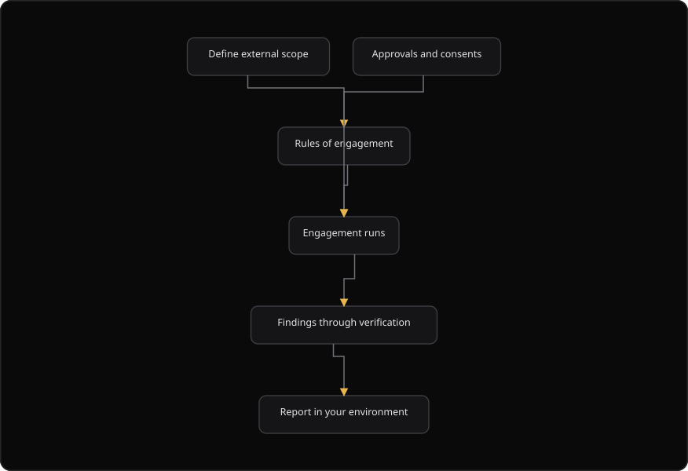

# Command Centre: Pentest scope

**Where:** **Pentest scope** → **External pentest scope** (`/pentest/external-scope`)
**What:** The external scope and rules of engagement for a human-assisted engagement, held inside your own workspace so every finding lands in one place.
**Who:** The **initiator** drafts a scope. The **authorizer** approves it. Both actions need operate mode with dual control.
**Before you start:** The declared internet-facing assets are verified. An authorizer is available.

---

## Before you start

- The declared internet-facing assets exist and are verified.
- Operate mode is unlocked for a write action.
- An authorizer is available. The authorizer approves the document.
- The engagement window is known. The end time is later than the start time.
- The acknowledgements are read and understood.

This is a document workshop. It does not start a VAPT campaign or a scan. A draft carries the watermark `DRAFT: NOT AUTHORIZATION TO TEST` until an authorizer approves it.

---

## Process flow

---

## Steps

1. Open **Pentest scope**.
2. Select **New scope**. The wizard opens on **Assets and code**.
3. Select at least one in-scope asset. An engagement cannot be approved while no asset is selected.
4. Add related code as context. Related code is context and not attack surface.
5. Select **Next**.
6. Set the window: the start time, the end time, the timezone and business hours only.
7. Select **Next**.
8. Accept all four acknowledgements: authorization, out of scope, data handling and third parties.
9. Select **Next**.
10. Enable each prohibition. Write a reason when you disable one.
11. Select **Next** and read the review. Then save the draft.
12. Select **Approve document** as the authorizer. The watermark is removed and the content hash is set.
13. Download the scope and the rules of engagement as PDF or DOCX.
14. Open the **Findings** tab and select **Import findings**. Paste a JSON array, or an object with a `findings` key.
15. Keep **verify** on to run the agent verifier over the imported findings.

---

## Reference

### What you define

| Field | Means |
| --- | --- |
| **In-scope assets** | Hosts, apps and APIs the engagement may touch |
| **Out of scope** | Explicitly excluded systems |
| **Rules of engagement** | Windows, contacts, and what is never tested |
| **Approvals** | The acknowledgements required before the engagement can proceed |

An engagement cannot be approved while a required acknowledgement is missing. That is a gate and not a warning.

### Wizard steps

| Step | Fields |
| --- | --- |
| **Assets and code** | Title, in-scope assets, related code assets |
| **Window** | Starts at, ends at, timezone, business hours only |
| **ROE acknowledgements** | Authorization, out of scope, data handling, third parties |
| **Prohibitions** | Each prohibition, with a reason when it is off |
| **Review** | The full draft |

### Acknowledgements

| Field | Statement |
| --- | --- |
| `authorization_ack` | Authorize testing of the named in-scope assets only |
| `out_of_scope_ack` | Out-of-scope assets stay out of scope, including anything discovered later |
| `data_handling_ack` | No download, modification or exfiltration of customer or personal data |
| `third_parties_ack` | No third-party engagement without prior written approval |

### Document status values

| Status | Meaning |
| --- | --- |
| `draft` | The document is not authorization to test. Downloads carry a red draft banner |
| `approved` | The authorizer approved the document. The watermark is removed |

### Documents and downloads

| Document | Formats |
| --- | --- |
| Scope | PDF and DOCX |
| Rules of engagement | PDF and DOCX |
| Scope and ROE preview | Markdown |

An approved document is immutable. To change the scope, open a new document. A draft can be edited.

### Imported findings

A human-led engagement reports results outside SecureGraph. The **Import findings** action stores them, runs the agent verifier over them and lands them beside the engine findings. The import accepts a JSON array of findings, or an object with a `findings` key. A finding needs a title. The other fields are severity, description, target, category, CVE, CVSS score, asset ID, tool, source reference and evidence.

### Why scope lives here

Running the engagement inside your SecureGraph workspace means the findings flow through the same verification gate and impact analysis as your internal work. You get one source of truth instead of a stitched view of reports from several vendors.

### Commercial and scope rules

- Scope is immutable once the engagement starts. To change the scope, open a new engagement.
- Human-led engagements are quoted separately from subscription plans.

---

## Troubleshooting

| Symptom | Cause | Fix |
| --- | --- | --- |
| **Approve document** is absent | You are not the authorizer | Ask the authorizer to sign in and approve the document |
| **Approve document** is disabled | An acknowledgement is missing, or no asset is selected | Complete the acknowledgements and select an asset |
| The wizard does not advance | The current step is incomplete | Read the step requirement and complete it |
| Saving the draft says "Drafting an external pentest scope requires a dual-control operate session" | Operate mode is locked | Unlock operate, or ask an authorizer |
| **Import findings** says "Findings must be valid JSON" | The pasted text is not JSON | Export the findings as a JSON array |
| **Import findings** says "No finding had a title" | A finding has no title | Add a title to each finding |
| A download says "PDF fell back to markdown" | The PDF renderer is unavailable | Use the DOCX file, or the markdown preview |
| The edit action is gone on an approved document | An approved document is immutable | Open a new scope for a change |
| A non-authorizer sees a 403 on approve | Only the authorizer can finalize the document | Ask the authorizer to approve it |
| The engagement will not start | A required acknowledgement is missing | Complete the acknowledgements and approve the document |

---

## Related

- [06-run-vapt-campaign.md](./06-run-vapt-campaign.md)
- [17-autonomous-pentest.md](./17-autonomous-pentest.md)
- [34-prior-reports.md](./34-prior-reports.md)
- [14-authorizer-approvals.md](./14-authorizer-approvals.md)
