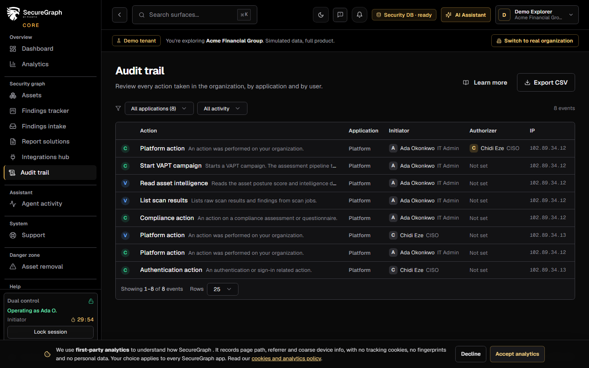
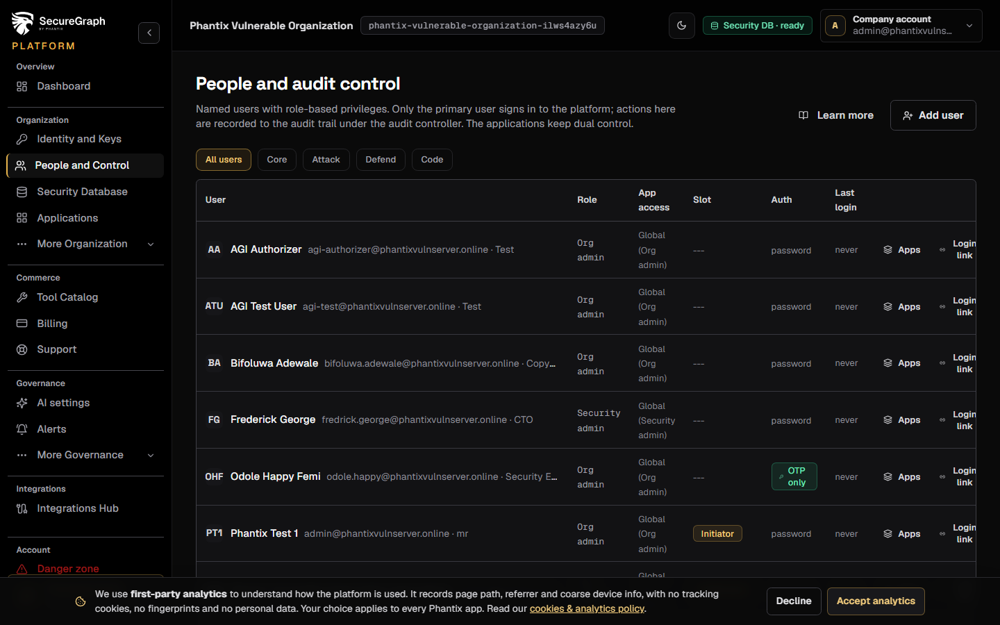
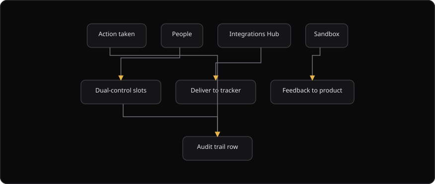

# Command Centre: Audit, people, integrations and sandbox

**Where:** **Audit trail** (`/audit`), **People** (`/people`), **Integrations Hub** (`/integrations`), **BETA sandbox** (`/sandbox`)
**What:** The supporting surfaces. Who did what, who is in the organization, where findings are delivered, and how to try new features safely.
**Who:** Any operator can read the audit trail and export it. An install, an uninstall and a secret rotation need operate mode with dual control.
**Before you start:** Operate mode is unlocked for an install, an uninstall or a secret rotation.

---

## Before you start

- Operate mode is unlocked for an install, an uninstall or a secret rotation.
- An authorizer is available when dual control applies.
- The organization is enrolled in the launch sandbox cohort before you open **BETA sandbox**.
- The security database is connected. The audit trail reads it.

---

## Process flow

---

## Steps

### Audit trail

1. Open **Audit trail**.
2. Filter by **Application** and by **Action**.
3. Read a row: **Action**, **Application**, **Initiator**, **Authorizer**, **IP** and **Time**.
4. Select **Export CSV**. The file downloads as `phantix-audit-<date>.csv`.

### People

5. Open **People** and invite a user.
6. Set the role. The **initiator** and **authorizer** slots unlock a mutating operate session.

### Integrations Hub

7. Open **Integrations Hub**.
8. Search the catalog. Then select a connector to install it and enter a **Label**.
9. Wait for the authorizer when the toast says the install is parked.
10. Open **Installed** to test a connector, rotate a secret or uninstall it.
11. Open **Pending auth** to finish an OAuth flow.

### BETA sandbox

12. Open **BETA sandbox** and read **Live updates**. Acknowledge an update after you read it.
13. Select **Rate this build** and enter the score, the NPS, the area, the comment and what broke.

---

## Reference

### Audit trail columns

| Column | Shows |
| --- | --- |
| **Action** | The action label and the endpoint description |
| **Application** | Core, Attack, Defend, Code or Platform |
| **Initiator** | The user who started the action |
| **Authorizer** | The user who approved the action, when dual control applied |
| **IP** | The source address |
| **Time** | When the action occurred |

The trail is append-only. Nothing edits history. Every action records the initiator, the authorizer, the status and the timeline.

### People roles

| Role | Can do |
| --- | --- |
| View and reports | Read and export. This is the default |
| Initiator | Start a mutating action in an operate session |
| Authorizer | Approve a mutating action that needs dual control |

A user who is neither an initiator nor an authorizer can still read and export. That is the intended default and not a limitation. A user removed from the organization loses access immediately, and the audit history remains.

### Integrations Hub tabs

| Tab | Shows |
| --- | --- |
| **Connector catalog** | Every connector, with a search box and a category filter |
| **Installed** | Active installations, with test, secret rotation and uninstall actions |
| **Pending auth** | Installations that wait for an OAuth flow |

Delivery is the outward-facing step and it is irreversible. A delivery is parked for authorizer approval before it runs. Findings are never delivered without approval.

### BETA sandbox

| Field | Values |
| --- | --- |
| **Score** | 1 to 5 |
| **NPS** | 0 to 10 |
| **Area** | The product area |
| **Comment** | Free text |
| **What broke?** | Free text |

The cohort holds 20 seats. SecureGraph staff enroll an organization from the staff portal. Feedback goes to the product team and sandbox data stays in your tenant.

---

## Troubleshooting

| Symptom | Cause | Fix |
| --- | --- | --- |
| **Export CSV** says "Export failed" | The export request failed | Retry. Check your connection. Your session stays signed in |
| The audit table lists no event | No event matches the active filters | Clear the filters |
| The **Authorizer** cell is empty | Dual control did not apply to that action | No action |
| An install says "Sent for approval" | Dual control parked the install | Approve it in **Authorizations** |
| A connector row reads `pending_auth` | The OAuth flow is not finished | Open **Pending auth** and finish the flow |
| An uninstall says "Sent for approval" | Dual control parked the uninstall | Approve it in **Authorizations** |
| **BETA sandbox** says "Not enrolled" | The organization is not in the cohort | Ask SecureGraph staff to enroll the organization |
| A rating fails with "Score must be 1–5" | The score is outside the range | Enter a score from 1 to 5 |
| **Integrations Hub** says "No connectors" | No connector matches the filter | Clear the search and the category filter |
| A user lost access after removal | The user left the organization | No action. The audit history remains |

---

## Related

- [14-authorizer-approvals.md](./14-authorizer-approvals.md)
- [03-add-and-verify-assets.md](./03-add-and-verify-assets.md)
- [09-manage-risks.md](./09-manage-risks.md)
- [36-incidents.md](./36-incidents.md)
