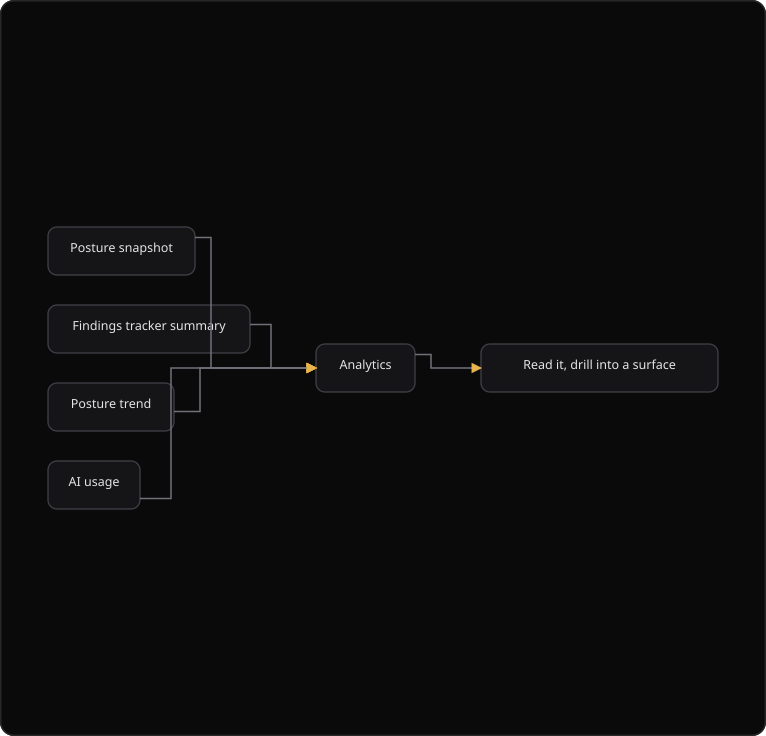

# Command Centre: Analytics

**Where:** **Analytics** (`/analytics`)
**What:** The security picture of the organization, live, posture, findings, comparative and automation panels, with nothing to generate and nothing to wait for.
**Who:** Any operator. The page is read-only.
**Before you start:** At least one engine holds data. A posture trend needs two or more snapshots.

---

## Before you start

- At least one engine holds data. The page reads the posture snapshot, the tracker and the AI usage endpoint.
- A posture trend needs two or more snapshots.
- The security database is connected. Each panel reads an endpoint that already exists.

---

## Process flow

---

## Steps

1. Open **Analytics**.
2. Read the four counters: **Overall posture**, **Open findings**, **Fix rate** and **Regressions**.
3. Read **Posture trend**. History appears after two or more snapshots.
4. Select a surface row in **Surface scores** to filter the page by that surface.
5. Read **Exposure composition by surface** and **Tracked findings by surface**.
6. Read **Severity mix across the organization**.
7. Read the compliance panel, **Control outcomes by framework**.
8. Read **How long open work waits** and **Past their fix date**.
9. Read the automation panel: **Tokens used**, **AI spend**, **AI credits** and **Budget window**.
10. Select **Refresh** after a scan or a campaign finishes.

---

## Reference

### What each panel answers

| Panel | Question it answers |
| --- | --- |
| **Overall posture** | Where do we stand, 0–100 across every surface? |
| **Open findings** | How much work is outstanding, open and in progress? |
| **Fix rate** | Of everything tracked, how much is actually fixed? |
| **Regressions** | How many fixes did not hold? |
| **Surface scores** | Which surfaces carry the exposure. Select one to filter |
| **Posture donut** | How is the score composed across surfaces |
| **Posture trend** | Which way are we moving over time |
| **Findings breakdown** | Magnitude and share, reframed by status, severity and surface |
| **Comparative analysis** | Surfaces measured against each other. Exposure composition and where remediation work sits |
| **Automation** | What the AI work of the platform is costing |

### Analytics is not a report

A **report** is an artifact you generate, version and hand to someone. **Analytics** answers the same questions from the same engine data immediately. Use Analytics to decide what to do. Generate a report when you need to send it.

### Panel sources

| Panel group | Source |
| --- | --- |
| Posture, surface scores, trend | Posture snapshot and posture trend |
| Open findings, fix rate, regressions | Findings tracker summary |
| Compliance outcomes | Compliance bundle |
| Automation | AI usage endpoint |

### Reading the panels honestly

- Each panel reads an endpoint that already exists. A source that is unavailable leaves the rest of the page intact.
- A panel with no data **says so** instead of an empty axis. An empty chart reads as "zero" when it usually means "not measured yet".
- The severity composition shows `other` for what the posture snapshot does not break out. It does not invent a medium or low split.
- Posture history appears once there are two or more snapshots. A single point is not a trend.

### Limits

Nothing on the page is credit-metered. You are never billed to view or analyze. Analytics reflects the same engines that produce findings and reports, so the numbers agree with the tracker by construction.

---

## Troubleshooting

| Symptom | Cause | Fix |
| --- | --- | --- |
| A panel shows no data | The source endpoint returned nothing | Run a scan or a campaign, then select **Refresh** |
| **Posture trend** shows one point | Fewer than two snapshots exist | Wait for the next daily snapshot |
| A panel names an unavailable engine | The source is down | Check the security database connection |
| **Severity mix** shows `other` | The posture snapshot does not break out the severity | No action. The value stays honest |
| The page is empty after sign-in | No engine holds data yet | Complete discovery and a first scan |
| **Fix rate** reads 0 | No tracked finding is fixed | Work the remediation queue |
| A surface filter hides every panel | The chosen surface holds no data | Clear the surface filter |

---

## Related

- [29-dashboard.md](./29-dashboard.md)
- [11-generate-reports.md](./11-generate-reports.md)
- [22-posture.md](./22-posture.md)
- [12-findings-tracker.md](./12-findings-tracker.md)
- [33-remediation.md](./33-remediation.md)
