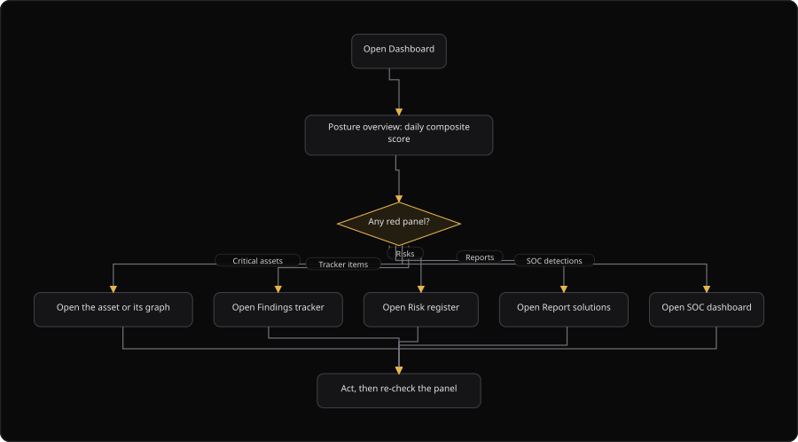

# Command Centre: Dashboard

**Where:** **Overview** → **Dashboard** (`/dashboard`)
**What:** The daily composite picture. Posture score, findings by surface and severity, the open-findings trend, critical assets, tracker items, top risks, recent reports and SOC detections in one screen.
**Who:** Any operator. The page is read-only. Each panel tile navigates to its full page.
**Before you start:** You are signed in. At least one engine holds data, so the panels fill.

---

## Before you start

- You are signed in. The Dashboard is the landing page after sign-in.
- At least one engine holds data. An empty panel reads "not measured yet".
- Operate mode is unlocked when you plan to act on a panel item.

---

## Process flow

---

## Steps

1. Sign in. The Dashboard is the landing page after sign-in.
2. Read the posture score first. A falling score with no new assets usually means new findings.
3. Work the red panels top to bottom: critical assets, critical tracker items, top risks.
4. Read **Open findings per day** to see the trend of open work.
5. Read **Server heartbeat** to see the organization uptime checks.
6. Use a panel tile to open the full page for that topic.
7. If a panel says the engine is unavailable, the related page has the same state. Check the security database connection.
8. Dismiss the critical alert banner before you start, so it does not cover the panels.

---

## Reference

### Panels

| Panel | Shows | Leads to |
| --- | --- | --- |
| Posture overview | Daily composite score | Analytics |
| Findings by surface | Tracked findings per attack surface | Analytics |
| Findings by severity | Share of tracked findings | Analytics |
| Open findings per day | Findings still open at the end of each day | Analytics |
| Critical assets at risk | Highest-risk assets | Asset intelligence |
| Critical tracker items | Tracker work that is still open | Findings tracker |
| Top risks | Ranked risks | Risk register |
| Recent reports | Newest generated files | Report solutions |
| SOC detections | Open detection queue | SOC dashboard |
| Shortcuts | Frequent actions | The named page |
| Server heartbeat | Organization uptime checks | Availability monitoring |

### Panel availability

| Message | Meaning | Fix |
| --- | --- | --- |
| "Risk engine unavailable" | The risk engine did not answer | Check the security database connection |
| "SOC unavailable" | The SOC engine did not answer | Check the Log Pipeline and the security database connection |
| An empty panel | The source holds no data yet | Run a scan or a campaign |

### Red panels

The critical alert banner sits above the panels. Dismiss it before you work the panels. The three red panels are **Critical assets at risk**, **Critical tracker items** and **Top risks**.

---

## Troubleshooting

| Symptom | Cause | Fix |
| --- | --- | --- |
| A panel names an unavailable engine | The source engine is down | Check the security database connection, then reload |
| **Critical assets at risk** is empty | No asset carries a critical risk | Read **Top risks** and the tracker |
| The posture score falls and the asset count is stable | New findings arrived | Open **Open findings per day** and the tracker |
| The critical alert banner covers a panel | The banner is not dismissed | Dismiss the banner |
| The Dashboard is not the landing page | The signed-in route changed | Open `/dashboard` from the sidebar |
| A panel tile does not open a page | The target app is unavailable | Open the named page from the app switcher |
| **SOC detections** shows 0 and an incident is live | The SOC engine did not match the event | Check the Log Pipeline ingest |

---

## Related

- [11-generate-reports.md](./11-generate-reports.md)
- [12-findings-tracker.md](./12-findings-tracker.md)
- [22-posture.md](./22-posture.md)
- [28-analytics.md](./28-analytics.md)
- [35-asset-intelligence.md](./35-asset-intelligence.md)
