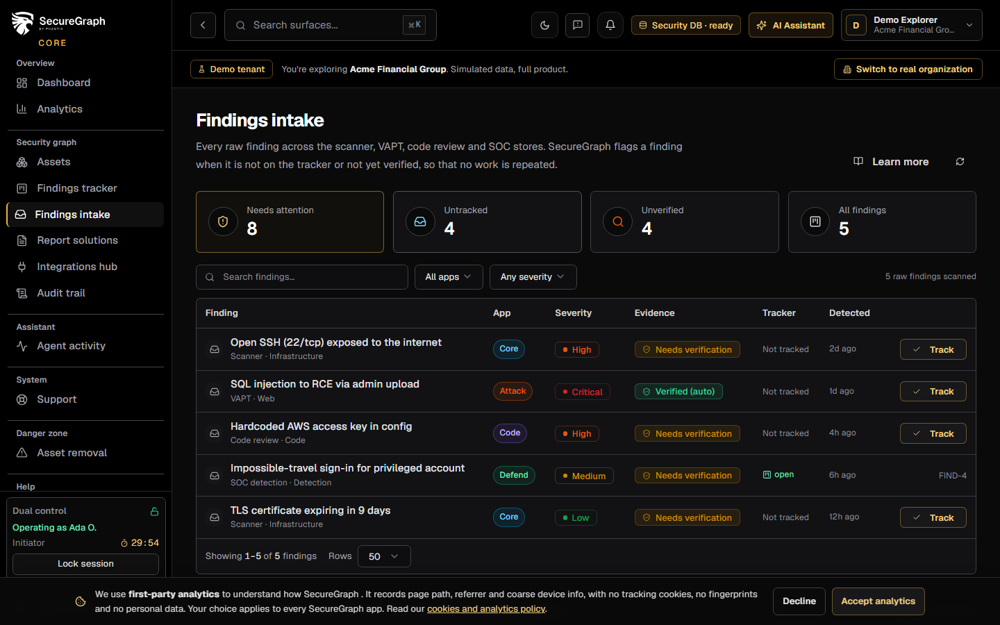
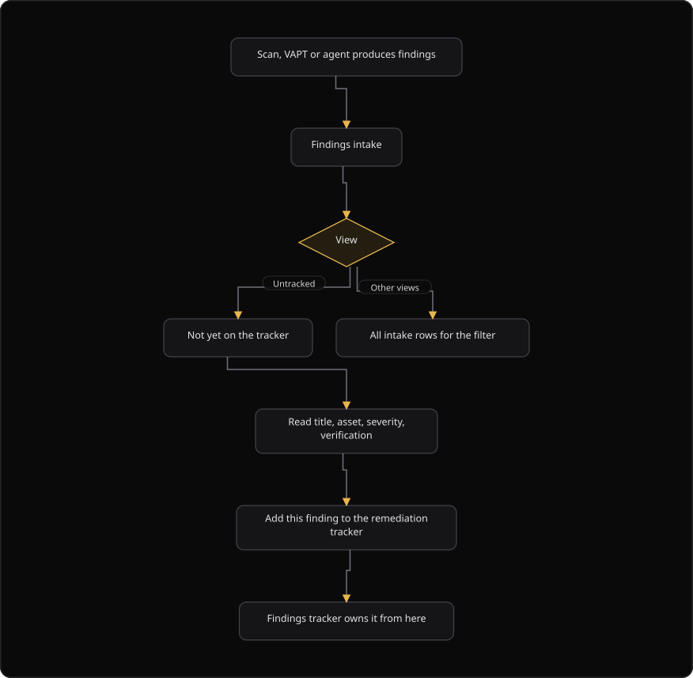

# Command Centre: Findings intake

**Where:** **Security graph** → **Findings intake** (`/findings`)
**What:** Findings that the engines produced but that are **not yet on the remediation tracker**. This is the inbox between a scan or campaign and the tracker.
**Who:** Any operator. **Add this finding to the remediation tracker** is a write action.
**Before you start:** A scan, a VAPT campaign or the agent produced at least one finding.

---

## Before you start

- A scan, a VAPT campaign, a code review or the agent produced at least one finding.
- The finding is verified before you route it to the tracker. A finding that is not verified is not ready to fix.
- The security database is connected. The page reads every finding store from it.

---

## Process flow

---

## Steps

1. Open **Findings intake**.
2. Read the four view tiles: **Needs attention**, **Untracked**, **Unverified** and **All findings**.
3. Select **Untracked** to see only what needs a decision.
4. Filter by **App** and by **Severity**, or use the search box.
5. Read the finding: the title, the app, the severity, the evidence and the verification status.
6. Read the **Tracker** column. A finding with no tracker row needs a decision.
7. Select **Add this finding to the remediation tracker**. The tracker now owns the row.
8. Open **Findings tracker** to set a status and an owner.
9. Select **Refresh** after a scan finishes, so new findings appear.
10. If the list is empty, every finding is already tracked, or the filter excludes the rest.

---

## Reference

### Views

| View | Shows |
| --- | --- |
| **Needs attention** | Untracked findings plus unverified findings. This is the default view |
| **Untracked** | Findings with no tracker row yet |
| **Unverified** | Findings that no verifier confirmed |
| **All findings** | Every finding across the scanner, VAPT, code review and SOC stores |

### Intake columns

| Column | Shows |
| --- | --- |
| **Finding** | The title of the finding |
| **App** | The app that produced the finding |
| **Severity** | The severity |
| **Evidence** | The verification status |
| **Tracker** | The tracker status, when a tracker row exists |
| **Detected** | When the finding arrived |

### Verification status values

| Status | Meaning |
| --- | --- |
| `auto_verified` | An automated verifier confirmed the finding |
| `manually_verified` | A person confirmed the finding |
| `unverified` | No verifier confirmed the finding |

### Rules

- Intake is a queue. It never generates a report and never fixes anything.
- The verification status tells you how much to trust the row.
- Never invent a finding ID. Every row is a SecureGraph finding with an ID.

---

## Troubleshooting

| Symptom | Cause | Fix |
| --- | --- | --- |
| The list is empty | Every finding is tracked, or the filter excludes the rest | Clear the filters, or open **All findings** |
| The action says "Already on the tracker" | The finding has a tracker row | Open **Findings tracker** |
| The toast says "Could not add to the tracker" | The write failed | Retry, then check the security database connection |
| A row shows `unverified` | No verifier confirmed the finding | Verify the finding before you fix it |
| The **App** filter hides a finding | The finding belongs to another app | Set **App** to the correct app |
| A new finding is missing | The finding arrived after the last load | Select **Refresh** |
| **Findings unavailable** appears | The finding stores did not load | Select **Retry** |

---

## Related

- [03-add-and-verify-assets.md](./03-add-and-verify-assets.md)
- [05-launch-a-scan.md](./05-launch-a-scan.md)
- [12-findings-tracker.md](./12-findings-tracker.md)
- [33-remediation.md](./33-remediation.md)
