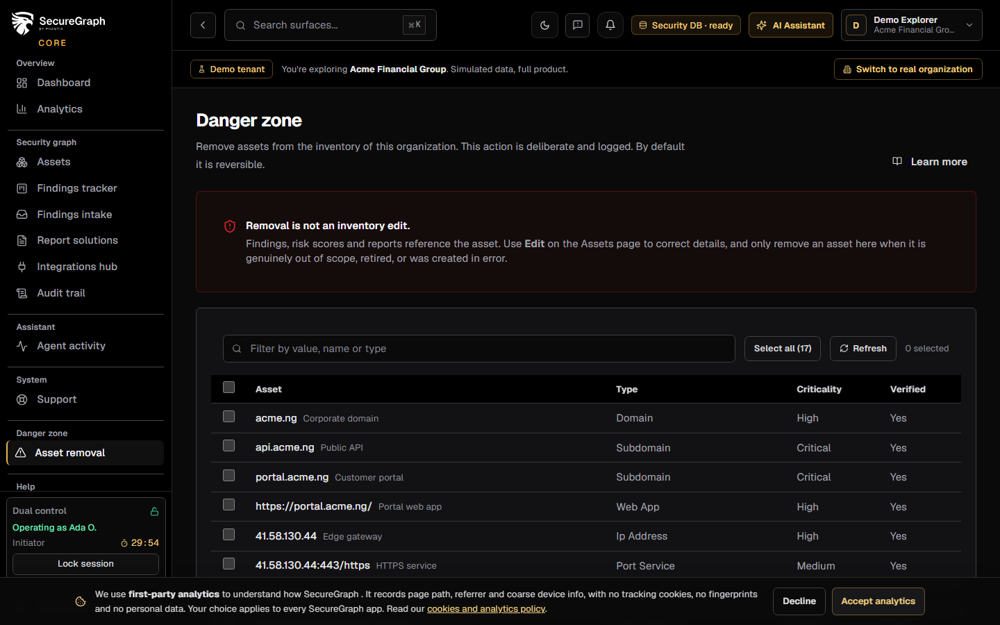
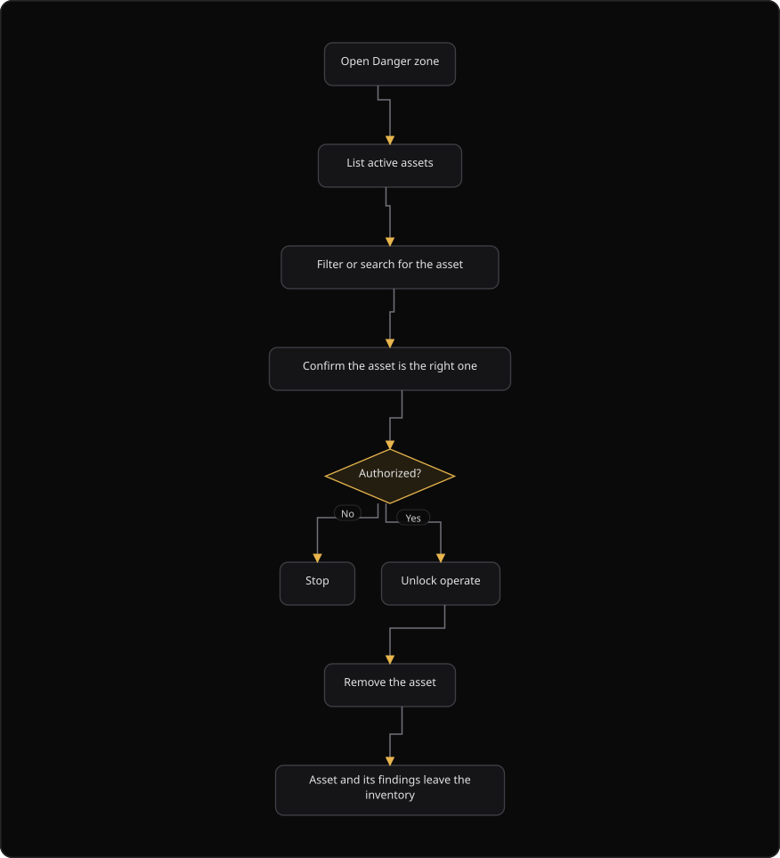

# Command Centre: Asset removal (Danger zone)

**Where:** **Danger zone** → **Asset removal** (`/danger-zone`)
**What:** Removes an asset and its related data from the inventory. This is a destructive action, and it needs operate mode.
**Who:** Any operator. Removal needs operate mode. An authorizer approves the action when dual control is configured.
**Before you start:** The asset is the correct asset. You know the removal mode.

---

## Before you start

- You know the asset value and name. Check both before you act.
- Operate mode is unlocked, or an authorizer is available.
- You know the removal mode: reversible or permanent.
- The security database is connected. The page reads the inventory from it.

---

## Process flow

---

## Steps

1. Open **Danger zone**. Read the warning on the page before you act.
2. Find the asset in the list. Use the filter if the list is long.
3. Check the asset value and name. An asset with no name shows its value only.
4. Select the asset. To remove several assets, select each one, or select all visible assets.
5. Select **Remove**.
6. Type `REMOVE` in the confirmation box.
7. Select **Remove permanently** when the removal must be irreversible. Leave it off to deactivate the asset.
8. Confirm the removal. The result list shows `Removed` or `Failed` for each asset.
9. Confirm the asset is gone from **Assets** and that its findings left the tracker.
10. If an error appears, the write failed. Nothing was removed. Retry after you resolve the cause.

---

## Reference

### Removal modes

| Mode | Confirmation | Result |
| --- | --- | --- |
| **Remove** | Type `REMOVE` | Soft delete. The asset is deactivated and stops being scanned and reported. Support can restore it |
| **Remove forever** | Type `REMOVE` and select **Remove permanently** | Hard delete. The row is gone and the action is not reversible |

### Fields

| Field | Values |
| --- | --- |
| Filter | Free text. It matches the value, the name and the asset type |
| Confirmation | The exact text `REMOVE` |
| **Remove permanently** | A checkbox. It is off by default |

### Rules

- A permanent removal has no undo.
- Removal is permanent for the demo and live inventory when you select **Remove permanently**.
- Scans and campaigns scoped to a removed asset skip it and anything beneath it.
- The audit trail records who removed the asset and when.
- Never remove an asset to hide a finding. Accept the risk or fix it instead.

---

## Troubleshooting

| Symptom | Cause | Fix |
| --- | --- | --- |
| The **Remove** button is disabled | The confirmation text does not read `REMOVE`, or no asset is selected | Select an asset and type `REMOVE` |
| The result list shows `Failed` for an asset | The delete request failed for that asset | Read the value in the list and retry |
| The toast says "0 removed" | No delete request succeeded | Check the security database connection |
| The asset remains in **Assets** | The list is stale | Select **Refresh** |
| The asset is gone and the findings remain | The finding belongs to another asset | Check the asset value on the finding |
| You removed the wrong asset | The selection was wrong | Support can restore a soft-deleted asset. A permanent removal is not reversible |
| The confirmation box rejects the text | The text is not `REMOVE` | Type `REMOVE` in capital letters |

---

## Related

- [03-add-and-verify-assets.md](./03-add-and-verify-assets.md)
- [27-admin-and-audit.md](./27-admin-and-audit.md)
- [12-findings-tracker.md](./12-findings-tracker.md)
