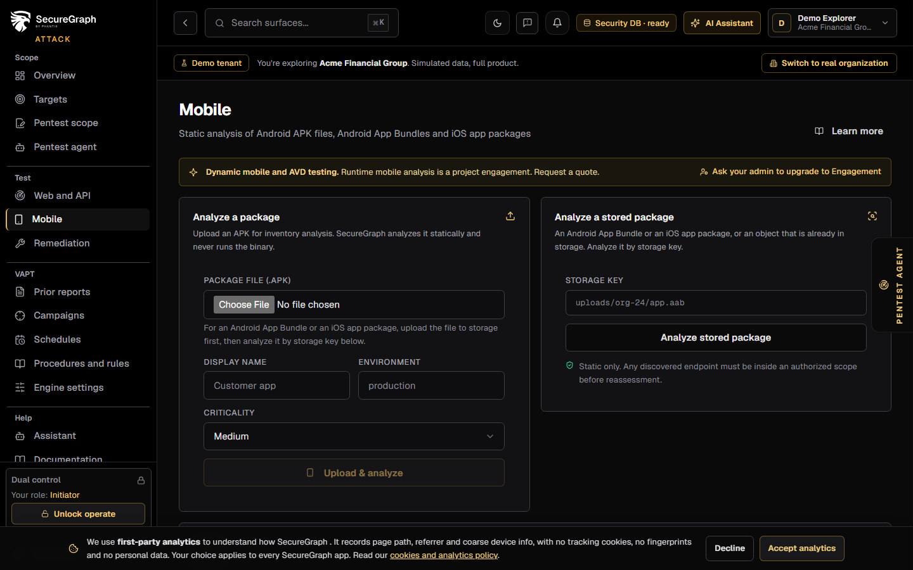
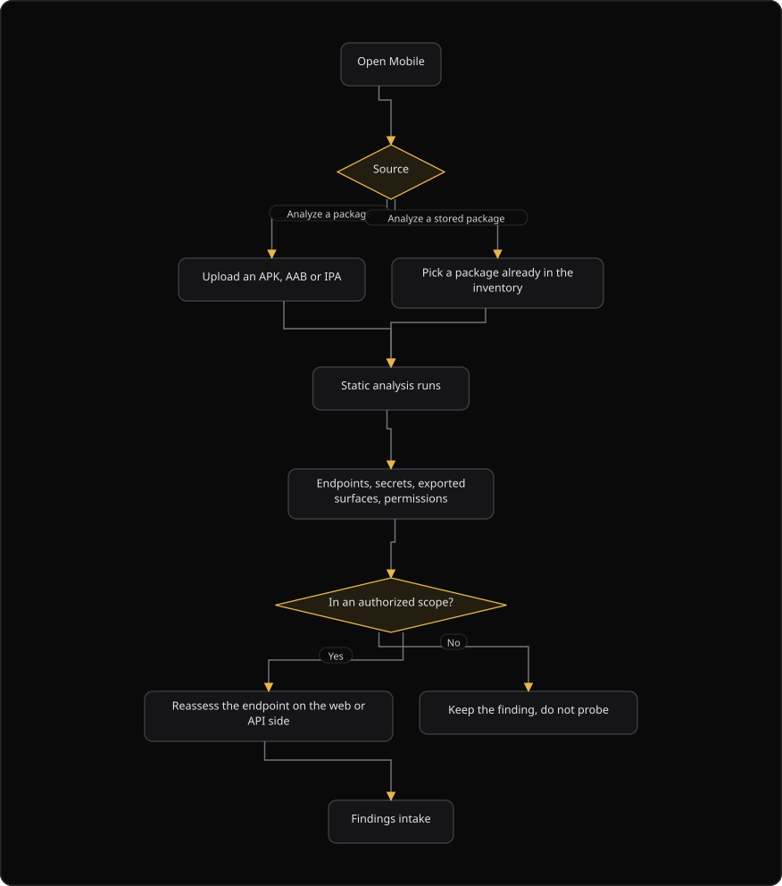

# Command Centre: Mobile package analysis

**Where:** **Test** → **Mobile** (`/mobile`)
**What:** Static analysis of an Android or iOS package: APK, Android App Bundle or iOS app package. The agent recovers secrets, exported surfaces and weak permissions without a live device.
**Who:** Any operator. A package upload needs operate mode with dual control.
**Before you start:** The package file is ready. Operate mode is unlocked for an upload.

---

## Before you start

- The package file is ready. The upload field accepts a `.apk` file.
- Operate mode is unlocked for an upload.
- An authorizer is available when dual control applies.
- A storage key exists when you analyze an Android App Bundle or an iOS app package.

---

## Process flow

---

## Steps

1. Open **Mobile**.
2. Select **Analyze a package** and choose the `.apk` file.
3. Enter a **Display name** and an **Environment**.
4. Select a **Criticality**: Low, Medium, High or Critical.
5. Select **Upload and analyze**. A `mobile_apk` asset is created or updated.
6. Read the result: the package name, the finding count, the `sha256`, the method and the first five findings.
7. For an Android App Bundle or an iOS app package, upload the file to storage first.
8. Paste the **Storage key** and select **Analyze stored package**.
9. Read the recovered endpoints first. Only endpoints inside an authorized scope can be reassessed.
10. Open a recovered endpoint to raise it as a finding, or add it to the asset inventory.
11. If the result says **Requires authorization**, the proposal is parked for an authorizer. It is not lost.
12. Send verified findings to **Findings intake**, then to the tracker.

---

## Reference

### Fields

| Field | Values | Notes |
| --- | --- | --- |
| **Package file (.apk)** | A `.apk` file | The upload limit is 8 MB per file |
| **Display name** | Text, 255 characters | Defaults to the file name |
| **Environment** | Text, 50 characters | For example `production` |
| **Criticality** | Low, Medium, High, Critical | Sets the asset criticality |
| **Storage key** | Text | For an AAB or an IPA already in storage |

### Result fields

| Field | Shows |
| --- | --- |
| Package name | The package identifier |
| Findings | The finding count |
| `sha256` | The package digest |
| Method | The analysis method |
| Message | A note from the analyzer |
| `scan_hint` | The next step the analyzer suggests |

### Rules

- Analysis is static. The agent does not run the app on a device.
- A package that is not in scope stays a finding. It is never probed.
- File formats stay as written: APK, AAB, IPA.
- Runtime and dynamic testing on an Android Virtual Device is a project engagement, not a self-serve scan.

---

## Troubleshooting

| Symptom | Cause | Fix |
| --- | --- | --- |
| **Upload and analyze** is disabled | No file is selected | Choose a `.apk` file |
| The toast says "Choose a package" | No file is selected | Select a `.apk` file |
| The toast says "Upload failed" | The file failed validation, or the upload failed | Read the message. Use a `.apk` file inside the size limit |
| **Analyze stored package** says "Storage key required" | The storage key box is empty | Paste the key that the upload returned |
| The result says **Requires authorization** | Dual control parked the reassessment | Ask the authorizer to approve the request |
| The analysis reports no finding | The package passed the static checks | No action. Read the `sha256` and the method |
| A recovered endpoint is outside the scope | The endpoint belongs to another host | Keep the finding and do not probe |
| The upload says "Uploading a mobile package requires a dual-control operate session" | Operate mode is locked | Unlock operate, or ask an authorizer |

---

## Related

- [03-add-and-verify-assets.md](./03-add-and-verify-assets.md)
- [30-findings-intake.md](./30-findings-intake.md)
- [17-autonomous-pentest.md](./17-autonomous-pentest.md)
