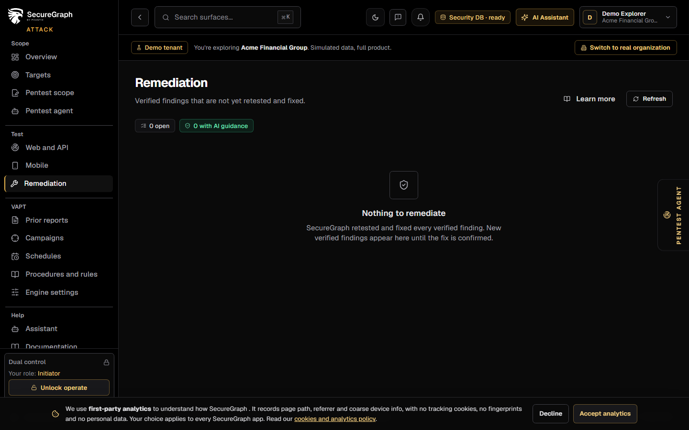
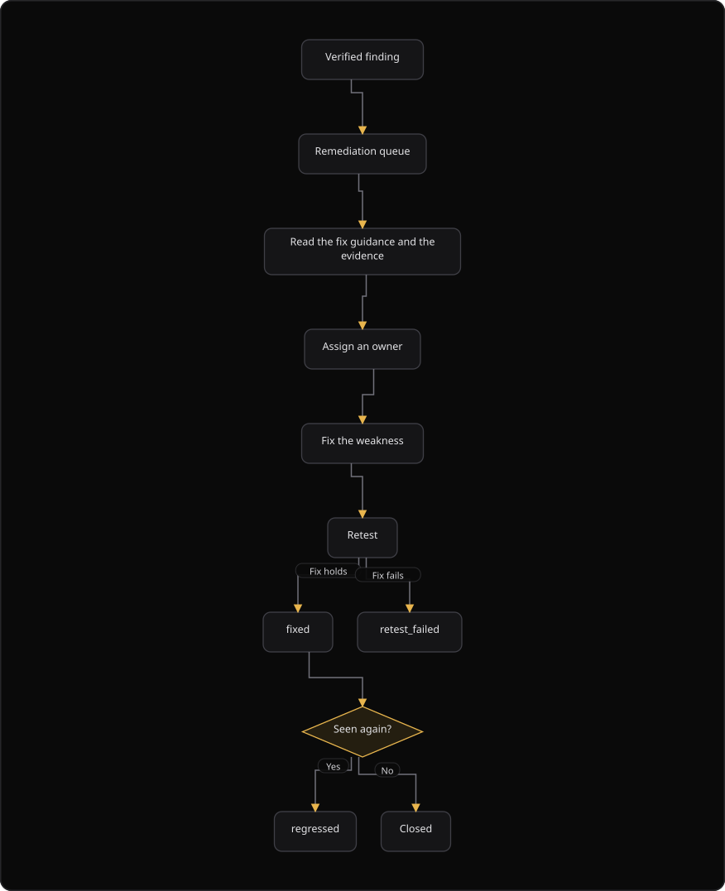

# Command Centre: Findings tracker: the fix queue

**Where:** **Findings tracker** (`/tracker`), then **Remediation** in the Actions column. Command Centre holds it under **Security graph**; Attack holds it under **Test**.
**What:** The fix queue for findings that are verified and ready to repair. Each row carries the fix guidance action, the affected asset and where the finding came from.
**Who:** Any operator. The remediation action writes to the security database.
**Before you start:** A finding is verified. Remediation is offered for verified findings only.

---

## Before you start

- A finding is verified. Only verified findings reach the queue.
- The security database is connected. The queue reads the feed from it.
- The finding is not retested and fixed yet. A confirmed fix leaves the queue.

---

## Process flow

---

## Steps

1. Open **Findings tracker**. Command Centre holds it under **Security graph**; Attack holds it under **Test**.
2. Read the three chips: the open count, the count with AI guidance and the count that awaits generation.
3. Read the board from the highest severity down.
4. Find the row. The Evidence column shows **Verified (auto)** or **Verified (human)**. A row that reads **Needs verification** has no remediation action yet.
5. Select **Remediation** in the Actions column of the row. The AI guidance opens beside the board, so the work list and the fix stay on one page.
6. Read the guidance: the summary, the ordered steps, the references and the validation.
7. Give the row an owner before you leave it.
8. Apply the fix on the asset.
9. Retest the finding with the retest action in the same row. A fix that is not retested stays open.
10. If the board holds no remediation action, every verified finding is either fixed or accepted.
11. If the row shows **Needs verification**, use the Verify action in the Actions column first. A finding that is not verified has no remediation action.

---

## Reference

### Statuses (do not invent others)

| Status | Meaning |
| --- | --- |
| open | Not started |
| in_progress | Being fixed |
| fixed | Fix confirmed by a retest |
| accepted | Risk accepted on purpose |
| retest_failed | The fix did not hold |
| regressed | Was fixed; seen again |

### Board columns

| Column | Shows |
| --- | --- |
| **Key** | The finding key, shortened to 10 characters. Hover for the full key |
| **Finding** | The title of the finding |
| **Severity** | The severity |
| **Asset** | The asset value |
| **Owner** | The assigned owner |
| **Due** | The target fix date |
| **Evidence** | The verification status |
| **Status** | The remediation status |
| **Age** | The days since the first detection |
| **Actions** | **Remediation**, **Verify** and the retest action |

### Actions column

| Action | Shows |
| --- | --- |
| **Remediation** | The fix guidance for a verified finding. The button is inactive until the finding is verified |
| **Verify** | The verify, false positive and reject decisions. It is offered on a finding that reads **Needs verification** |
| Retest | The targeted retest of the row's asset. The finding closes when the fix is confirmed |

### Guidance fields

| Field | Shows |
| --- | --- |
| `status` | `generated` when the guidance landed |
| Summary | The short description of the fix |
| Steps | The ordered fix steps |
| References | Source references |
| Validation | How to confirm the fix |
| `effort` | The estimated effort |
| `priority` | The priority |
| `generated_by` | The generator |
| `model` | The model that produced the guidance |
| `confidence` | The confidence value |

### Generation behavior

Generation is asynchronous. The request queues a job, and a fresh generate flips the status to `generated`. A regenerate changes the artifact. A finding leaves the page only after a retest confirms the fix. AutoFix holds the same rule: only verified findings reach it, so an unverified heuristic can never open a pull request.

---

## Troubleshooting

| Symptom | Cause | Fix |
| --- | --- | --- |
| The board is empty | Every verified finding is fixed or accepted | No action. New verified findings appear here |
| **Findings tracker unavailable** appears | The feed failed | Check the security database connection, then select **Refresh** |
| The **Remediation** action is inactive | The finding is not verified, or it has no source row | Use **Verify** in the same row, or open the scan result that produced the finding |
| A row says "awaiting generation" for a long time | The generation job did not complete | Open the row and generate the guidance again |
| The guidance never appears | The job failed | Read the error line above the table and retry |
| A row disappears from the board | The finding is retested and confirmed fixed | No action |
| The page shows a demo board | The demo mode flag is set | Sign in to the live organization |
| A status reads `retest_failed` | The fix did not hold | Fix the weakness again and retest |
| A status reads `regressed` | The fixed finding returned | Reopen the work and fix the root cause |
| The row shows no asset value | The finding has no asset link | Open the finding and check the asset |

---

## Related

- [30-findings-intake.md](./30-findings-intake.md)
- [12-findings-tracker.md](./12-findings-tracker.md)
- [09-manage-risks.md](./09-manage-risks.md)
- [21-code-security.md](./21-code-security.md)
