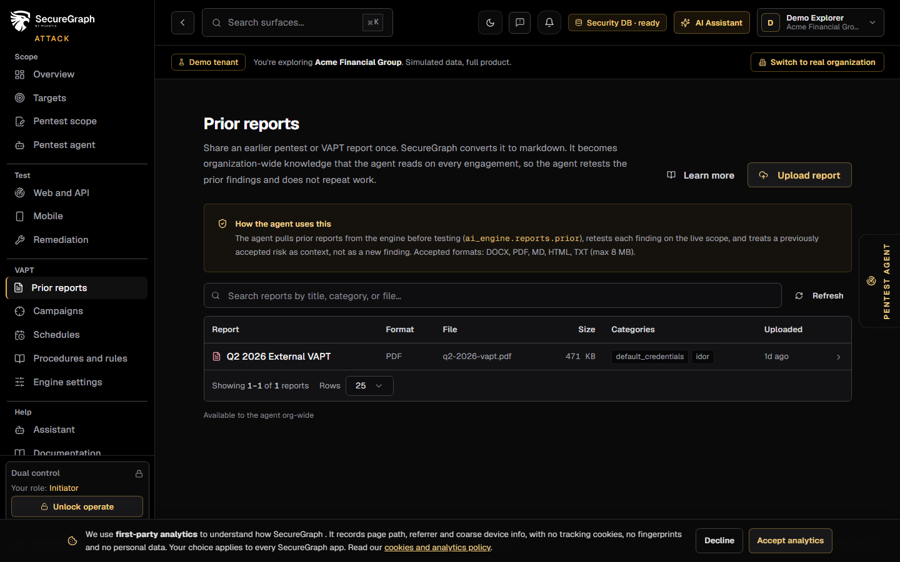
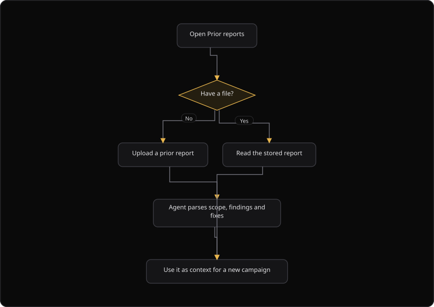

# Command Centre: Prior reports

**Where:** **VAPT** → **Prior reports** (`/prior-reports`)
**What:** Reports and evidence from engagements that ran before SecureGraph, or outside it. The agent reads them for context, so new work does not repeat old work.
**Who:** Any operator. An upload stores a document for the whole organization.
**Before you start:** You have the report file. The file size is 8 MB or less.

---

## Before you start

- You have the report file on the local machine.
- The report is a prior engagement report, or a report from outside SecureGraph.
- The file size is 8 MB or less.
- The file converts to markdown. A scanned PDF with no text layer reports a warning.

---

## Process flow

---

## Steps

1. Open **Prior reports**.
2. Select **Upload a prior report** and choose the file. PDF, DOCX, XLSX, HTML, JSON, CSV and MD are accepted.
3. Enter a **Title**. Add the categories, the tags and the report date.
4. Select **Upload and convert**. The backend converts the file to markdown.
5. Read the warnings. A file that converts with a problem reports a warning instead of a silent success.
6. Select **Refresh** after the upload.
7. Open a row to read what the agent parsed: the scope, the findings and the fixes.
8. Use the parsed context when you scope a new campaign, so known issues are not reported as new.
9. Search the list by title, category or file.
10. If a report fails to load, select **Could not load reports** to retry.

---

## Reference

### Upload fields

| Field | Values |
| --- | --- |
| File | An accepted format. The maximum size is 8 MB |
| **Title** | Free text, for example `Q2 2026 External VAPT` |
| Categories | Comma-separated terms, for example `sqli, idor, auth` |
| Tags | Comma-separated terms, for example `external, web, 2026` |
| Report date | The date of the original report |

### Accepted formats

PDF, DOCX, XLSX, HTML, JSON, CSV and MD.

### Report list columns

| Column | Shows |
| --- | --- |
| **Title** | The report title |
| Source file | The original file name |
| Categories | The category tags |
| Warnings | A conversion warning, when one exists |

### Rules

- A prior report is context, not a SecureGraph finding. It does not enter the tracker on its own.
- A claim in a prior report stays a claim until SecureGraph verifies it.
- Keep the original file. The parsed view is a convenience.
- The agent treats a previously accepted risk as context and not as a new finding.
- The report is available to the agent for the whole organization.

---

## Troubleshooting

| Symptom | Cause | Fix |
| --- | --- | --- |
| The upload button is disabled | No file is selected, or the upload is in progress | Select a file |
| The toast says "That file cannot be uploaded" | The file type or the file size is invalid | Use an accepted format inside the size limit |
| The toast says "Uploaded with warnings" | The file converted with a problem, for example a scanned PDF | Read the warnings and upload a text-based file |
| The list says "Could not load reports" | The report list failed to load | Select the retry action |
| A report shows no findings | The parse found none | Open the row and read the parsed text |
| The parsed view differs from the original | The converter changed the layout | Keep the original file. The parsed view is a convenience |
| The list is empty | No report is stored yet | Select **Upload a prior report** |
| No report matches the search | The search term excludes every report | Clear the search box |

---

## Related

- [06-run-vapt-campaign.md](./06-run-vapt-campaign.md)
- [26-pentest-scope.md](./26-pentest-scope.md)
- [11-generate-reports.md](./11-generate-reports.md)
