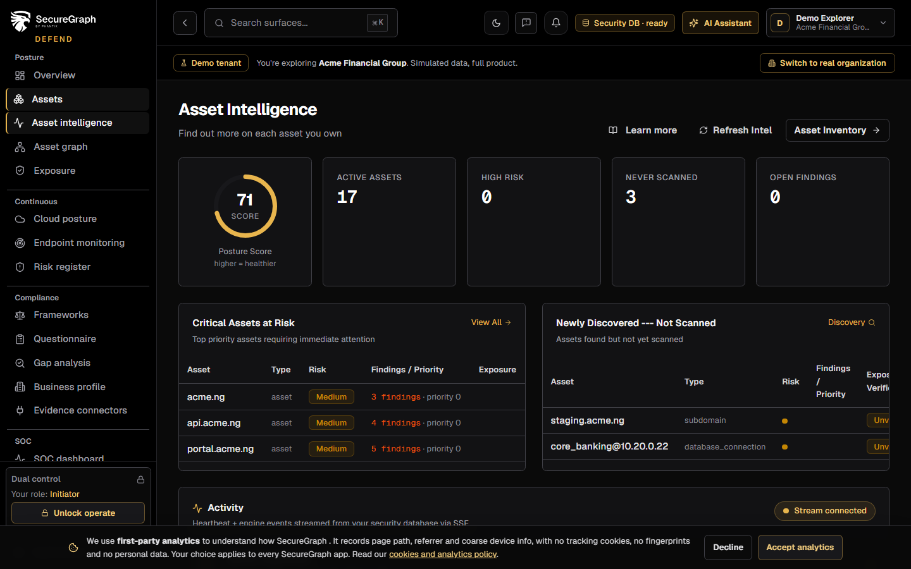
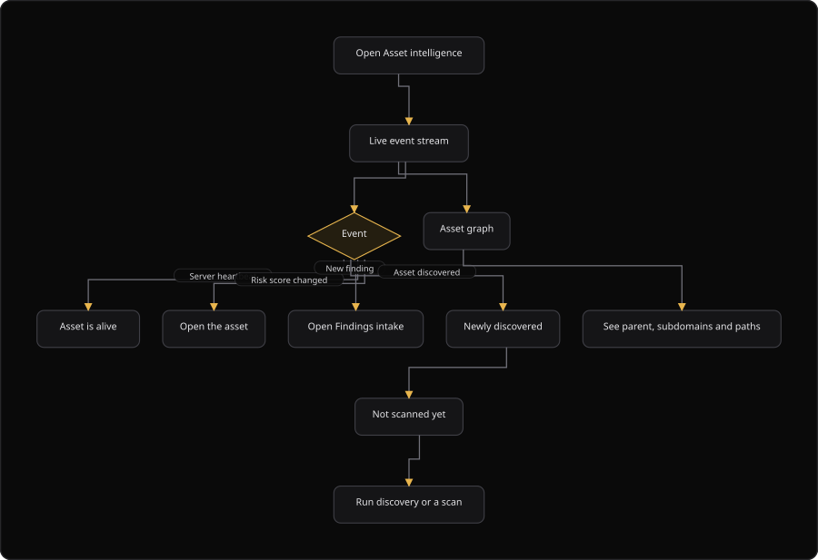

# Command Centre: Asset intelligence

**Where:** **Posture** → **Asset intelligence** (`/assets/intelligence`) and **Asset graph** (`/assets/intelligence/graph`)
**What:** A live view of what is happening to your assets: heartbeats, risk-score moves, new findings and updates from the security database. It also shows a graph of how the assets relate.
**Who:** Any operator. **Refresh intelligence** and the AI deep-dive need operate mode with dual control.
**Before you start:** At least one asset exists. Operate mode is unlocked for a refresh.

---

## Before you start

- At least one asset exists in the inventory.
- The live event stream is connected. The header shows "Server responsive" when it is.
- Operate mode is unlocked for a refresh or a deep-dive.
- An authorizer is available when dual control applies.

---

## Process flow

---

## Steps

1. Open **Asset intelligence**.
2. Read the four counters: **Active Assets**, **High Risk**, **Never Scanned** and **Open Findings**.
3. Watch the live event stream. A missing heartbeat is a warning and not proof of downtime.
4. Select **Refresh intelligence** to recompute the asset intelligence. The toast reports the updated count.
5. Work the **Critical Assets at Risk** list first.
6. Open **Newly Discovered** assets and scan them. An unscanned asset is an unknown exposure.
7. Select the AI deep-dive action to explain an asset. The action needs dual control.
8. Open **Asset graph** to see the relationship between assets before you scope a scan.
9. Use the graph controls: search to highlight an asset, **Show tags** and **Show types**.
10. Open an asset from either view to reach its full record.
11. Double-click the canvas to refit the graph.

---

## Reference

### Panels

| Panel | Shows |
| --- | --- |
| Live event stream | Heartbeat, risk-score change, discovery, new finding and update events |
| Critical assets at risk | Highest-priority assets that need attention |
| Newly discovered | Assets found but not yet scanned |
| Asset graph | Relationships between assets: parent, subdomains and paths |

### Counters

| Counter | Shows |
| --- | --- |
| **Active Assets** | The active asset count |
| **High Risk** | Assets with a high risk score |
| **Never Scanned** | Assets with no scan |
| **Open Findings** | Open findings across the assets |

### Event types

| Event | Meaning |
| --- | --- |
| `heartbeat` | The asset is alive |
| Risk score changed | The risk score moved |
| Asset discovered | A new asset appeared |
| New finding | A finding landed on the asset |
| Intelligence updated | The intelligence recomputed |

### Asset table columns

| Column | Shows |
| --- | --- |
| **Asset** | The asset value |
| **Type** | The asset type |
| **Risk** | The risk level |
| **Findings and Priority** | The finding count and the priority |
| **Exposure and Verified** | The exposure score and the verification state |

### Stream states

| State | Meaning |
| --- | --- |
| "Server responsive" | The stream is healthy and a heartbeat arrived |
| "Waiting for heartbeat" | The stream is connected and no heartbeat arrived yet |
| "Reconnecting to the event stream" | The stream dropped and it reconnects |

### Rules

- The graph draws subdomains and paths beneath the parent they were found under.
- An asset that has not reported a heartbeat recently is flagged, but the flag is not a finding.
- Use the graph to avoid a scan that reaches past the asset you meant to test.

---

## Troubleshooting

| Symptom | Cause | Fix |
| --- | --- | --- |
| The stream says "Reconnecting to the event stream" | The stream dropped | Wait for the reconnect. The page keeps the last data |
| The stream says "Waiting for heartbeat" | No heartbeat arrived yet | Confirm the asset is live. A missing heartbeat is not proof of downtime |
| **Refresh intelligence** says "Refresh failed" | The refresh request failed | Check the security database connection and retry |
| The AI deep-dive asks for an authorizer | Dual control parked the request | Ask the authorizer to approve it |
| **Newly discovered** is empty | Every discovered asset is scanned | No action |
| **Asset graph** says "Nothing to map yet" | No relationship exists | Add assets and run discovery |
| A heartbeat flag appears and no finding exists | A flag is not a finding | Confirm the asset, then act |
| **Asset Intelligence** shows no counter value | The intelligence endpoint returned nothing | Select **Refresh** or check the security database connection |

---

## Related

- [03-add-and-verify-assets.md](./03-add-and-verify-assets.md)
- [04-run-discovery.md](./04-run-discovery.md)
- [22-posture.md](./22-posture.md)
- [30-findings-intake.md](./30-findings-intake.md)
