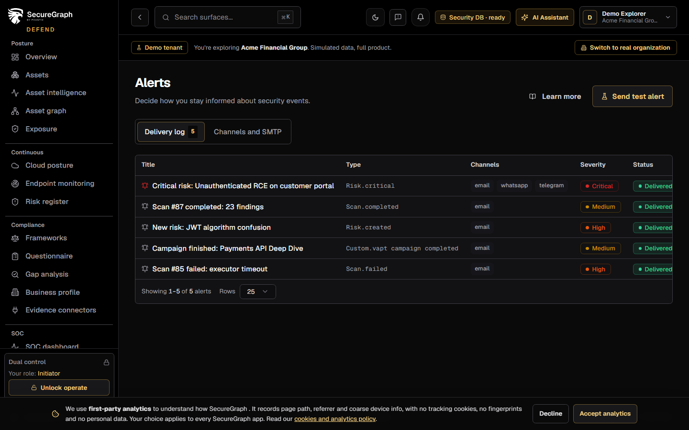
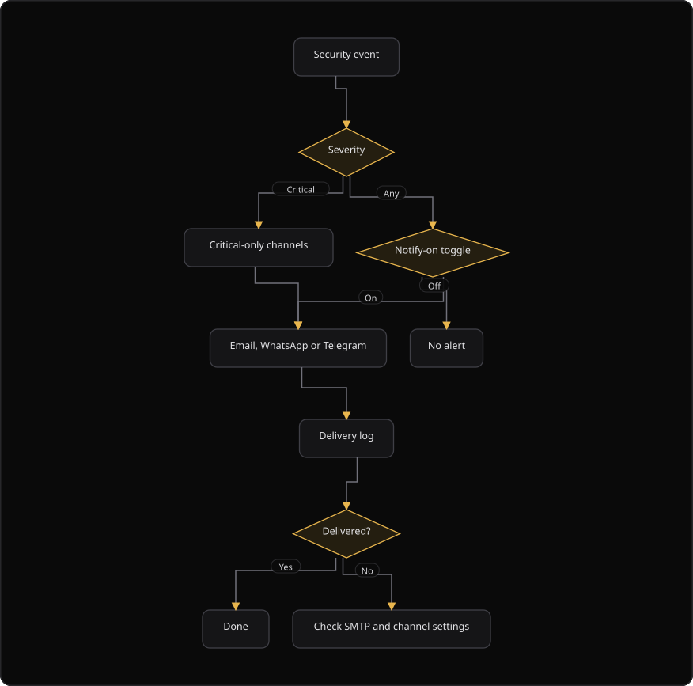

# Command Centre: Alerts and incidents

**Where:** **Operate** → **Incidents** (`/alerts`)
**What:** Where alerts go and what they say: the delivery log, the SMTP server, the critical-only channels and the event toggles that decide what fires.
**Who:** Any operator. A test alert and an alert settings change need operate mode with dual control.
**Before you start:** An SMTP server is configured for client alert mail.

---

## Before you start

- An SMTP server is configured for client alert mail.
- Operate mode is unlocked for a settings change or a test alert.
- An authorizer is available when dual control applies.
- The alert channels are known. WhatsApp and Telegram are critical-only.

---

## Process flow

---

## Steps

1. Open **Incidents**.
2. Read the **Delivery log** first. It shows what was sent and whether it arrived.
3. Open **Channels and SMTP** and set the client alert SMTP server.
4. Select **Update SMTP** to save the settings.
5. Add the critical-only channels: WhatsApp and Telegram.
6. Read **Notify on** to see each event toggle and its state.
7. Select **Send test alert** to test the channels. The action needs dual control.
8. If an alert is missing, check the event toggle first, then the channel, then the SMTP server.

---

## Reference

### Delivery log columns

| Column | Shows |
| --- | --- |
| **Title** | The alert title |
| **Type** | The event type |
| **Channels** | The channels that received the alert |
| **Severity** | The severity |
| **Status** | The delivery state |
| **Time** | When the alert fired |

### Channels

| Channel | Fires on |
| --- | --- |
| Email | The configured alert recipients |
| WhatsApp | Critical events only |
| Telegram | Critical events only |

Slack, Teams and other channels are managed in the Integrations Hub. The client alert SMTP server is separate from the SecureGraph one-time password server. It delivers security alerts and VAPT completion mail.

### Recipients

VAPT completion mail goes to the configured recipients, or to the primary email of the organization.

### Rules

- Critical-only channels stay critical-only. Do not route a low-severity event to them.
- The delivery log records the outcome. A failed send is retried or reported, and it is not hidden.
- Alerts report events. They do not change a finding or a risk.

---

## Troubleshooting

| Symptom | Cause | Fix |
| --- | --- | --- |
| No alert arrived | The event toggle is off | Turn the event on in **Notify on** |
| No alert arrived and the toggle is on | The channel is not configured | Configure the channel, then send a test alert |
| The test alert does not arrive | The SMTP host or the port is wrong | Correct the SMTP settings and select **Update SMTP** |
| A low-severity event did not reach WhatsApp or Telegram | The channels are critical-only | Route the event to a general channel |
| A toast says "Sending a test alert requires a dual-control operate session" | Operate mode is locked | Unlock operate, or ask an authorizer |
| The delivery log shows a failed send | The destination refused the message | Check the destination and retry |
| VAPT completion mail is missing | The recipients are not configured | Set the recipients, or use the primary email of the organization |
| The delivery log is empty | No alert has fired yet | Send a test alert |

---

## Related

- [27-admin-and-audit.md](./27-admin-and-audit.md)
- [07-triage-soc.md](./07-triage-soc.md)
- [09-manage-risks.md](./09-manage-risks.md)
