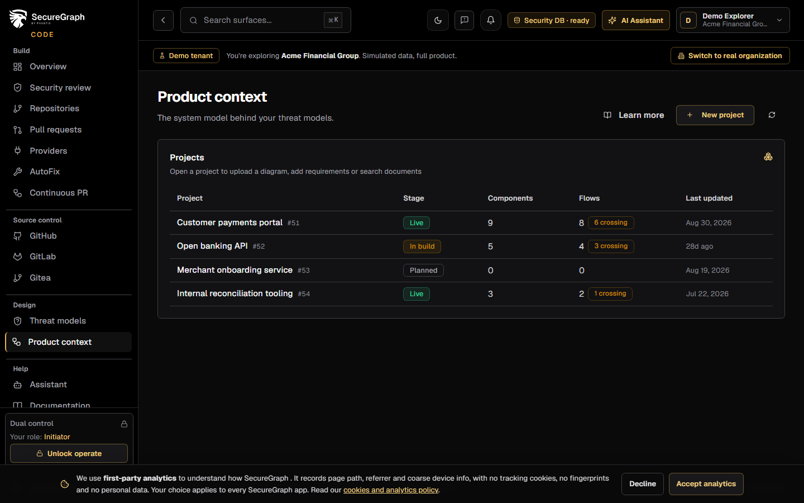
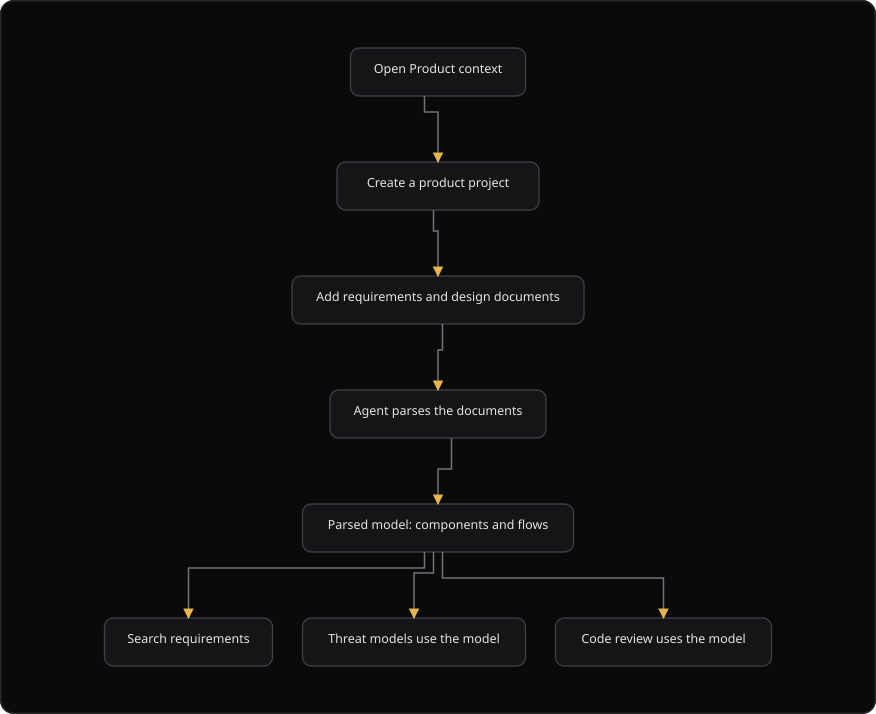

# Command Centre: Product context

**Where:** **Design** → **Product context** (`/context`)
**What:** The projects that describe what your system is, so review and threat models have something to reason about. A project holds components, the flows between them, and the documents it ingested.
**Who:** Any operator. Creating a project, uploading a diagram and adding a document write to the security database.
**Before you start:** The security database is connected. A `.drawio` diagram describes the system.

---

## Before you start

- The security database is connected. Product context is stored there.
- A `.drawio` or `.xml` diagram describes the system.
- The requirements text is ready to paste.
- The requirements tool needs at least 2 characters for a search.

---

## Process flow

---

## Steps

1. Open **Product context**.
2. Select **New project**.
3. Enter a **Project name** and select a **Stage**: Planned, In build or Live.
4. Select **Create project**. The stage shapes which threats the engine considers realistic.
5. Open the project row. The drawer shows **Components**, **Flows** and **Crossing boundaries**.
6. Select **Upload .drawio** and choose the diagram. The toast reports the components, the boundaries and the flows.
7. Read the **Parsed model** panel. External, trusted and internal components have different colors.
8. Select **Add requirements**, enter a **Title** and the text, then select **Ingest document**.
9. Use **Search requirements** to find a passage. Enter at least 2 characters.
10. Select **Refresh** after you add a document.
11. If a project shows **Nothing parsed yet**, the document is queued, or the parse failed. Check the document list.

---

## Reference

### Project columns

| Column | Shows |
| --- | --- |
| **Project** | The project name and the numeric ID |
| **Stage** | Planned, In build or Live |
| **Components** | The parsed component count |
| **Flows** | The parsed flow count. A cross-boundary flow adds a `crossing` chip |
| **Last updated** | When the project changed |

### Stage values

| Stage | Meaning |
| --- | --- |
| `planned` | The system is planned |
| `in_build` | The system is in build |
| `live` | The system is live |

### Diagram upload

| Item | Value |
| --- | --- |
| Accepted files | `.drawio` and `.xml` |
| Maximum size | 5 MB |
| Result | Components, boundaries and flows |

### Component kinds

| Kind | Color |
| --- | --- |
| External | Medium severity color |
| Trusted | Green |
| Internal | Neutral |

### Document ingest

| Field | Value |
| --- | --- |
| Title | Free text. The default is `Requirements` |
| Text | The requirements, design notes or user stories |
| Result | The text is chunked for retrieval. `inline` chunks immediately. Otherwise it chunks in the background |

### Search requirements

The search is a full-text search over the documents that this project ingested. Enter at least 2 characters. A result shows the document title and the matching passage.

### Rules

- Product context is input. It defines what secure means for this system, so a threat model or a review can judge it.
- The model is derived from the documents you provide. It does not invent components.
- Keep documents current. A stale model produces stale threats.

---

## Troubleshooting

| Symptom | Cause | Fix |
| --- | --- | --- |
| **Product context unavailable** appears | The load failed | Select **Retry**. A 409 status means the security storage is not activated |
| A toast says "Your security storage is not activated yet" | The security database is not connected | Connect it on the Platform under Connections |
| Diagram upload says "Diagram not parsed" | The `.drawio` file is malformed | Correct the diagram and upload it again |
| **Parsed model** says "Nothing parsed yet" | The diagram is missing, or the parse is queued | Upload the `.drawio` diagram |
| The search returns "No matching passages" | The text is absent from the ingested documents | Add the document, then search again |
| A document ingest says "Could not ingest the document" | The paste is empty, or the ingest failed | Paste the requirements text and retry |
| The create action warns that the name is required | The **Project name** box is empty | Enter a name |
| A toast says "Could not create the project" | The security storage is not activated, or the write failed | Connect the security database, then retry |

---

## Related

- [16-threat-models.md](./16-threat-models.md)
- [21-code-security.md](./21-code-security.md)
- [11-generate-reports.md](./11-generate-reports.md)
