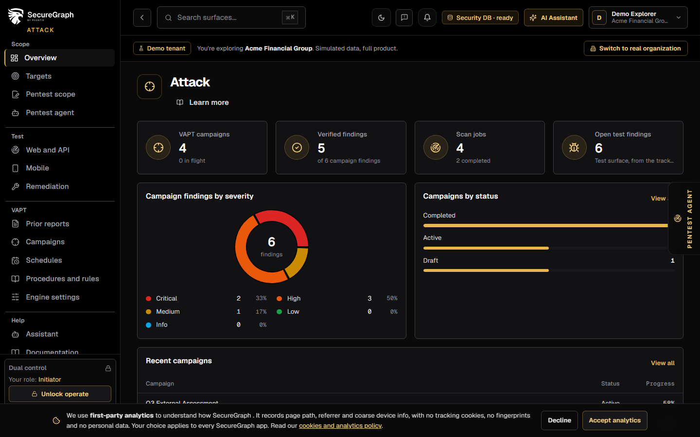
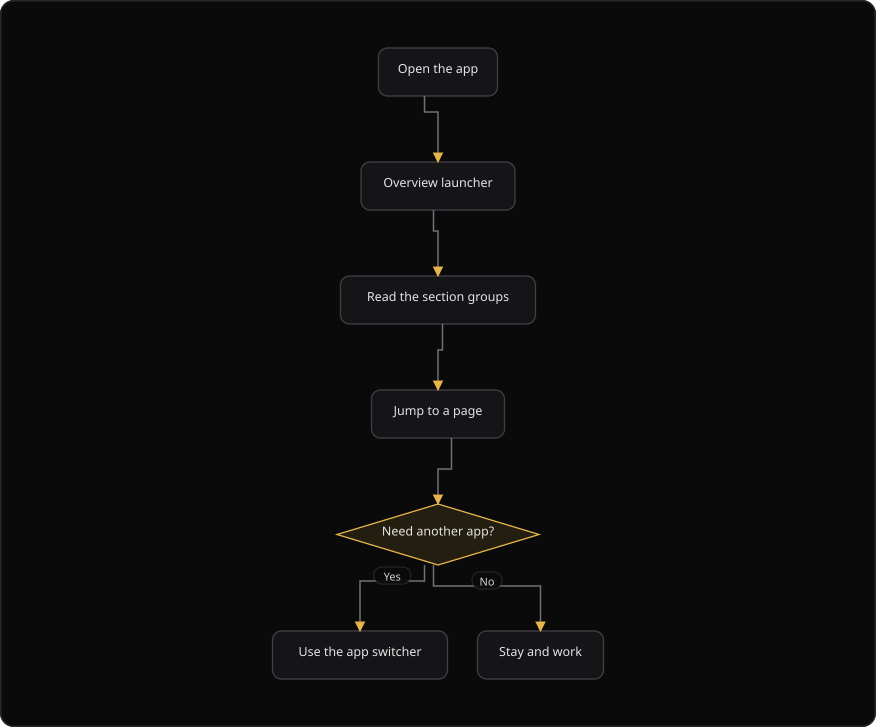
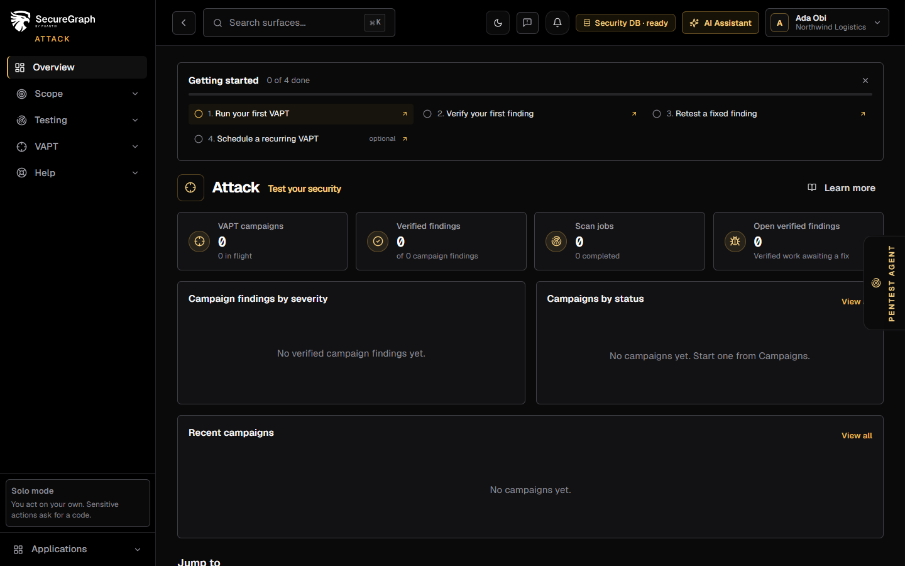

# Command Centre: Overview and navigation

**Where:** Any Command Centre app → **Overview** (`/`)
**What:** The launcher for the app you are in. It shows the app name, the sections that belong to it, and a jump list to every page.
**Who:** Any operator. The page is read-only.
**Before you start:** You are signed in. At least one app is available to the organization.

---

## Before you start

- You are signed in. The Overview page is the landing screen of each app.
- At least one Command Centre app is available to the organization.
- The session is live. Moving between apps does not end a running session.

---

## Process flow

---

## Steps

1. Open any Command Centre app. The Overview page is the landing screen.
2. Work through **Getting started** at the top when it shows. It lists the first things to do in this app, in order. See the reference below.
3. Read the app header. The backend catalog supplies the app name, the tagline and the description.
4. Read the mini dashboard and the latest assessment panel.
5. Read the section groups. Each group holds the pages for one job.
6. Select a page in **Jump to** to open it.
7. Use the app switcher in the header to move between Core, Attack, Defend and Code without a second sign-in.
8. Open **Documentation** in the Help group when a page needs its guide.
9. Select **Learn more** in a page header to open the matching guide in a new tab.

---

## Reference

### Launcher parts

| Part | Shows |
| --- | --- |
| App header | The app name, the tagline and the description from the backend catalog |
| Mini dashboard | A compact status view for the app |
| Latest assessment | What the last completed assessment left for the app |
| **Jump to** | Every page the app owns, grouped the way the sidebar groups them |

### Getting started

Each app lists its own first steps. In Core, the list shows on the dashboard. A step ticks itself when you do the thing, for example when the first report exists. Select a step to open its page. Select the close control to hide the list on this browser. The list goes away once every required step is done.

| App | First steps, in order | Optional |
| --- | --- | --- |
| Core | Add your first asset, review and verify your first finding, generate your first report, invite a teammate | Start an assurance engagement |
| Attack | Run your first VAPT, verify your first finding, retest a fixed finding | Schedule a recurring VAPT |
| Defend | Set your compliance profile, complete the questionnaire, run your first compliance assessment, connect a cloud account or evidence connector | Install a SOC agent |
| Code | Connect a repository provider, run your first code review, fix your first finding with a pull request, build your first threat model | Add a CI/CD gate |

### The four apps

| App | Purpose |
| --- | --- |
| Core | Assets, findings, reports, audit and the security graph |
| Attack | Scans, VAPT campaigns, pentest scope and remediation |
| Defend | Posture, SOC, compliance, risks and threat intelligence |
| Code | Source-control review, AutoFix and threat models |

### Help and navigation

| Control | Action |
| --- | --- |
| App switcher | Move between the four apps without a second sign-in |
| **Documentation** | Open the documentation home in the Help group |
| **Learn more** | Open the guide for the current page in a new tab |
| Section group | Hold the pages for one job |
| Jump tile | Open one page |

### Rules

- The launcher is the same in Attack, Defend and Code. Only the sections change.
- Moving between apps does not end a running session.
- Every page header carries a **Learn more** link to its own how-to.
- Each section in **Jump to** comes from the navigation of that app, which is the source of truth for routes.

---

## Troubleshooting

| Symptom | Cause | Fix |
| --- | --- | --- |
| **Learn more** opens a new tab and the guide does not load | The doc route is unavailable | Open **Documentation** in the Help group |
| The app switcher does not list an app | The organization cannot access that app | Ask an administrator for access |
| **Jump to** shows no section | The app owns no page for this organization | Check the entitlements of the organization |
| A toast says "Could not load application details" | The application catalog did not load | Reload the page. The launchpad still works |
| A jump tile is missing | The page is not in the navigation of the app | Open the page from the sidebar |
| Moving between apps ends the session | The session expired | Sign in again. Moving between apps normally does not end a session |
| The **Latest assessment** panel is empty | No assessment completed for the app | Run an assessment, then reload |

---

## Related

- [README.md](./README.md)
- [29-dashboard.md](./29-dashboard.md)
- [28-analytics.md](./28-analytics.md)
