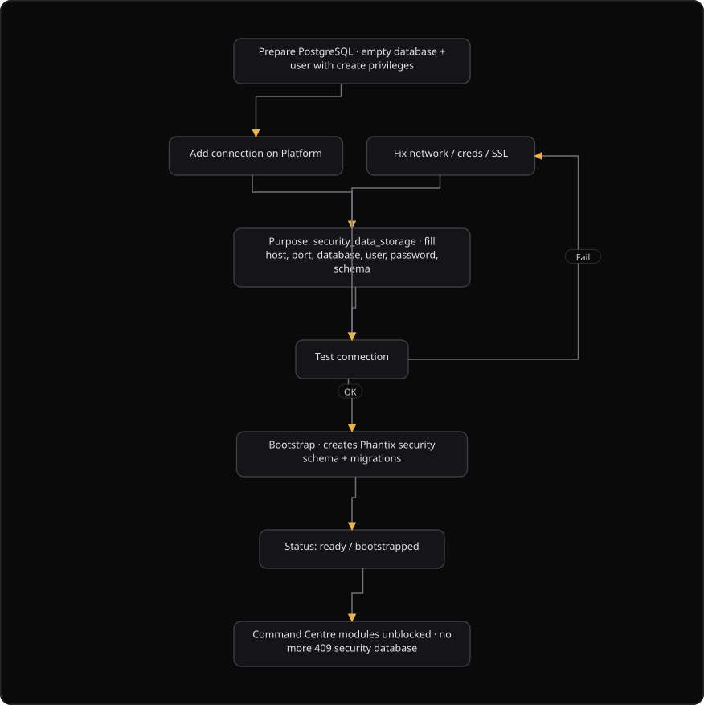

# Platform: Connect a security database

**Where:** **Security Database** → `/connections`
**What:** Registers the dedicated database that holds assets, findings, risks, and security operations center (SOC) data. Bootstrap creates the SecureGraph schema and the migrations.
**Who:** The primary user of the organization.
**Before you start:** A PostgreSQL database you control, a user with create privileges, and an open network path.

---

## Before you start

- The bootstrap gate blocks scans and vulnerability assessment and penetration testing (VAPT) until the connection reads ready.
- The database is empty, or it has a dedicated schema for SecureGraph.
- The database user can create schemas and tables for the bootstrap.
- The network path from the Platform backend to the host and port is open.
- Dual control is assigned. Platform refuses connection changes without it.
- One security data storage connection is primary. Platform clears the flag on the old primary when a new one arrives.
- The purpose value is `security_data_storage`. A config inspection connection is a different task.

---

## Process flow

---

## Steps

1. Provision a dedicated PostgreSQL database. Use a cloud or on-premises server.
2. Create a database user with the privilege to create schemas and tables.
3. Sign in to Platform and select **Security Database**.
4. Click **Add connection**.
5. Enter the name of the connection. The default is `SecureGraph Store`.
6. Select the purpose **Security data storage**. The value is `security_data_storage`.
7. Select the engine: `postgresql`, `mysql`, `mssql`, or `mongodb`.
8. Enter the host. Platform resolves a hostname to IPv4 before the connection starts.
9. Enter the port. The PostgreSQL default is `5432`.
10. Enter the database name. The default is `phantix_security`.
11. Enter the target schema. The default is `phantix`.
12. Enter the username and the password.
13. Select the Secure Sockets Layer (SSL) mode: `prefer`, `require`, or `disable`.
14. Select the environment: `production`, `staging`, or `development`.
15. Click **Save connection**. Platform stores the credentials in encrypted form.
16. Click **Test**. Wait for the message "Connectivity OK".
17. Click **Bootstrap schema**. Wait for the status **ready**.
18. Open Command Centre and confirm that scans and VAPT report no missing security database.

**Result:** The bootstrap gate reads **ready**, and the product modules are unblocked.

- The gate is enforced by Platform, not by the user interface alone.
- A bootstrap result of `pending` means an authorizer must approve it in Authorizations.
- A delete result of `pending` behaves in the same way.

---

## Reference

### Connection fields

| Field | Allowed values or default | Notes |
| --- | --- | --- |
| Name | Text | Default: `SecureGraph Store`. |
| Purpose | `security_data_storage`, `config_inspection` | Security data storage is required for the product modules. |
| Engine | `postgresql`, `mysql`, `mssql`, `mongodb` | The live drivers cover PostgreSQL, Supabase, SQLite, MySQL, and MariaDB. |
| Host | Hostname or IP address | Platform resolves a hostname to IPv4 first. |
| Port | Number | Default: `5432`. |
| Database | Text | Default: `phantix_security`. |
| Target schema | Text | Default: `phantix`. |
| Username | Text | The example is `phantix_writer`. |
| Password | Text | Stored in encrypted form. |
| SSL mode | `prefer`, `require`, `disable` | Default: `prefer`. |
| Environment | `production`, `staging`, `development` | Default: `production`. |

Each engine offers further options beyond the username and the password. Open **Connection options** on the page for the list, for example `ssl_mode`, `search_path`, and `odbc_driver`.

### Driver availability

The **Driver availability for your engine** card reads `GET /db-connections/drivers`.

| Chip | Meaning |
| --- | --- |
| Live | The driver package is installed, so a live probe can run. |
| Optional | Platform can store the credentials, but a live test needs the package. |

### Connection states

| State | Meaning |
| --- | --- |
| `not_bootstrapped` | The connection is saved and the schema is missing. |
| `ready` | The bootstrap finished. The gate is open. |
| Last test `passed` | The live probe succeeded. |
| Last test `failed` | The probe failed. Read the last error on the connection card. |
| `pending` | The action waits for an authorizer. Approve it in Authorizations. |

### Requirements

| Item | Detail |
| --- | --- |
| Database | An empty or dedicated database. Do not point the connection at a production transaction database at random. |
| Network path | The Platform backend must reach the host and the port. |
| Privileges | Create schema and create table for the bootstrap. |
| Primary | One primary security store for each organization. |
| Least privilege | SecureGraph needs its own schema only, never the application tables. |

---

## Troubleshooting

| Symptom | Cause | Fix |
| --- | --- | --- |
| The test times out | A firewall or a security group blocks the port, or the host is wrong | Open the path to the host and port, then test again. |
| Authentication fails | The username or the password is wrong, or the host uses a different password hash | Check the credentials. Note the `scram` and `md5` difference on PostgreSQL. |
| The bootstrap fails | The user lacks the create privilege, or the schema holds an unexpected state | Grant create on the schema, then read the last error on the connection card. |
| "Audit control required" | Dual control is not assigned | Assign an initiator and an authorizer first. |
| A 409 arrives in Command Centre | The bootstrap did not finish, or the connection is not primary | Finish the bootstrap and confirm the **primary** label. |
| A driver chip reads **optional** | The engine package is not installed on the server | Save the credentials. A live test needs the driver package. |
| "Sent for approval" after the bootstrap | Platform parked the bootstrap for an authorizer | Approve it in Authorizations. |
| "No IPv4 record" after a save | The hostname has no A record | Use an IP address, or add the record. Platform passes the name as it is. |
| The **Add connection** control opens a warning | Dual control is not assigned | Assign the slots on **People and Control**. |

---

## Related

- Previous: [02-complete-setup-wizard.md](./02-complete-setup-wizard.md)
- Next step: [07-connect-config-database.md](./07-connect-config-database.md)
- [04-assign-dual-control.md](./04-assign-dual-control.md)
- [Command Centre: Launch a scan](../command-centre/05-launch-a-scan.md)
- [Platform how-tos](./README.md)
